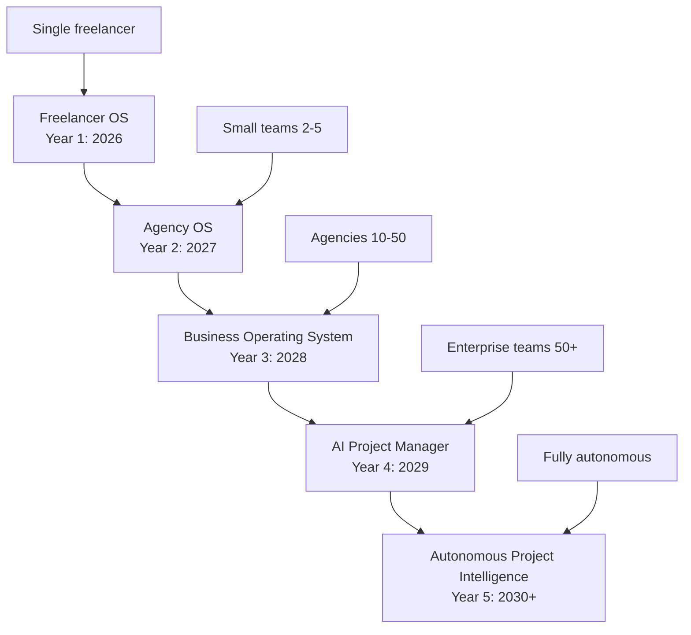
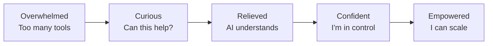
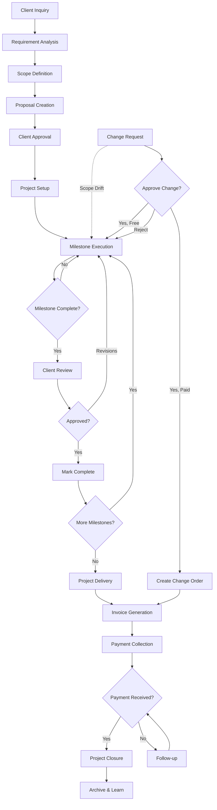
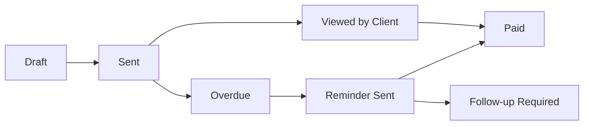

# Freelance OS: Product Context

**Last Updated:** August 2, 2026  
**Version:** 1.0  
**Document Type:** Canonical Product Context  
**Audience:** AI agents, product managers, designers, engineers, stakeholders

---

## Document Purpose & Usage

This document serves as the **Product Bible** for Freelance OS. It contains comprehensive product context sufficient for generating PRDs, user stories, user flows, feature specifications, UX documentation, product roadmaps, and acceptance criteria without requiring additional context.

### How to Use This Document

**For AI Agents:**
- Read relevant sections before proposing product changes
- Use this as the source of truth for product decisions
- Reference specific sections when making feature recommendations
- Create TODOs when information conflicts or is missing

**For Product Managers:**
- Use this to onboard new team members
- Reference when writing feature specifications
- Update this document as product decisions evolve
- Ensure consistency across all product documentation

**For Designers:**
- Understand the design philosophy and principles
- Reference user flows and interaction patterns
- Align designs with stated UX principles
- Use examples and patterns defined here

**For Engineers:**
- Understand product requirements and context
- Reference feature specifications during implementation
- Align technical decisions with product goals
- Escalate conflicts between technical and product requirements

---

## Table of Contents

1. [Product Vision & Mission](#1-product-vision--mission)
2. [Product Principles](#2-product-principles)
3. [User Experience Philosophy](#3-user-experience-philosophy)
4. [Design Philosophy](#4-design-philosophy)
5. [Product Goals & Non-Goals](#5-product-goals--non-goals)
6. [Primary & Secondary Personas](#6-primary--secondary-personas)
7. [Complete User Journey](#7-complete-user-journey)
8. [Information Architecture](#8-information-architecture)
9. [Navigation System](#9-navigation-system)
10. [Dashboard Design](#10-dashboard-design)
11. [Project Workspace](#11-project-workspace)
12. [AI Workspace](#12-ai-workspace)
13. [Client Workspace](#13-client-workspace)
14. [Invoice Workspace](#14-invoice-workspace)
15. [Notification Center](#15-notification-center)
16. [Core Features: Deep Dive](#16-core-features-deep-dive)
17. [AI Features: Comprehensive Guide](#17-ai-features-comprehensive-guide)
18. [Mobile Strategy](#18-mobile-strategy)
19. [Offline Strategy](#19-offline-strategy)
20. [Accessibility](#20-accessibility)
21. [UX Principles](#21-ux-principles)
22. [Product Constraints](#22-product-constraints)
23. [MVP Definition](#23-mvp-definition)
24. [Future Roadmap: V2, V3, Beyond](#24-future-roadmap-v2-v3-beyond)

---

## 1. Product Vision & Mission

### Vision Statement

Freelance OS is building the **operating system for modern freelancers in India**—a comprehensive platform that eliminates administrative overhead and enables freelancers to focus on their craft.

We are **not** building another project management tool.  
We are **not** building another invoicing application.  
We are **not** building another AI chatbot wrapper.


**We are building an AI-first operating system** where intelligent automation and project management work together to solve the specific, painful problems Indian freelancers face every day.

### What Makes Us Different

| Traditional PM Tools | Freelance OS |
|---------------------|--------------|
| Generic workflows | Indian freelancer-specific workflows |
| Manual scope definition | AI-powered scope analysis |
| Reactive scope management | Proactive scope drift detection |
| Generic invoicing | GST-native invoicing |
| Payment tracking only | UPI payment collection |
| Tool for users | Operating system for freelancers |
| AI as addon | AI as core product |

### Mission Statement

Our mission is threefold:

1. **Empower Indian freelancers** with professional-grade tools previously accessible only to enterprises
2. **Eliminate administrative friction** from the complete project lifecycle—from initial client inquiry to final payment
3. **Prove AI augmentation works** by reducing administrative overhead by 60%+ while keeping humans in control

### Long-Term Vision (5-Year Evolution)



Each phase builds on the previous one, maintaining backward compatibility while expanding capabilities.

---

## 2. Product Principles

These principles guide every product decision, feature prioritization, and user experience choice.

### Core Principles

#### 1. **AI Augments, Never Replaces**

Human judgment remains paramount. AI exists to:
- Reduce cognitive load
- Surface insights humans might miss
- Automate repetitive administrative work
- Prevent mistakes before they happen

AI **never** makes final decisions. Users always retain control.

**Example:**  
❌ AI automatically approves scope changes  
✅ AI detects scope drift and asks user to approve/reject

#### 2. **Indian-First, Not Indian-Only**

We design for Indian freelancers first:
- GST compliance is native, not an addon
- UPI is the primary payment method
- Language, time zones, and cultural norms are Indian
- Pricing is in rupees with Indian purchasing power in mind

But we build with global expansion in mind:
- Architecture supports multi-currency
- Tax systems are pluggable
- Payment methods are configurable
- Language/localization is built-in


#### 3. **Opinionated by Default, Flexible When Needed**

We have strong opinions about best practices:
- Projects should have clear milestones
- Scope changes require explicit approval
- Invoices should be GST-compliant
- Communication should be professional

But we don't enforce rigidity:
- Users can customize workflows
- Templates are editable
- AI suggestions are optional
- Power users can build their own processes

#### 4. **Speed is a Feature**

Every screen loads in under 1 second (p95).  
Every action completes in under 100ms (p95).  
Every interaction feels instant.

Slow software frustrates users and reduces adoption. Speed is not a technical metric—it's a core product feature.

#### 5. **Professional from Day One**

Freelancers use our product to manage their livelihood. We cannot afford to look amateur:
- UI is polished, not prototype-quality
- Errors are helpful, not cryptic
- Empty states guide next actions
- Onboarding is smooth, not overwhelming
- Every feature is production-ready

#### 6. **Progressive Disclosure**

Simple tasks remain simple. Complex tasks are possible.

- New users see only core features
- Advanced features are discoverable but not intrusive
- Power users can access deep customization
- Learning curve is gradual, not overwhelming


#### 7. **Transparency Builds Trust**

Users must understand what AI is doing and why:
- Show confidence scores for AI suggestions
- Explain reasoning behind recommendations
- Allow users to edit AI-generated content
- Never hide complexity that affects user decisions
- Make data export and backup effortless

---

## 3. User Experience Philosophy

### What Experience We're Creating

Freelance OS should feel like having an experienced project manager working alongside you—someone who:
- Organizes chaos into structure
- Catches problems before they escalate
- Handles tedious administrative work
- Lets you focus on creative work
- Never makes decisions without asking

### Emotional Journey



**Overwhelmed → Curious → Relieved → Confident → Empowered**

### Experience Pillars

| Pillar | Definition | How We Deliver |
|--------|-----------|----------------|
| **Clarity** | Users always know what's happening | Clear status indicators, real-time updates, no ambiguity |
| **Control** | Users retain final decision authority | AI suggests, humans decide; everything is editable |
| **Confidence** | Users trust the system | Professional UI, reliable data, transparent AI |
| **Speed** | Actions feel instant | Optimistic UI, background processing, caching |
| **Intelligence** | System anticipates needs | Contextual suggestions, smart defaults, proactive alerts |

---

## 4. Design Philosophy

### Design Inspiration

Our design language draws inspiration from world-class products:

#### **Linear** — Intuitive, Professional, Fast
- Clean typography and generous whitespace
- Keyboard-first interactions with clear shortcuts
- Instant feedback for every action
- Minimal, purposeful color usage
- Command palette for power users

**Why:** Linear proves that B2B tools can be beautiful and fast. We adopt their focus on speed and polish.

#### **Notion** — Flexible, Structured, Powerful
- Block-based content editing
- Nested hierarchies that stay comprehensible
- Inline editing without mode switching
- Templates and reusable components
- Collaborative features that feel natural

**Why:** Notion shows how to balance flexibility with structure. We need similar content organization for scope documents.

#### **Stripe** — Trustworthy, Clear, Data-Dense
- High information density without clutter
- Clear data visualization
- Professional color palette
- Excellent error states and edge cases
- Developer-friendly design patterns

**Why:** Stripe handles money and inspires trust. Our invoicing and payment features must meet this standard.


#### **Vercel** — Modern, Fast, Developer-Focused
- Deployment previews and status indicators
- Real-time updates without page refresh
- Dark mode done right
- Clean dashboards with actionable metrics
- Excellent empty states

**Why:** Vercel understands developer workflows. Our users are technical; we need similar clarity and speed.

#### **OpenAI** — AI-First, Conversational, Clear
- Chat interface that feels natural
- AI responses that are helpful, not overwhelming
- Clear indication when AI is thinking/processing
- Easy to refine and iterate on AI outputs
- Balance between automation and control

**Why:** OpenAI pioneered conversational AI UX. We need similar patterns for our AI features.

#### **Apple** — Polished, Consistent, Delightful
- Consistent interaction patterns
- Attention to micro-interactions
- Accessibility built-in from day one
- Performance as a feature
- Every detail considered

**Why:** Apple proves that polish matters. Freelancers deserve tools that respect their professionalism.

### Visual Design System

#### Typography
- **Primary Font:** Inter (UI text, body copy)
- **Monospace Font:** JetBrains Mono (code, invoice numbers)
- **Heading Scale:** 12/14/16/20/24/32/48px
- **Body Text:** 14px default, 16px for reading-focused content
- **Line Height:** 1.5 for body, 1.2 for headings


#### Color Palette

**Semantic Colors:**
- Primary (Brand): Deep Blue `#1a56db`
- Success: Green `#0e9f6e`
- Warning: Amber `#ff8a00`
- Danger: Red `#f05252`
- Info: Blue `#3f83f8`

**Neutral Scale:**
- Black: `#111827`
- Gray 900-100: Tailwind gray scale
- White: `#ffffff`

**AI-Specific Colors:**
- AI Suggestion: Purple `#7c3aed`
- Confidence High: Green `#0e9f6e`
- Confidence Medium: Amber `#ff8a00`
- Confidence Low: Red `#f05252`

#### Spacing System
Based on 4px grid: 4, 8, 12, 16, 24, 32, 48, 64, 96px

#### Component Patterns

**Buttons:**
- Primary: Filled with primary color
- Secondary: Outlined with neutral border
- Ghost: Text only, no background
- Danger: Red for destructive actions
- Sizes: Small (32px), Medium (40px), Large (48px)

**Form Inputs:**
- Height: 40px default
- Border radius: 6px
- Focus ring: 2px offset
- Error states: Red border + error message below
- Help text: Gray, 12px

**Cards:**
- Border radius: 8px
- Padding: 16px or 24px
- Shadow: Subtle elevation
- Hover: Slight lift + shadow increase


**Status Indicators:**
- Not Started: Gray dot
- In Progress: Blue pulsing dot
- Completed: Green checkmark
- Overdue: Red exclamation
- Blocked: Orange warning

---

## 5. Product Goals & Non-Goals

### Primary Goals

#### For Freelancers

1. **Reduce administrative overhead by 60%+**
   - Automate scope analysis and project structuring
   - Generate GST-compliant invoices automatically
   - Track payments without manual spreadsheets
   - Eliminate context switching between tools

2. **Prevent project failures before they happen**
   - AI detects scope drift in real-time
   - Flag timeline risks automatically
   - Surface dependency issues early
   - Predict project health based on historical data

3. **Improve professionalism and client relationships**
   - Generate polished scope documents
   - Provide transparent project visibility
   - Send professional invoices on time
   - Communicate proactively about delays

4. **Enable sustainable scaling**
   - Free up 10+ hours per week from admin work
   - Take on more projects without overwhelm
   - Build reusable templates and workflows
   - Track profitability per client and project type

#### For the Business

1. **Achieve product-market fit within 6 months**
   - 1,000+ active freelancers
   - 60%+ weekly active usage
   - NPS score above 50
   - <5% monthly churn


2. **Validate AI value proposition**
   - 80%+ of users use AI scope analysis
   - AI suggestions accepted 70%+ of the time
   - Measurable time savings (tracked via analytics)
   - AI features drive adoption, not novelty

3. **Build sustainable business model**
   - Pricing validated by 100+ paying customers
   - Unit economics positive by month 6
   - Clear path to profitability
   - Retention proves long-term value

### Non-Goals (Things We Explicitly Don't Do)

#### ❌ **We Don't Build a Marketplace**
We are not connecting freelancers with clients. We assume freelancers already have clients.

**Why:** Marketplaces require different business models, network effects, and go-to-market strategies. We focus on workflow, not lead generation.

#### ❌ **We Don't Build Collaboration Tools**
We are not Slack, Notion, or Figma. We integrate with them.

**Why:** Freelancers already use tools they love. We make project management better, not replace their entire toolkit.

#### ❌ **We Don't Build Time Tracking**
We track milestones and deliverables, not hours worked.

**Why:** Indian freelancers typically work on fixed-price or milestone-based projects, not hourly billing. If users need time tracking, we integrate with existing tools.

#### ❌ **We Don't Build Accounting Software**
We generate invoices and track payments. We don't do full accounting, tax filing, or bookkeeping.

**Why:** Accounting is complex and regulated. We integrate with Zoho Books, Tally, etc. for users who need full accounting.


#### ❌ **We Don't Support Agencies (MVP)**
MVP focuses on solo freelancers. Agency features come in V2.

**Why:** Solo freelancers have simpler workflows. Agencies introduce complexity (team management, permissions, revenue sharing) that distracts from core value prop.

#### ❌ **We Don't Build Mobile Apps (MVP)**
We build mobile-responsive web app. Native iOS/Android apps come later.

**Why:** Web-first allows faster iteration. Most project management happens on desktop. Mobile is for quick updates, not primary usage.

---

## 6. Primary & Secondary Personas

### Primary Persona 1: The Technical Freelancer

**Name:** Rohan (Composite)  
**Age:** 28  
**Location:** Bangalore, India  
**Profession:** Full-stack developer  
**Experience:** 4 years freelancing  
**Annual Revenue:** ₹12-18 lakhs

#### Background
- Quit corporate job to freelance full-time
- Works with 3-5 US/Indian clients simultaneously
- Mix of fixed-price projects and monthly retainers
- Strong technical skills, weak administrative skills

#### Pain Points
1. Spends 15-20 hours/month on admin work (invoicing, scope docs, payment tracking)
2. Scope creep is constant—clients add "small changes" that become huge
3. GST invoicing is confusing; fears compliance issues
4. Uses 8 different tools (Notion, WhatsApp, Google Sheets, Excel, Gmail, etc.)
5. Cannot accurately estimate projects due to lack of historical data
6. Payment delays hurt cash flow; no systematic follow-up


#### Goals
- Reduce admin work to focus on coding
- Prevent scope creep from eating profits
- Present professional image to clients
- Scale to 10+ clients without hiring help
- Track profitability per project

#### Behaviors
- Highly technical; comfortable with APIs and integrations
- Prefers keyboard shortcuts over clicking
- Values speed and efficiency
- Skeptical of "AI magic"—wants to understand what AI does
- Willing to pay for tools that save time

#### How They Discover Us
- Developer communities (Reddit, Hacker News)
- Twitter/X threads about freelancing
- Word of mouth from other freelancers
- Google search for "GST invoicing for freelancers"

### Primary Persona 2: The Creative Freelancer

**Name:** Priya (Composite)  
**Age:** 31  
**Location:** Mumbai, India  
**Profession:** UX/UI Designer  
**Experience:** 6 years freelancing  
**Annual Revenue:** ₹8-12 lakhs

#### Background
- Freelances while raising a child
- Works with Indian startups and small businesses
- Mostly fixed-price projects with milestone-based payments
- Strong design skills, moderate technical skills

#### Pain Points
1. Clients don't know what they want; requirements are vague
2. Revision requests are endless without clear scope boundaries
3. Creating professional proposals and contracts takes hours
4. Invoicing feels unprofessional (Word docs or Excel sheets)
5. Tracking multiple projects manually is overwhelming

6. Communication happens across WhatsApp, email, and calls—nothing is documented

#### Goals
- Convert vague client requirements into clear deliverables
- Set boundaries around revisions
- Look professional to attract better clients
- Manage multiple projects without chaos
- Spend more time designing, less time on admin

#### Behaviors
- Visual thinker; values aesthetics and usability
- Prefers templates and guided workflows
- Appreciates AI help for structuring chaos
- Less technical; avoids complex tools
- Willing to pay for simplicity and polish

#### How They Discover Us
- Design communities (Behance, Dribbble)
- LinkedIn posts about freelancing
- YouTube videos about freelance business
- Instagram ads targeting freelancers

### Secondary Persona: The Consultant

**Name:** Arjun (Composite)  
**Age:** 36  
**Location:** Pune, India  
**Profession:** Business consultant  
**Experience:** 8 years freelancing  
**Annual Revenue:** ₹20-30 lakhs

#### Background
- Former management consultant at Big 4
- Works with SMEs on strategy and operations
- Long-term engagements (3-12 months)
- High value per project; fewer simultaneous projects

#### Pain Points
1. Proposals and scope documents are critical but time-consuming
2. Projects evolve; scope needs frequent revisions
3. Billing is complex (milestone + retainer combinations)
4. Needs professional invoices for corporate clients

5. Clients expect detailed reporting and project updates
6. Managing deliverables across phases is manual

#### Goals
- Create impressive proposals quickly
- Manage scope evolution professionally
- Generate detailed project reports
- Maintain enterprise-grade professionalism
- Scale consulting practice to a small firm

**Note:** This persona is important but not MVP priority. Features serving consultants come in V2.

---

## 7. Complete User Journey

### The Complete Lifecycle



### Detailed Journey Stages

#### Stage 1: Client Inquiry → Requirement Analysis

**User Actions:**
1. Receives inquiry via email/WhatsApp/call
2. Client provides messy, incomplete requirements
3. Freelancer copies client message into Freelance OS

**System Actions:**
1. AI analyzes raw client requirements
2. Extracts key information: project type, deliverables, constraints, timeline
3. Identifies missing information
4. Generates clarification questions

**User Outcomes:**
- Structured understanding of what client wants
- List of questions to ask client
- Confidence that nothing was missed

**AI Magic:**
- Natural language understanding
- Entity extraction (deliverables, dates, budgets)
- Gap analysis (what's missing)
- Question generation

#### Stage 2: Scope Definition

**User Actions:**
1. Reviews AI-generated scope structure
2. Edits and refines deliverables
3. Adds project constraints and assumptions
4. Defines success criteria
5. Sets milestones and deadlines

**System Actions:**
1. Suggests milestone breakdown based on project type
2. Recommends timeline based on deliverable complexity
3. Flags potential risks or dependencies
4. Generates scope document draft

**User Outcomes:**
- Clear, professional scope document
- Realistic timeline and milestones
- Identified risks and assumptions
- Ready to share with client


**AI Magic:**
- Milestone suggestion based on project patterns
- Timeline estimation using historical data
- Risk prediction based on project characteristics
- Scope document generation with professional formatting

#### Stage 3: Proposal Creation

**User Actions:**
1. Reviews scope document
2. Adds pricing information
3. Includes payment terms (upfront, milestone-based, final)
4. Adds terms and conditions
5. Sends proposal to client

**System Actions:**
1. Converts scope into client-facing proposal
2. Formats professionally
3. Generates shareable link
4. Tracks when client views proposal

**User Outcomes:**
- Professional proposal ready to send
- Shareable link for client
- Visibility into client engagement

**AI Magic:**
- Auto-formatting based on templates
- Pricing suggestions based on market rates (future)
- Payment term recommendations based on project size

#### Stage 4: Project Setup (Post-Approval)

**User Actions:**
1. Client approves proposal
2. Freelancer creates project in Freelance OS
3. System imports scope, milestones, and deliverables
4. Freelancer invites client to project workspace (optional)

**System Actions:**
1. Creates project structure automatically
2. Sets up milestone tracking
3. Generates task checklist for each milestone
4. Sets up notifications for deadlines


**User Outcomes:**
- Project ready to execute
- Milestones and tasks clear
- Client has visibility (if invited)
- Timeline tracking active

#### Stage 5: Milestone Execution

**User Actions:**
1. Works on delivering milestone
2. Updates task status as work progresses
3. Uploads deliverables
4. Communicates with client via project updates
5. Marks milestone as "Ready for Review"

**System Actions:**
1. Tracks progress automatically
2. Sends reminders for approaching deadlines
3. AI monitors for scope drift
4. Alerts if client requests are outside scope
5. Generates progress reports for client

**User Outcomes:**
- Always knows project status
- Scope protected from drift
- Client stays informed
- No surprises at delivery

**AI Magic:**
- Scope drift detection by comparing client messages to original scope
- Risk scoring for timeline delays
- Automatic progress summaries for client updates

#### Stage 6: Client Review & Revisions

**User Actions:**
1. Notifies client that milestone is ready
2. Client reviews deliverables
3. Client provides feedback
4. Freelancer addresses feedback
5. Resubmits for approval

**System Actions:**
1. Notifies client via email
2. Tracks revision rounds
3. Flags excessive revision requests

4. Asks if revisions are within scope or require change order
5. Documents all feedback for future reference

**User Outcomes:**
- Clear audit trail of feedback
- Protection from endless revisions
- Professional revision management
- Client accountability

#### Stage 7: Invoice Generation

**User Actions:**
1. Milestone approved by client
2. Clicks "Generate Invoice"
3. Reviews auto-populated invoice
4. Edits if needed
5. Sends to client

**System Actions:**
1. Auto-populates invoice from milestone data
2. Calculates GST correctly
3. Generates professional PDF
4. Sends email with payment instructions
5. Tracks invoice status

**User Outcomes:**
- Invoice created in seconds
- GST-compliant automatically
- Professional appearance
- Payment tracking enabled

**AI Magic:**
- Auto-population from project context
- GST calculation based on freelancer location
- Payment term enforcement

#### Stage 8: Payment Collection

**User Actions:**
1. Client receives invoice with UPI/payment link
2. Client makes payment
3. Freelancer marks payment as received
4. System reconciles payment

**System Actions:**
1. Sends payment reminders automatically
2. Tracks payment status

3. Flags overdue payments
4. Calculates days-to-payment metrics
5. Updates project financials

**User Outcomes:**
- No manual follow-up needed
- Clear payment status
- Cash flow visibility
- Professional payment experience for client

#### Stage 9: Project Closure & Learning

**User Actions:**
1. All milestones completed
2. All payments received
3. Freelancer closes project
4. Reviews project performance

**System Actions:**
1. Archives project data
2. Generates project retrospective report
3. Analyzes estimate accuracy
4. Identifies lessons learned
5. Feeds data into AI for future improvements

**User Outcomes:**
- Project cleanly closed
- Data preserved for future reference
- Insights for improving future projects
- Historical data for better estimates

**AI Magic:**
- Retrospective analysis comparing estimates vs actuals
- Pattern recognition for future similar projects
- Risk identification from past projects
- Pricing insights for similar future work

---

## 8. Information Architecture

### High-Level Structure

```
Freelance OS
│
├── Dashboard (Home)
│   ├── Active Projects Overview
│   ├── Revenue This Month
│   ├── Upcoming Milestones
│   ├── Overdue Payments
│   └── Quick Actions
│
├── Projects
│   ├── All Projects (List View)
│
   ├── Active / Completed / Archived
│   └── Individual Project View
│       ├── Overview
│       ├── Scope Document
│       ├── Milestones
│       ├── Tasks
│       ├── Deliverables
│       ├── Client Communication
│       ├── Invoices
│       └── Settings
│
├── AI Workspace
│   ├── New Scope Analysis
│   ├── Scope Drift Detection
│   ├── Project Health Analysis
│   ├── Chat with AI
│   └── Analysis History
│
├── Invoices
│   ├── All Invoices (List View)
│   ├── Draft / Sent / Paid / Overdue
│   ├── Individual Invoice View
│   └── Invoice Settings (GST info, bank details)
│
├── Clients
│   ├── All Clients (List View)
│   ├── Individual Client View
│   │   ├── Projects
│   │   ├── Invoices
│   │   ├── Revenue History
│   │   └── Contact Info
│   └── Client Portal Access
│
├── Analytics
│   ├── Revenue Dashboard
│   ├── Project Analytics
│   ├── Client Analytics
│   ├── Time-to-Payment Metrics
│   └── Profitability Reports
│
├── Notifications
│   ├── All Notifications
│   ├── Unread / Read
│   └── Notification Settings
│
└── Settings
    ├── Profile
    ├── Business Information (GST, bank)
    ├── Billing & Subscription
    ├── Integrations
    ├── Notification Preferences
    └── Team (V2)
```


### Content Hierarchy Principles

1. **Dashboard-First:** Users land on dashboard showing most important information
2. **Project-Centric:** Everything revolves around projects
3. **Flat Navigation:** No more than 3 levels deep
4. **Context-Aware:** Right sidebar shows contextual actions
5. **Search-Accessible:** Everything accessible via global search (CMD+K)

---

## 9. Navigation System

### Primary Navigation (Sidebar)

**Always Visible:**
- 🏠 Dashboard
- 📁 Projects
- 🤖 AI Workspace
- 🧾 Invoices
- 👥 Clients
- 📊 Analytics
- 🔔 Notifications (with unread count)
- ⚙️ Settings

**Responsive Behavior:**
- Desktop: Full sidebar with labels
- Tablet: Collapsed sidebar with icons only
- Mobile: Bottom navigation bar with 5 key sections

### Secondary Navigation (Contextual)

**Within Project View:**
- Tab bar: Overview | Scope | Milestones | Tasks | Deliverables | Invoices
- Actions menu (top-right): Edit Project | Archive | Export | Settings

**Within AI Workspace:**
- Action tabs: Analyze | Chat | History
- Context: Show relevant project context

### Command Palette (CMD+K / CTRL+K)

**Quick Actions:**
- "New Project"
- "Analyze Requirements"
- "Create Invoice"
- "Add Client"

**Navigation:**
- Jump to any project
- Jump to any invoice
- Jump to any client


**Search:**
- Search projects by name or client
- Search invoices by number or status
- Search tasks and milestones

### Breadcrumb Navigation

Always show current location:
```
Dashboard > Projects > Website Redesign > Milestones > Design Phase
```

Clicking any breadcrumb navigates back to that level.

---

## 10. Dashboard Design

### Purpose

The dashboard is the command center. It answers:
1. What needs my attention right now?
2. How are my projects progressing?
3. What's my financial status?
4. What's coming up next?

### Layout Structure

```
┌─────────────────────────────────────────────────────────┐
│  Welcome back, [Name]                    [Quick Actions] │
├─────────────────────────────────────────────────────────┤
│  ┌───────────┐ ┌───────────┐ ┌───────────┐ ┌─────────┐ │
│  │ Active    │ │ Revenue   │ │ Pending   │ │ Overdue │ │
│  │ Projects  │ │ This      │ │ Invoices  │ │ Actions │ │
│  │    5      │ │ Month     │ │    3      │ │    2    │ │
│  │           │ │ ₹45,000   │ │           │ │         │ │
│  └───────────┘ └───────────┘ └───────────┘ └─────────┘ │
├─────────────────────────────────────────────────────────┤
│  Attention Required                                      │
│  ┌─────────────────────────────────────────────────────┐│
│  │ 🔴 Website Redesign - Design milestone overdue      ││
│  │ 🟡 Mobile App - Client requested scope change       ││
│  └─────────────────────────────────────────────────────┘│
├─────────────────────────────────────────────────────────┤
│  Active Projects            │  Upcoming Milestones      │
│  ┌──────────────────────┐  │  ┌──────────────────────┐ │
│  │ Website Redesign     │  │  │ Aug 5: Design Review │ │
│  │ Progress: 65%        │  │  │ Aug 8: Development   │ │
│  │ Next: Development    │  │  │ Aug 12: Testing      │ │
│  └──────────────────────┘  │  └──────────────────────┘ │
└─────────────────────────────────────────────────────────┘
```


### Key Metrics (Top Row)

| Metric | Definition | Why It Matters |
|--------|-----------|----------------|
| **Active Projects** | Projects with status "In Progress" | Shows current workload |
| **Revenue This Month** | Sum of invoices paid this month | Cash flow visibility |
| **Pending Invoices** | Invoices sent but not yet paid | Accounts receivable tracking |
| **Overdue Actions** | Milestones past deadline + overdue invoices | Immediate attention items |

### Attention Required Section

**Priority Order:**
1. 🔴 Overdue milestones
2. 🔴 Overdue payments (>30 days)
3. 🟡 Scope drift detected
4. 🟡 Approaching deadlines (within 3 days)
5. 🟢 Invoices ready to send
6. 🟢 Milestones ready for client review

**Interaction:**
- Click any item to jump directly to that project/invoice/milestone
- Dismiss button to hide low-priority items

### Active Projects Panel

**Shows:**
- Project name
- Client name
- Progress percentage
- Current milestone
- Days until next deadline
- Health indicator (🟢 on track, 🟡 at risk, 🔴 delayed)

**Actions:**
- Click to open project
- Quick update status
- Mark milestone complete

### Upcoming Milestones Panel

**Shows next 7 days:**
- Date
- Milestone name
- Project name
- Type (delivery, payment, review)


**Actions:**
- Click to jump to milestone
- Reschedule if needed

### Quick Actions (Top-Right)

- ➕ New Project
- 🤖 Analyze Requirements
- 🧾 Create Invoice
- 💬 Chat with AI

### Empty States

**No Active Projects:**
```
You don't have any active projects yet.

[Start Your First Project]  [Analyze Client Requirements]
```

**No Overdue Items:**
```
✅ Everything on track!

All your projects and payments are up to date.
```

---

## 11. Project Workspace

### Overview Tab

**Purpose:** Quick snapshot of project status

**Content:**
- Project name and description
- Client information
- Timeline (start date, end date, days remaining)
- Budget and revenue
- Progress indicator
- Current milestone
- Recent activity feed
- Quick stats (milestones completed, invoices sent, payments received)

**Actions:**
- Edit Project
- Share with Client
- Generate Report
- Archive Project

### Scope Document Tab

**Purpose:** Single source of truth for project scope

**Content Structure:**

```markdown
# Project Scope: [Project Name]

## Overview
[AI-generated or user-written project summary]

## Deliverables
1. [Deliverable 1]
   - Acceptance Criteria
   - Format/Specification
2. [Deliverable 2]
   ...

## Out of Scope
- [Explicitly excluded items]

## Timeline
- Start Date: [Date]
- End Date: [Date]
- Key Milestones: [List]


## Assumptions
- [Technical assumptions]
- [Resource assumptions]
- [Client responsibility assumptions]

## Dependencies
- [External dependencies]
- [Client-provided materials]

## Success Criteria
- [How we measure success]

## Risks
- [Identified risks and mitigation]

## Change Management
- Scope changes require written approval
- Change requests will be evaluated for impact on timeline and budget
```

**Features:**
- Inline editing (Notion-like)
- Version history
- Export as PDF
- Share with client (read-only link)
- AI-assisted generation from raw requirements

**Change Management:**
- Track all scope changes
- Require approval for changes
- Flag scope drift automatically
- Create change orders for paid modifications

### Milestones Tab

**Purpose:** Track major project phases and deliverables

**Layout:**
```
┌────────────────────────────────────────────────────┐
│ [+ Add Milestone]                   [View: Timeline]│
├────────────────────────────────────────────────────┤
│                                                     │
│ ✅ Milestone 1: Discovery & Planning               │
│    Due: Jul 15, 2026 | Completed: Jul 14, 2026    │
│    Deliverables: Requirements doc, wireframes      │
│                                                     │
│ 🔵 Milestone 2: Design Phase (In Progress)         │
│    Due: Aug 5, 2026 | Progress: 65%               │
│    Deliverables: High-fidelity designs, prototype  │
│    [View Tasks] [Mark Complete]                    │
│                                                     │
│ ⚪ Milestone 3: Development                        │
│    Due: Aug 25, 2026 | Not Started                │
│    Deliverables: Working application               │
│                                                     │
└────────────────────────────────────────────────────┘
```


**Milestone Properties:**
- Name
- Description
- Due date
- Deliverables list
- Payment amount (if milestone-based billing)
- Status (Not Started, In Progress, Ready for Review, Approved, Completed)
- Dependencies on other milestones

**Actions:**
- Add milestone
- Edit milestone
- Reorder milestones
- Mark complete
- Generate invoice from milestone
- View associated tasks

**AI Features:**
- Suggest milestone breakdown based on project type
- Recommend timeline based on complexity
- Flag at-risk milestones
- Predict completion date based on progress

### Tasks Tab

**Purpose:** Granular task tracking within milestones

**Layout:**
```
Grouped by Milestone

📁 Milestone 2: Design Phase
  ✅ Create mood boards
  ✅ Design homepage mockup
  🔵 Design product page
  🔵 Create component library
  ⚪ Client review meeting
  
📁 Milestone 3: Development
  ⚪ Set up development environment
  ⚪ Implement homepage
  ...
```

**Task Properties:**
- Title
- Description
- Status (To Do, In Progress, Done)
- Associated milestone
- Due date (optional)
- Priority (optional)

**Features:**
- Drag-and-drop reordering
- Bulk actions
- Filter by status
- Search tasks
- Quick add with CMD+Enter


**Note:** MVP keeps tasks simple. Advanced features (assignees, subtasks, time tracking) come in V2.

### Deliverables Tab

**Purpose:** Track files and deliverables

**Layout:**
```
┌────────────────────────────────────────────────────┐
│ [Upload Deliverable]                   [Download All]│
├────────────────────────────────────────────────────┤
│                                                     │
│ 📄 Requirements_Document_v2.pdf                    │
│    Uploaded: Jul 14, 2026 | 2.3 MB                │
│    Milestone: Discovery & Planning                 │
│    Status: ✅ Approved by Client                   │
│                                                     │
│ 🎨 Homepage_Design_Final.fig                       │
│    Uploaded: Aug 3, 2026 | 15.8 MB                │
│    Milestone: Design Phase                         │
│    Status: 🔵 Pending Client Review                │
│    [Mark as Final] [Request Feedback]              │
│                                                     │
└────────────────────────────────────────────────────┘
```

**Deliverable Properties:**
- File name
- File type/size
- Upload date
- Associated milestone
- Version number
- Status (Draft, Pending Review, Approved, Rejected)
- Client feedback (if any)

**Features:**
- Drag-and-drop upload
- Version control (upload new version)
- Share with client
- Request client approval
- Download individually or in bulk

### Client Communication Tab (Future)

**Purpose:** Centralized communication log


**Content:**
- Timeline of all communication
- Emails, messages, meeting notes
- Client requests and freelancer responses
- Scope change requests
- Approval confirmations

**Features:**
- Log manual communications
- Import emails automatically (future)
- AI summarization of long threads
- Flag scope drift in conversations
- Generate meeting notes

**Note:** MVP may not include this tab. Focus first on core project management.

### Invoices Tab (Within Project)

**Purpose:** Track all invoices for this project

**Shows:**
- All invoices linked to this project
- Invoice number, amount, status
- Quick actions: View, Send, Mark Paid

---

## 12. AI Workspace

### Purpose

The AI Workspace is where the magic happens. This is where freelancers interact with AI to:
- Analyze messy client requirements
- Generate structured scope documents
- Detect scope drift
- Get project health insights
- Ask questions about their projects

### Core Sections

#### 1. Scope Analysis (Primary Feature)

**Entry Point:**
```
┌─────────────────────────────────────────────────────┐
│  Analyze Client Requirements                        │
│                                                      │
│  Paste your client's message, email, or call notes │
│  and I'll help you structure it into a clear scope.│
│                                                      │
│  ┌─────────────────────────────────────────────────┐│
│  │ [Text Area: Paste client requirements here]    ││
│  │                                                 ││
│  │                                                 ││
│  │                                                 ││
│  └─────────────────────────────────────────────────┘│
│                                                      │
│  Or [Upload File] (PDF, DOCX, TXT)                 │
│                                                      │
│  [Analyze with AI]                                  │
└─────────────────────────────────────────────────────┘
```


**AI Processing:**
1. Extracts key entities (project type, deliverables, timeline, budget)
2. Identifies gaps and ambiguities
3. Generates clarification questions
4. Suggests project structure
5. Creates draft scope document

**Output:**
```
┌─────────────────────────────────────────────────────┐
│  AI Analysis Results                                │
├─────────────────────────────────────────────────────┤
│                                                      │
│  Project Type: Website Redesign                    │
│  Estimated Duration: 6-8 weeks                      │
│  Complexity: Medium                                 │
│  Confidence: 85%                                    │
│                                                      │
│  📋 Identified Deliverables (5)                     │
│    ✓ Wireframes for 10 pages                       │
│    ✓ High-fidelity designs                         │
│    ✓ Responsive implementation                     │
│    ✓ Content migration                             │
│    ✓ SEO optimization                              │
│                                                      │
│  ❓ Questions to Ask Client (3)                     │
│    • Do you have existing brand guidelines?        │
│    • Who will provide content and images?          │
│    • What's your target launch date?               │
│                                                      │
│  ⚠️  Potential Risks (2)                            │
│    • Content delays could extend timeline          │
│    • No mentioned budget; discuss pricing early    │
│                                                      │
│  📝 Suggested Milestones (4)                        │
│    1. Discovery & Wireframes (Week 1-2)            │
│    2. Design & Review (Week 3-4)                   │
│    3. Development (Week 5-6)                       │
│    4. Testing & Launch (Week 7-8)                  │
│                                                      │
│  [Create Project from Analysis]  [Edit Details]    │
└─────────────────────────────────────────────────────┘
```

**User Actions:**
- Review AI analysis
- Edit any section
- Ask AI follow-up questions
- Create project directly from analysis
- Export analysis as PDF
- Save analysis for later


#### 2. Scope Drift Detection

**Purpose:** Monitor projects for scope drift automatically

**How It Works:**
- AI watches client communications
- Compares requests to original scope
- Flags potential scope drift
- Suggests appropriate response

**Alert Example:**
```
┌─────────────────────────────────────────────────────┐
│  🟡 Scope Drift Detected: Website Redesign          │
├─────────────────────────────────────────────────────┤
│                                                      │
│  Client Request:                                    │
│  "Can we also add a blog section with commenting?" │
│                                                      │
│  AI Analysis:                                       │
│  This request is NOT in the original scope.         │
│                                                      │
│  Original scope includes:                           │
│  • 10 static pages                                  │
│  • No dynamic features                              │
│  • No backend functionality                         │
│                                                      │
│  Impact Assessment:                                 │
│  • Additional work: ~15-20 hours                    │
│  • Timeline impact: +1-2 weeks                      │
│  • Requires: Backend development, commenting system │
│                                                      │
│  Suggested Actions:                                 │
│  • Acknowledge request professionally               │
│  • Explain this is out of scope                     │
│  • Offer to create a change order with pricing     │
│                                                      │
│  [Approve as Free]  [Create Change Order]  [Reject] │
└─────────────────────────────────────────────────────┘
```

**Decisions:**
1. **Approve as Free:** Add to scope without extra charge (goodwill gesture)
2. **Create Change Order:** Generate paid change request
3. **Reject:** Politely decline with explanation


#### 3. Project Health Analysis

**Purpose:** Proactive risk detection

**Triggers:**
- Weekly automated analysis
- On-demand when user requests
- When project shows warning signs

**Analysis Dimensions:**
- Timeline risk (ahead, on track, at risk, delayed)
- Scope risk (contained, minor drift, major drift)
- Communication risk (active, declining, inactive client)
- Payment risk (on time, delayed, overdue)

**Report Example:**
```
┌─────────────────────────────────────────────────────┐
│  Project Health: Website Redesign                   │
│  Overall: 🟡 At Risk                                │
├─────────────────────────────────────────────────────┤
│                                                      │
│  Timeline: 🟢 On Track                              │
│  Current milestone is 65% complete with 5 days left │
│  Expected completion: Aug 5 (on schedule)           │
│                                                      │
│  Scope: 🟡 Minor Drift Detected                     │
│  Client has made 3 requests outside original scope  │
│  Recommended: Address scope boundaries with client  │
│                                                      │
│  Communication: 🟢 Active                            │
│  Client responds within 24 hours                    │
│  Last update: 2 days ago                            │
│                                                      │
│  Payment: 🟢 On Track                               │
│  Milestone 1 invoice paid on time                   │
│  No overdue invoices                                │
│                                                      │
│  Recommendations:                                    │
│  1. Schedule scope review meeting with client       │
│  2. Document recent requests as change orders       │
│  3. Send project update email this week             │
│                                                      │
│  [View Details]  [Schedule Review]  [Dismiss]       │
└─────────────────────────────────────────────────────┘
```


#### 4. Chat with AI

**Purpose:** Ask project-related questions conversationally

**Example Conversations:**

**User:** "How should I respond to this client request?"  
**AI:** "Based on your scope document, this request is outside the agreed deliverables. Here's a professional response template: [template]"

**User:** "Am I charging enough for this project?"  
**AI:** "Based on your estimated 40 hours and ₹2,000/hour rate, this should be ₹80,000. Your current quote is ₹60,000, which is 25% below market rate for your skill level."

**User:** "Will I finish on time?"  
**AI:** "Current progress suggests you're on track. However, Milestone 2 has 5 tasks remaining with 5 days until deadline. Recommend focusing on high-priority tasks."

**Features:**
- Context-aware (knows current project)
- Remembers conversation history
- Can reference scope documents, invoices, timelines
- Provides citations for recommendations
- Learns from user feedback

---

## 13. Client Workspace

### Purpose

Give clients visibility into project progress without overwhelming them.

### Client Portal Features (MVP)

#### Public Project Page

**URL:** `freelance-os.com/project/[unique-id]`

**Contents:**
```
┌─────────────────────────────────────────────────────┐
│  Website Redesign Project                           │
│  For: Acme Corp                                     │
│  By: Rohan Kumar (Freelancer)                       │
├─────────────────────────────────────────────────────┤
│                                                      │
│  Project Progress: 65%                              │
│  ████████████░░░░░░░                                │
│                                                      │
│  Current Milestone: Design Phase                    │
│  Expected Completion: Aug 5, 2026                   │
│                                                      │
│  ✅ Milestone 1: Discovery (Completed)              │
│  🔵 Milestone 2: Design (In Progress)               │
│  ⚪ Milestone 3: Development (Upcoming)             │
│  ⚪ Milestone 4: Launch (Upcoming)                  │
│                                                      │
│  Recent Updates:                                    │
│  • Aug 2: Uploaded homepage designs for review      │
│  • Jul 30: Completed wireframes                     │
│  • Jul 28: Finalized color palette                  │
│                                                      │
└─────────────────────────────────────────────────────┘
```


**Client Actions:**
- View milestone details
- Download deliverables
- Leave feedback/comments
- Approve milestones
- View invoices

**Privacy:**
- No login required (access via unique URL)
- Freelancer controls what's visible
- Optional password protection
- Can revoke access anytime

### Client Collaboration Features (V2)

**Future features not in MVP:**
- Full client accounts with login
- Two-way messaging
- File upload by client
- Digital signature for approvals
- Notification preferences
- Mobile app for clients

---

## 14. Invoice Workspace

### Invoice List View

**Layout:**
```
┌─────────────────────────────────────────────────────┐
│  Invoices                              [+ New Invoice]│
│                                                      │
│  [All] [Draft] [Sent] [Paid] [Overdue]             │
│  Search invoices...                     [Filters]   │
├─────────────────────────────────────────────────────┤
│                                                      │
│  INV-2026-001  │  Acme Corp  │  ₹45,000  │  🟢 Paid │
│  Jul 30, 2026  │  Milestone 1 payment              │
│                                                      │
│  INV-2026-002  │  TechStart  │  ₹30,000  │  🔵 Sent │
│  Aug 1, 2026   │  Due: Aug 15, 2026                │
│                                                      │
│  INV-2026-003  │  Acme Corp  │  ₹60,000  │  ⚪ Draft│
│  Aug 2, 2026   │  Milestone 2 payment              │
│                                                      │
└─────────────────────────────────────────────────────┘
```

**Filters:**
- Status (Draft, Sent, Paid, Overdue)
- Client
- Date range
- Amount range
- Project

**Bulk Actions:**
- Send multiple invoices
- Export to PDF/CSV
- Mark as paid
- Delete drafts


### Invoice Detail View

**Layout:**
```
┌─────────────────────────────────────────────────────┐
│  Invoice INV-2026-002                    [⋮ Actions]│
│  Status: Sent | Due: Aug 15, 2026                   │
├─────────────────────────────────────────────────────┤
│                                                      │
│  FROM                          TO                   │
│  Rohan Kumar                   Acme Corp            │
│  GST: 29ABCDE1234F1Z5         GST: 29XYZAB5678C2D9 │
│  Bangalore, Karnataka          Mumbai, Maharashtra  │
│                                                      │
│  Invoice Date: Aug 1, 2026                          │
│  Due Date: Aug 15, 2026                             │
│  Payment Terms: Net 15                              │
│                                                      │
├─────────────────────────────────────────────────────┤
│  ITEMS                                               │
│                                                      │
│  Design Phase - Website Redesign                    │
│  Milestone 2 payment                                │
│  Quantity: 1                                        │
│  Rate: ₹30,000                           ₹30,000    │
│                                                      │
│  Subtotal                                ₹30,000    │
│  CGST (9%)                               ₹2,700     │
│  SGST (9%)                               ₹2,700     │
│  ───────────────────────────────────────────────    │
│  TOTAL                                   ₹35,400    │
│                                                      │
├─────────────────────────────────────────────────────┤
│  PAYMENT INSTRUCTIONS                                │
│  UPI: rohan@oksbi                                   │
│  Bank Transfer: HDFC Bank, A/C 12345678901         │
│  IFSC: HDFC0001234                                  │
│                                                      │
│  Payment Link: [Generate UPI Link]                  │
├─────────────────────────────────────────────────────┤
│  NOTES                                               │
│  Thank you for your business!                       │
│                                                      │
└─────────────────────────────────────────────────────┘

[Edit Invoice]  [Send to Client]  [Download PDF]  [Mark as Paid]
```


### GST Calculation Logic

**Intra-State (Same State):**
- CGST: 9%
- SGST: 9%
- Total GST: 18%

**Inter-State (Different States):**
- IGST: 18%

**Automatic Detection:**
- System compares freelancer GST state code with client GST state code
- Applies correct GST type automatically
- Displays breakdown clearly

### Invoice States & Workflow



**State Definitions:**

| State | Definition | Actions Available |
|-------|-----------|-------------------|
| **Draft** | Invoice created but not sent | Edit, Delete, Send |
| **Sent** | Email sent to client | Resend, Mark Paid, Edit |
| **Viewed** | Client opened email/link | Mark Paid, Send Reminder |
| **Paid** | Payment received | Export, Archive |
| **Overdue** | Past due date, not paid | Send Reminder, Call Client |

### Invoice Templates

**Default Template:** Professional, minimal, GST-compliant

**Customization Options (V2):**
- Logo upload
- Color scheme
- Font selection
- Custom terms and conditions
- Branding elements

---

## 15. Notification Center

### Purpose

Keep users informed without overwhelming them.

### Notification Types

| Type | Priority | Channel | Example |
|------|----------|---------|---------|
| **Critical** | Immediate action | Email + In-app + SMS | Payment overdue 30+ days |
| **High** | Action needed today | Email + In-app | Milestone due today |
| **Medium** | Action needed soon | In-app | Client viewed deliverable |
| **Low** | Informational | In-app | Project progress report |

### Notification Categories

**Project Updates:**
- Milestone approaching deadline (3 days before)
- Milestone overdue
- Client approved deliverable
- Client requested changes
- Scope drift detected

**Financial:**
- Invoice sent successfully
- Invoice viewed by client
- Payment received
- Payment overdue (7, 14, 30 days)
- Monthly revenue summary

**AI Insights:**
- Project health alert
- Estimate accuracy feedback
- Optimization suggestions
- Weekly project summary

**System:**
- Account updates
- Feature announcements
- Maintenance notifications

### Notification UI

**In-App Notification Center:**
```
┌─────────────────────────────────────────────────────┐
│  Notifications                   [Mark All as Read] │
├─────────────────────────────────────────────────────┤
│                                                      │
│  🔴 OVERDUE: Invoice INV-2026-001 (30 days)         │
│      Acme Corp - ₹45,000                            │
│      2 hours ago                           [Action] │
│                                                      │
│  🟡 Scope Drift Detected: Website Redesign          │
│      Client requested blog feature                  │
│      5 hours ago                           [Review] │
│                                                      │
│  🟢 Payment Received: ₹30,000                       │
│      TechStart - INV-2026-002                       │
│      Yesterday                               [View] │
│                                                      │
│  ℹ️  Milestone Reminder: Design Phase due in 3 days │
│      Website Redesign project                       │
│      Yesterday                               [View] │
│                                                      │
└─────────────────────────────────────────────────────┘
```

**Notification Preferences:**

Users can control:
- Which notifications they receive
- Email vs in-app vs SMS
- Frequency (instant, daily digest, weekly)
- Quiet hours (no notifications during specified times)


---

## 16. Core Features: Deep Dive

### Feature: AI Scope Analysis

#### Overview
AI Scope Analysis transforms messy client requirements into structured project plans with deliverables, milestones, timelines, and risks.

#### Purpose
Clients often provide vague, incomplete, or disorganized requirements. Freelancers waste hours trying to structure chaos. AI automates this painful process.

#### Business Value
- Reduces time-to-proposal by 70%
- Improves estimation accuracy
- Prevents scope ambiguity
- Creates professional first impression

#### User Value
- Saves 3-5 hours per project
- Prevents misunderstandings
- Provides structure for negotiations
- Builds confidence in estimates

#### Inputs
- Raw client message (text, email, chat transcript)
- Uploaded documents (PDF, DOCX, TXT)
- Voice-to-text transcription (future)

#### Outputs
- Structured project summary
- List of deliverables with acceptance criteria
- Suggested milestones
- Timeline estimate
- Clarification questions for client
- Identified risks and dependencies

#### Processing Logic

1. **Entity Extraction**
   - Project type (website, app, design, consulting, etc.)
   - Deliverables mentioned explicitly
   - Timeline clues (dates, durations, urgency)
   - Budget mentions
   - Technical requirements
   - Client expectations

2. **Gap Analysis**
   - Compare extracted information against typical project requirements
   - Identify missing critical information
   - Generate clarification questions

3. **Structure Generation**
   - Map deliverables to milestones
   - Suggest logical project phases
   - Estimate duration based on project type patterns
   - Identify dependencies between deliverables


4. **Risk Assessment**
   - Flag vague deliverables
   - Identify technical complexity
   - Highlight potential scope creep areas
   - Note missing prerequisites (content, access, resources)

5. **Confidence Scoring**
   - High (85%+): Clear, complete requirements
   - Medium (60-85%): Some ambiguity, needs clarification
   - Low (<60%): Very vague, major gaps

#### Success Metrics
- 80%+ of users use scope analysis for new projects
- 70%+ acceptance rate of AI suggestions
- 60%+ reduction in time spent on scope definition
- 90%+ user satisfaction with analysis quality

#### Acceptance Criteria
- ✅ Analyzes text input up to 10,000 words
- ✅ Extracts at least 3 deliverables per project
- ✅ Generates 3-5 clarification questions
- ✅ Suggests 3-5 milestones for typical projects
- ✅ Provides timeline estimate in weeks
- ✅ Identifies at least 2 potential risks
- ✅ Returns results in under 10 seconds
- ✅ Allows user to edit all AI-generated content
- ✅ Saves analysis for future reference
- ✅ Creates project directly from analysis

#### Edge Cases
- Very short input (<100 words): Ask for more details
- Very long input (>10,000 words): Summarize first, then analyze
- Non-English input: Detect language, offer translation (future)
- Highly technical jargon: Flag unfamiliar terms, ask for clarification
- Multiple projects in one message: Separate and analyze individually
- No clear deliverables: Generate suggestions based on project type

#### Failure Cases
- Gibberish input: Return error, ask for meaningful description
- Offensive content: Block and report
- No identifiable project type: Ask user to specify
- API timeout: Retry with exponential backoff
- LLM returns malformed output: Parse gracefully, show partial results


#### Future Improvements
- Learn from user edits to improve suggestions
- Project type-specific analysis (better for design vs development)
- Historical data integration (use past project patterns)
- Multi-language support
- Voice input support
- Competitive pricing suggestions

---

### Feature: Scope Drift Detection

#### Overview
AI continuously monitors project communications and changes, comparing them to the original scope to detect drift before it becomes expensive.

#### Purpose
Scope creep is the #1 killer of freelance project profitability. Clients add "small requests" that compound into massive unbilled work. Most freelancers realize too late.

#### Business Value
- Protects project profitability
- Reduces project overruns
- Improves client relationships (clear boundaries)
- Justifies additional billing

#### User Value
- Prevents working for free
- Provides professional backup for scope conversations
- Reduces stress from unclear boundaries
- Increases confidence in client negotiations

#### Inputs
- Original project scope document
- Client messages and requests
- Task and milestone changes
- Deliverable modifications

#### Outputs
- Scope drift alerts (in-scope, out-of-scope, ambiguous)
- Impact assessment (time, cost, timeline)
- Suggested responses to client
- Change order generation

#### Detection Logic

**Triggers for Analysis:**
- Client sends message mentioning "also", "additionally", "can we", "what about"
- User adds tasks not in original milestone
- Milestone deliverables are modified
- Timeline is extended repeatedly

**Analysis Process:**
1. Extract request from communication
2. Compare against scope document using semantic similarity
3. Check if request matches existing deliverables
4. Assess impact if not in scope
5. Generate alert with recommendation


**Classification:**
- **In Scope:** Request matches existing deliverables → Acknowledge and proceed
- **Ambiguous:** Could be interpreted either way → Ask for clarification
- **Out of Scope:** Clear addition → Flag for approval or change order

#### Success Metrics
- 90%+ accuracy in detecting out-of-scope requests
- 75%+ of users act on drift alerts
- 50%+ of change orders result from AI detection
- Measurable increase in project profitability

#### Acceptance Criteria
- ✅ Monitors client communications for scope-related requests
- ✅ Compares requests to scope document using semantic matching
- ✅ Classifies requests as in-scope, out-of-scope, or ambiguous
- ✅ Provides impact assessment (estimated hours, timeline effect)
- ✅ Suggests professional response templates
- ✅ Allows user to approve, reject, or create change order
- ✅ Tracks scope changes over project lifetime
- ✅ Generates scope change history report

#### Edge Cases
- Minor changes (typo fixes, color tweaks): Auto-approve as goodwill
- Client language is indirect: Parse intent carefully
- Legitimate bug fixes vs new features: Distinguish clearly
- Revisions within agreed iteration count: Mark as in-scope

#### Failure Cases
- Unable to parse client message: Ask user to clarify
- Scope document too vague: Warn user, suggest refinement
- False positives: Allow user to dismiss and provide feedback

#### Future Improvements
- Learn from user corrections (supervised learning)
- Predict scope drift risk before it happens
- Auto-draft professional decline messages
- Integration with email/Slack for real-time monitoring

---

### Feature: Milestone Management

#### Overview
Visual, intuitive milestone tracking with progress indicators, deadlines, and deliverable associations.


#### Purpose
Projects need structure. Milestones provide clear checkpoints that align freelancer work with client expectations and payment schedules.

#### Business Value
- Reduces project management overhead
- Enables milestone-based billing
- Improves client communication
- Tracks progress objectively

#### User Value
- Clear roadmap of what needs to be done
- Alignment with payment schedule
- Client visibility into progress
- Sense of accomplishment

#### Inputs
- Milestone name
- Description
- Due date
- Deliverables list
- Payment amount (if milestone-based billing)
- Dependencies on other milestones

#### Outputs
- Visual milestone timeline
- Progress tracking
- Overdue alerts
- Completion reports
- Invoice generation trigger

#### Success Metrics
- 95%+ of projects have at least 3 milestones
- 80%+ of milestones completed within 3 days of deadline
- 90%+ milestone-to-invoice conversion rate
- High user engagement with milestone tracking

#### Acceptance Criteria
- ✅ Create, edit, delete milestones
- ✅ Set due dates and deliverables
- ✅ Mark milestones as complete
- ✅ Track progress percentage
- ✅ Associate tasks with milestones
- ✅ Link invoices to milestones
- ✅ Send notifications for approaching/overdue milestones
- ✅ Generate invoice from completed milestone
- ✅ Display milestone timeline visually
- ✅ Support milestone dependencies

#### Edge Cases
- Milestone with no due date: Allow but warn
- Milestone completed before start date: Allow (early delivery)
- Overlapping milestones: Allow (parallel work)
- Changing due date after overdue: Track history


#### Future Improvements
- AI-suggested milestone breakdown for new projects
- Automatic progress calculation based on task completion
- Milestone templates for common project types
- Critical path analysis for dependencies
- Gantt chart visualization

---

### Feature: GST-Compliant Invoicing

#### Overview
Automatically generate professional, GST-compliant invoices with correct tax calculations based on state codes.

#### Purpose
GST invoicing in India is complex and error-prone. Wrong calculations lead to compliance issues and unprofessional appearance.

#### Business Value
- Compliance with Indian tax law
- Professional presentation to clients
- Reduced invoicing time
- Fewer errors and corrections

#### User Value
- No manual GST calculation
- Confidence in compliance
- Professional appearance
- Fast invoice generation

#### Inputs
- Freelancer GST details (number, state, bank info)
- Client GST details (number, state, billing address)
- Invoice items (description, quantity, rate)
- Payment terms

#### Outputs
- Professional PDF invoice
- Email with payment instructions
- UPI payment link
- Invoice tracking entry

#### GST Logic

**State Code Extraction:**
```
GST Number format: 29ABCDE1234F1Z5
First 2 digits = State code (29 = Karnataka)
```

**Tax Calculation:**

If `freelancer_state == client_state`:
```
CGST = amount × 0.09
SGST = amount × 0.09
Total Tax = amount × 0.18
```

If `freelancer_state != client_state`:
```
IGST = amount × 0.18
Total Tax = amount × 0.18
```

#### Success Metrics
- 100% accurate GST calculations
- <30 seconds to generate invoice
- 95%+ invoices sent within 24 hours of milestone completion

- Zero GST calculation errors reported

#### Acceptance Criteria
- ✅ Auto-populate invoice from milestone/project data
- ✅ Calculate GST correctly based on state codes
- ✅ Generate professional PDF with all required fields
- ✅ Send invoice via email with payment instructions
- ✅ Track invoice status (sent, viewed, paid)
- ✅ Support multiple line items
- ✅ Include terms and conditions
- ✅ Support invoice editing before sending
- ✅ Generate unique invoice numbers
- ✅ Archive all invoices securely

#### Mandatory Invoice Fields (GST Compliance)

- Invoice number (sequential, unique)
- Invoice date
- Supplier details (name, address, GST number)
- Buyer details (name, address, GST number)
- Item description
- Quantity and unit
- Rate per unit
- Taxable value
- GST rate and amount (CGST/SGST or IGST)
- Total invoice value
- Bank details for payment
- Signature (digital)

#### Edge Cases
- Client without GST number: Create invoice without client GST
- Client outside India: No GST, document as export (future)
- Advance payment invoice: Mark as advance
- Credit note: Support in V2
- Recurring invoices: Support in V2

#### Future Improvements
- TDS calculation for certain clients
- Auto-reminder emails for overdue invoices
- Multi-currency support
- E-way bill integration for goods
- GST return data export

---

## 17. AI Features: Comprehensive Guide

### AI Philosophy & Principles

**Core Beliefs:**
1. AI should be invisible until needed
2. AI suggestions must be explainable
3. Users always have final say
4. AI learns from user corrections
5. AI prevents problems, doesn't create them


### AI Capability Matrix

| AI Feature | MVP Status | Confidence Level | User Control |
|------------|-----------|------------------|--------------|
| Scope Analysis | ✅ Core | 85% | Full edit capability |
| Milestone Suggestions | ✅ Core | 80% | Accept/reject/modify |
| Scope Drift Detection | ✅ Core | 90% | Approve/dismiss |
| Timeline Estimation | ✅ Core | 70% | Manual override |
| Clarification Questions | ✅ Core | 85% | Edit questions |
| Risk Identification | ✅ Core | 75% | Acknowledge/dismiss |
| Project Health Analysis | 🔵 V2 | 80% | View only |
| Invoice Assistance | 🔵 V2 | 95% | Full edit |
| Meeting Notes | ⚪ V3 | 85% | Full edit |
| Contract Generation | ⚪ V3 | 70% | Full edit |
| Pricing Suggestions | ⚪ Future | 60% | Reference only |

### AI Architecture (High-Level)

**Tech Stack:**
- LLM Provider: OpenAI GPT-4 (primary), Claude (backup)
- Framework: LangGraph for agent workflows
- Vector DB: Pinecone for embeddings
- Caching: Redis for repeated queries
- Monitoring: LangSmith for observability

**Agent Design:**
```
User Input
    ↓
Intent Classifier
    ↓
[Scope Agent] [Drift Agent] [Health Agent] [Chat Agent]
    ↓
LLM Processing
    ↓
Output Validation
    ↓
User Presentation
    ↓
User Feedback → Learning Loop
```

### Scope Analysis Agent

**Purpose:** Transform unstructured requirements into structured project plans

**Input Schema:**
```json
{
  "raw_requirements": "string (max 10k chars)",
  "project_context": {
    "freelancer_specialty": "string",
    "past_project_types": ["array of strings"]
  }
}
```


**Output Schema:**
```json
{
  "project_summary": {
    "type": "string",
    "complexity": "low|medium|high",
    "duration_weeks": "number",
    "confidence_score": "0-100"
  },
  "deliverables": [
    {
      "name": "string",
      "description": "string",
      "acceptance_criteria": ["array"]
    }
  ],
  "milestones": [
    {
      "name": "string",
      "duration_weeks": "number",
      "deliverables": ["array of deliverable names"]
    }
  ],
  "questions": ["array of clarification questions"],
  "risks": [
    {
      "description": "string",
      "severity": "low|medium|high",
      "mitigation": "string"
    }
  ],
  "assumptions": ["array of assumptions"]
}
```

**Prompt Strategy:**
- Few-shot learning with example analyses
- Chain-of-thought reasoning for complex projects
- Self-consistency checking for deliverable extraction
- Confidence calibration based on requirement completeness

### Scope Drift Detection Agent

**Purpose:** Monitor project communications for out-of-scope requests

**Input Schema:**
```json
{
  "scope_document": "structured scope",
  "communication": {
    "message": "string",
    "sender": "client|freelancer",
    "timestamp": "ISO date"
  },
  "project_context": {
    "current_milestone": "string",
    "completed_deliverables": ["array"]
  }
}
```

**Output Schema:**
```json
{
  "classification": "in_scope|out_of_scope|ambiguous",
  "confidence": "0-100",
  "reasoning": "string explanation",
  "impact_assessment": {
    "estimated_hours": "number",
    "timeline_impact_days": "number",
    "complexity": "low|medium|high"
  },
  "suggested_response": "string template",
  "recommended_action": "approve_free|create_change_order|reject|clarify"
}
```


**Detection Strategy:**
- Semantic similarity comparison (scope vs request)
- Entity extraction for new deliverables
- Pattern matching for scope drift language
- Historical pattern recognition (learn from past projects)

### Timeline Estimation Model

**Purpose:** Predict realistic project timelines

**Approach:** Hybrid (rule-based + ML)

**Rule-Based (MVP):**
- Project type → baseline duration mapping
- Deliverable complexity scoring
- Sum of milestone estimates + 20% buffer

**ML-Based (Future):**
- Historical project data training
- Features: project type, deliverables count, freelancer skill level, complexity
- Regression model for duration prediction
- Continuous learning from actual completion times

**Confidence Factors:**
- High confidence: Similar past projects, clear deliverables
- Medium confidence: Some ambiguity, few past examples
- Low confidence: Novel project type, vague requirements

### AI Guardrails & Safety

**Input Validation:**
- Max input length: 10,000 words
- Reject offensive/harmful content
- Sanitize PII in logs
- Rate limiting (10 analyses per hour per user)

**Output Validation:**
- Schema validation (all required fields present)
- Sanity checks (e.g., timeline not negative)
- Confidence thresholds (warn if <60%)
- Fallback to human review if validation fails

**Monitoring:**
- Log all AI interactions
- Track acceptance/rejection rates
- A/B test prompt variations
- Alert on anomalies (high rejection rate)

---

## 18. Mobile Strategy

### MVP Approach: Mobile-Responsive Web

**Why Web-First:**
1. Faster iteration and deployment
2. Single codebase for all platforms
3. No app store approval delays
4. Easier updates and bug fixes
5. Lower development cost


**Mobile Use Cases:**
- Check project status on the go
- Update milestone/task status
- Review and respond to notifications
- Upload deliverables via phone camera
- Quick invoice status check
- Send payment reminders

**Not Expected on Mobile:**
- Creating new projects (too complex)
- Writing detailed scope documents (keyboard needed)
- Analyzing requirements (desktop task)
- Generating invoices (desktop preferred)

### Responsive Design Principles

**Breakpoints:**
- Mobile: <640px
- Tablet: 640px - 1024px
- Desktop: >1024px

**Mobile Adaptations:**
- Sidebar collapses to bottom navigation (5 key sections)
- Tables convert to card layouts
- Forms use mobile-optimized inputs
- Touch targets minimum 44x44px
- Reduced information density
- Priority content first

### Progressive Web App (PWA)

**MVP Features:**
- Add to home screen
- Offline viewing of cached data
- Push notifications (browser-based)
- Fast loading with service workers

**Future Features:**
- Full offline mode with sync
- Camera integration for documents
- Biometric authentication
- Native sharing

### Native Apps (V2+)

**When to Build:**
- 10,000+ monthly active users
- Strong demand for offline capabilities
- Need for deep OS integrations
- Funding secured for native development

**Platforms:**
- iOS first (higher paying users)
- Android second (larger market)
- Consider React Native or Flutter for code reuse

---

## 19. Offline Strategy

### MVP Approach: Online-First with Graceful Degradation

**Philosophy:** Freelance project management requires real-time data. Offline is a nice-to-have, not a requirement.


**Offline Capabilities (MVP):**
- View cached project data
- View cached invoices
- Browse navigation (cached pages)
- Show offline indicator clearly

**Disabled When Offline:**
- AI features (require server)
- Creating/editing projects
- Generating invoices
- Real-time updates
- Payment status sync

### Offline UX

**Indicator:**
```
⚠️  You're offline. Some features are unavailable.
   Viewing cached data from [timestamp]
```

**Actions:**
- Disable buttons for actions requiring server
- Show tooltip: "This action requires internet connection"
- Queue actions for later sync (future)

### Future: Offline-First Approach

**When to Implement:**
- User research shows offline is critical
- Use cases in low-connectivity areas
- Mobile apps require offline capability

**Technical Approach:**
- IndexedDB for local storage
- Sync queue for pending actions
- Conflict resolution strategy
- Differential sync for efficiency

---

## 20. Accessibility

### Commitment

Freelance OS is committed to WCAG 2.1 Level AA compliance.

### Principles

1. **Perceivable:** Content is available to all senses
2. **Operable:** UI components are usable by everyone
3. **Understandable:** Information is clear and predictable
4. **Robust:** Content works with assistive technologies

### Implementation

#### Keyboard Navigation
- All actions accessible via keyboard
- Logical tab order
- Visible focus indicators
- Keyboard shortcuts documented

#### Screen Reader Support
- Semantic HTML elements
- ARIA labels where needed
- Alt text for images
- Descriptive link text

#### Visual Design
- Minimum contrast ratio 4.5:1 for text
- No information conveyed by color alone
- Resizable text up to 200%
- No flashing content


#### Forms
- Clear labels for all inputs
- Error messages descriptive and actionable
- Required fields clearly marked
- Instructions available before form submission

#### Notifications
- Visual + text notifications (not sound alone)
- Persistent notifications for critical items
- Dismissable non-critical notifications

### Testing

**Automated:**
- axe DevTools in CI pipeline
- Lighthouse accessibility audits
- Pa11y for continuous monitoring

**Manual:**
- Screen reader testing (NVDA, JAWS)
- Keyboard-only navigation testing
- Color blindness simulation
- User testing with people with disabilities

---

## 21. UX Principles

### 1. **Reduce Cognitive Load**

Users are already overwhelmed. We reduce mental effort by:
- Clear defaults for every choice
- Progressive disclosure of complexity
- Consistent patterns throughout
- Visual hierarchy that guides attention
- Smart suggestions that reduce decisions

**Example:** Invoice generation pre-fills all data from project context. User just reviews and sends.

### 2. **Make Success Obvious**

Users should always know:
- What just happened (confirmation feedback)
- What's happening now (loading states, progress)
- What to do next (clear CTAs, empty states)

**Example:** After creating project, show success message and CTA: "Add your first milestone"

### 3. **Recover from Errors Gracefully**

Errors will happen. We handle them by:
- Preventing errors when possible (validation)
- Clear error messages explaining what went wrong
- Actionable suggestions for fixing
- Never lose user data (auto-save, draft states)

**Example:** Invoice validation error shows exactly which field is wrong and how to fix it.


### 4. **Optimize for Repeated Tasks**

Freelancers do the same tasks repeatedly. We optimize by:
- Keyboard shortcuts for power users
- Bulk actions where applicable
- Templates and duplicates
- Quick actions from anywhere
- Recent items easily accessible

**Example:** CMD+K command palette allows creating projects, invoices, or jumping anywhere without clicking.

### 5. **Transparent AI**

Users must understand what AI is doing:
- Show confidence scores
- Explain reasoning
- Allow editing of all suggestions
- Never hide AI involvement
- Track when AI suggestions are rejected

**Example:** Scope analysis shows "Confidence: 85%" and allows clicking for detailed explanation.

### 6. **Respect User Time**

Every feature saves time or we don't build it:
- No unnecessary steps
- No redundant data entry
- No waiting for slow operations
- No distractions from core tasks

**Example:** Invoice auto-populates from milestone. User doesn't re-enter data already in system.

---

## 22. Product Constraints

### Technical Constraints

**Infrastructure:**
- Hosted on Vercel (frontend) + Railway (backend)
- Database: Neon PostgreSQL (serverless)
- Max DB size: 10GB (MVP), scale later
- AI API costs: Budget $0.10 per analysis

**Performance:**
- Page load: <1s (p95)
- API response: <200ms (p95)
- AI analysis: <10s (p95)
- Real-time updates: <500ms latency

**Security:**
- Data encryption at rest and in transit
- GDPR compliance for EU users
- SOC 2 compliance (post-Series A)
- Regular security audits

### Business Constraints

**Pricing:**
- Must be affordable for Indian freelancers
- Target: ₹500-1000/month pricing
- Free tier for initial adoption
- Annual plans for retention


**Team:**
- 2 engineers (full-stack)
- 1 designer (product + visual)
- 1 founder (product + AI)
- Limited bandwidth requires focus

**Time:**
- MVP launch: 3 months
- Must reach PMF within 6 months
- Runway: 18 months
- Fast iteration required

### Regulatory Constraints

**GST Compliance:**
- Must follow Indian GST regulations
- Invoice format must be legally valid
- Tax calculations must be accurate
- Records must be maintained for 6 years

**Data Privacy:**
- User data cannot be used for AI training without consent
- Client data is confidential
- Data export available on request
- Account deletion removes all data

### User Constraints

**Technical Literacy:**
- Users range from tech-savvy to basic
- Cannot assume advanced technical knowledge
- Must work without training or onboarding
- Mobile responsiveness required (but not native apps)

**Indian Context:**
- Intermittent internet connectivity
- Price-sensitive users
- Preference for local payment methods (UPI)
- GST compliance non-negotiable

---

## 23. MVP Definition

### What is MVP?

The Minimum Viable Product is the smallest set of features that:
1. Solves the core problem (admin overhead)
2. Proves the value proposition (AI + project management)
3. Enables user feedback for iteration
4. Can be built in 3 months

### MVP Feature Set

#### ✅ **Must Have (P0)**

| Feature | Why It's Essential |
|---------|-------------------|
| User authentication | Users need accounts |
| Project creation | Core functionality |
| AI scope analysis | Our differentiation |
| Milestone tracking | Project structure |
| GST-compliant invoicing | Pain point we solve |
| Payment status tracking | Cash flow visibility |

| Dashboard | Users need overview |
| Scope drift detection | AI feature proving value |
| Email notifications | Keep users engaged |
| Mobile-responsive UI | Users work on phones |

#### 🟡 **Should Have (P1)**

| Feature | Why It Can Wait |
|---------|----------------|
| Client portal access | Nice to have, not essential |
| Task management | Milestones are enough initially |
| Basic analytics | Insights are valuable but not blocking |
| Deliverable file management | Can use external storage temporarily |

#### ⚪ **Won't Have (MVP)**

| Feature | Why Not Now |
|---------|------------|
| Payment collection integration | Manual payment tracking works initially |
| Team collaboration | MVP focuses on solo freelancers |
| Time tracking | Not core to our value prop |
| Advanced analytics | Need data first |
| Mobile native apps | Responsive web is sufficient |
| Multi-language support | English + Hindi later |
| Contract templates | Post-PMF feature |
| Meeting notes AI | Nice to have, not essential |

### MVP Success Criteria

**Adoption:**
- 500 signups in first month
- 200 active users (created ≥1 project)
- 100 users using AI scope analysis

**Engagement:**
- 60%+ weekly active users
- Average 3 projects per active user
- 70%+ AI suggestion acceptance rate

**Satisfaction:**
- NPS score ≥40
- <10% churn in first 3 months
- Qualitative feedback validates problem-solution fit

**Business:**
- 20 paying customers by month 2
- $500 MRR by month 3
- Clear path to $5K MRR by month 6


---

## 24. Future Roadmap: V2, V3, Beyond

### V2: Power User Features (Months 4-6)

**Focus:** Deepen value for existing users

**Features:**
- ✅ Payment collection (Razorpay integration)
- ✅ Recurring/retainer billing
- ✅ Client portal with login
- ✅ Advanced analytics dashboard
- ✅ Project templates
- ✅ Automated payment reminders
- ✅ Team collaboration (2-5 people)
- ✅ Project health scoring
- ✅ Historical estimate accuracy tracking
- ✅ Export capabilities (PDF reports, CSV)

**Success Metrics:**
- 1,000 active users
- $10K MRR
- 80% feature adoption among power users

### V3: Scale & Polish (Months 7-12)

**Focus:** Improve experience, scale operations

**Features:**
- ✅ Meeting notes with AI summarization
- ✅ Contract generation
- ✅ Client communication templates
- ✅ Advanced scope drift patterns
- ✅ Multi-currency support
- ✅ Custom invoice branding
- ✅ Integration marketplace (Slack, Notion, Trello)
- ✅ Mobile native apps (iOS + Android)
- ✅ Offline mode
- ✅ Advanced permissions for teams

**Success Metrics:**
- 5,000 active users
- $50K MRR
- NPS ≥60
- <5% monthly churn

### V4: Agency Expansion (Year 2)

**Focus:** Support small agencies and teams

**Features:**
- ✅ Multi-freelancer workspaces
- ✅ Revenue sharing & payouts
- ✅ Role-based permissions
- ✅ Client assignment to team members
- ✅ Team analytics and performance
- ✅ Subcontractor management
- ✅ Advanced financial reporting
- ✅ White-label options for agencies


**Success Metrics:**
- 10,000 active users
- $150K MRR
- 30% users on team plans
- Expansion revenue ≥20%

### Future Vision (Year 3+)

#### Business Operating System
- Full accounting integration
- Expense tracking
- Tax filing assistance
- Business insights and forecasting
- Vendor management
- Inventory for product businesses

#### AI Project Manager
- Autonomous milestone tracking
- Predictive risk detection
- Auto-generated status reports
- Intelligent resource allocation
- Learning from all users' projects
- Personalized workflow optimization

#### Marketplace & Network Effects
- Freelancer directory
- Client lead generation
- Subcontractor matching
- Template marketplace
- Plugin ecosystem

---

## Appendix: Quick Reference

### Key Metrics Dashboard

| Metric | MVP Target | V2 Target | V3 Target |
|--------|-----------|----------|-----------|
| Active Users | 200 | 1,000 | 5,000 |
| MRR | $500 | $10K | $50K |
| NPS | ≥40 | ≥50 | ≥60 |
| Weekly Active % | 60% | 70% | 75% |
| Monthly Churn | <10% | <7% | <5% |
| AI Usage Rate | 70% | 80% | 85% |

### Feature Priority Matrix

```
High Impact, Low Effort → DO FIRST
├─ AI Scope Analysis
├─ GST Invoicing
└─ Scope Drift Detection

High Impact, High Effort → DO NEXT
├─ Project Dashboard
├─ Milestone Tracking
└─ Client Portal

Low Impact, Low Effort → DO IF TIME
├─ Email notifications
├─ Basic analytics
└─ File uploads

Low Impact, High Effort → DON'T DO
├─ Native mobile apps (MVP)
├─ Video conferencing
└─ Built-in chat
```


### Decision Framework

When evaluating new features, ask:

1. **Does it solve a real user pain?** (Not just "nice to have")
2. **Does it align with our AI-first vision?** (Leverage AI or enable AI)
3. **Can we build it in <2 weeks?** (MVP velocity requirement)
4. **Will users pay for it?** (Contributes to business model)
5. **Does it scale?** (Works for 1 user and 10,000 users)

If answer is "no" to any question, defer or reject.

---

## TODO Sections

The following sections require additional research, user input, or product decisions:

### Product TODOs

- [ ] **Pricing Strategy:** Finalize exact pricing tiers (free, starter, pro)
- [ ] **Onboarding Flow:** Design first-time user experience in detail
- [ ] **Integration Priorities:** Which third-party tools to integrate first
- [ ] **Localization:** Hindi language support timeline and scope
- [ ] **Mobile App Timeline:** When exactly to invest in native apps
- [ ] **Agency Features:** Detailed requirements for team/agency workflows
- [ ] **Payment Gateway:** Razorpay vs Stripe vs both for payment collection
- [ ] **Analytics Depth:** Which specific metrics and charts for analytics dashboard

### Technical TODOs

- [ ] **AI Model Selection:** GPT-4 vs Claude vs fine-tuned model trade-offs
- [ ] **Real-time Architecture:** Socket.io implementation details
- [ ] **File Storage:** Where to store deliverable files (S3, Cloudflare R2)
- [ ] **Search Implementation:** Full-text search strategy (Postgres, Algolia, Typesense)
- [ ] **Caching Strategy:** What to cache, for how long, invalidation strategy
- [ ] **Rate Limiting:** Exact limits per endpoint
- [ ] **Backup Strategy:** How often, where stored, retention policy


### User Research TODOs

- [ ] **Persona Validation:** Interview 20+ freelancers to validate personas
- [ ] **Pain Point Ranking:** Survey to rank pain points by severity
- [ ] **Workflow Observation:** Shadow 5 freelancers through full project lifecycle
- [ ] **Competitive Analysis:** Deep dive into competitor feature sets
- [ ] **Pricing Research:** Willingness-to-pay survey across segments
- [ ] **Feature Demand:** Which V2 features do users want most

### Design TODOs

- [ ] **Design System:** Create comprehensive component library in Figma
- [ ] **User Flow Diagrams:** Detailed flows for every major user journey
- [ ] **Empty States:** Design for every empty state in the application
- [ ] **Error States:** Design for every error scenario
- [ ] **Loading States:** Skeleton screens and progress indicators
- [ ] **Responsive Breakpoints:** Exact layouts for mobile/tablet/desktop
- [ ] **Illustration Style:** Define illustration and icon style guide
- [ ] **Animation Guidelines:** When and how to use micro-interactions

### Legal & Compliance TODOs

- [ ] **Terms of Service:** Draft with legal counsel
- [ ] **Privacy Policy:** GDPR and Indian privacy law compliance
- [ ] **Data Retention Policy:** How long we keep user data
- [ ] **GST Compliance Certification:** Verify invoice format with CA
- [ ] **Contract Templates:** Legal review of user-facing contract templates (V3)
- [ ] **Liability Limitations:** What we're liable for vs not

### Go-to-Market TODOs

- [ ] **Launch Strategy:** Where and how to announce product
- [ ] **Content Marketing:** Blog topics, SEO strategy
- [ ] **Partnership Strategy:** Which tools/communities to partner with
- [ ] **Referral Program:** Design and incentives
- [ ] **Community Building:** Slack, Discord, or other platform
- [ ] **Customer Support:** Support channels, response time SLAs


---

## Document Maintenance

### Ownership

**Primary Owner:** Product Manager  
**Contributors:** All team members can propose updates  
**Approval Required:** Product Manager must approve all changes  
**Review Cadence:** Monthly review, update as needed

### Version History

| Version | Date | Author | Changes |
|---------|------|--------|---------|
| 1.0 | Aug 2, 2026 | AI Agent | Initial comprehensive product context |

### How to Update This Document

1. **Identify Need:** Something changed (user research, product decision, market shift)
2. **Propose Changes:** Create proposal with reasoning
3. **Review:** Product team reviews and discusses
4. **Update:** Make changes with version note
5. **Communicate:** Announce significant changes to full team

### When to Update

**Must update when:**
- Major product direction changes
- New features added to roadmap
- User research invalidates assumptions
- MVP scope changes
- Personas evolve based on real users
- Core metrics change

**Should update when:**
- Minor feature adjustments
- UI/UX patterns change
- Technical constraints change
- New competitive insights
- User feedback reveals gaps

### Related Documents

This document connects to:
- `01-project-context.md` - Technical and engineering context
- `03-engineering-context.md` - Technical architecture details
- `/docs/01-product/prd.md` - Detailed product requirements
- `/docs/01-product/user-stories.md` - User stories and acceptance criteria
- `/docs/02-engineering/architecture.md` - System architecture
- `/docs/03-ai/agent-design.md` - AI agent implementation details


---

## Final Notes

### What This Document Achieves

This document provides **comprehensive product context** sufficient for:

✅ **AI Agents** to generate accurate PRDs, user stories, and feature specs  
✅ **Product Managers** to make consistent product decisions  
✅ **Designers** to create aligned user experiences  
✅ **Engineers** to understand product requirements and context  
✅ **Stakeholders** to understand product vision and strategy

### What This Document Is NOT

❌ A marketing document or pitch deck  
❌ A technical specification or API documentation  
❌ A user manual or tutorial  
❌ A complete feature specification (see PRD for that)  
❌ A static document (it evolves with the product)

### Critical Principles to Remember

1. **AI augments, never replaces** — Users always have final say
2. **Indian-first, not Indian-only** — Built for India, designed for global
3. **Speed is a feature** — Every interaction should feel instant
4. **Opinionated by default** — Strong defaults, flexible when needed
5. **Focus on core value** — Solve admin overhead, not everything

### Success Depends On

- **Solving real pain:** We must genuinely reduce admin work by 60%+
- **AI value proof:** Users must see AI as helpful, not gimmicky
- **Execution speed:** MVP in 3 months, iterate fast
- **User trust:** Professional, reliable, secure platform
- **Product-market fit:** 1,000 active users proving sustained value

---

**Document Status:** Complete  
**Word Count:** ~11,500 words  
**Last Updated:** August 2, 2026

**For questions or updates, contact:** Product Team

