# Operations & Quality Handbook

**Version:** 1.0  
**Last Updated:** August 2, 2026  
**Audience:** Engineers, DevOps, SREs, AI Agents, Technical Leads

---

## 1. Operations Philosophy

This handbook defines how Freelance OS operates in production. It is the canonical guide for reliability, quality, and operational excellence.

### Core Operational Principles

| Principle | Definition | Why It Matters |
|-----------|-----------|-----------------|
| **Observability First** | All systems are observable from day one | Can't fix what you can't measure |
| **Fail Fast, Recover Quickly** | Errors surface immediately; recovery is automated | User impact minimized |
| **Automation Over Manual** | Repetitive tasks are automated | Humans make mistakes; automation doesn't |
| **Explicit Configuration** | All configuration is version-controlled and auditable | Prevents "configuration drift" |
| **Defense in Depth** | Multiple layers of protection | Single point of failure is unacceptable |
| **Capacity Planning** | Resource needs are predicted and provisioned | Prevents surprise outages |
| **Incident-Driven Improvement** | Every incident triggers a postmortem and improvement | Prevents repeat incidents |
| **Documentation is Code** | Operations procedures are written, tested, and reviewed | Tribal knowledge is a liability |

### What "Production Ready" Means

Production-ready code has:

- ✅ Passed all automated quality gates
- ✅ Been reviewed by at least one senior engineer
- ✅ Been tested in staging environment
- ✅ Has monitoring and alerting configured
- ✅ Has error handling and retry logic
- ✅ Has documented rollback procedure
- ✅ Performance has been validated
- ✅ Security review has been completed

---

## 2. Reliability Philosophy

We measure reliability through SLAs (Service Level Agreements):

### SLA Targets

| Component | SLA | Measure | Impact |
|-----------|-----|---------|--------|
| **API Availability** | 99.5% | Uptime per month | < 3.6 hours downtime |
| **Database Availability** | 99.9% | Primary database up | Core functionality down if violated |
| **Frontend Availability** | 99.5% | Page loads succeed | Users cannot access platform |
| **Background Jobs** | 99.0% | Jobs complete within SLA | Features delayed, but not blocking |

### Reliability Metrics

| Metric | Target | Tool |
|--------|--------|------|
| **MTTR (Mean Time To Recovery)** | < 15 minutes | Incident tracking |
| **MTTD (Mean Time To Detect)** | < 5 minutes | Monitoring/Alerting |
| **Error Rate (p95)** | < 0.1% | Sentry |
| **API Response Time (p95)** | < 200ms | APM |
| **Availability (uptime)** | 99.5% | Uptime monitoring |

---

## 3. Environment Strategy

### Three Environment Topology

```
┌─────────────────────────────────────────────────────────┐
│                   Development (Local)                   │
│                  (Engineer's Machine)                   │
└──────────────────────────┬────────────────────────────┘
                           │
        ┌──────────────────┴──────────────────┐
        ↓                                      ↓
┌──────────────────────────────────┐  ┌──────────────────────┐
│        Staging (AWS)             │  │ Preview (Vercel)     │
│  (Production-like environment)   │  │ (PR deployments)     │
└──────────────────────────────────┘  └──────────────────────┘
        ↓                                      
┌──────────────────────────────────┐
│    Production (AWS + Vercel)     │
│  (Live user data and traffic)    │
└──────────────────────────────────┘
```

### Environment Parity

Environments should be as similar as possible:

| Aspect | Development | Staging | Production |
|--------|-------------|---------|------------|
| **OS** | macOS/Linux/Windows | Ubuntu 22.04 | Ubuntu 22.04 |
| **Node.js** | 20.x LTS | 20.x LTS | 20.x LTS |
| **Database** | Neon (dev branch) | Neon (staging branch) | Neon (production) |
| **Redis** | Local or Neon | Managed Redis | Managed Redis |
| **Secrets** | Local .env.local | Managed by AWS Secrets Manager | Managed by AWS Secrets Manager |

---

## 4. Local Development Environment

### Setup Process

```bash
# 1. Clone repository
git clone https://github.com/freelance-os/freelance-os.git
cd freelance-os

# 2. Install dependencies
npm install

# 3. Copy environment template
cp .env.example .env.local

# 4. Configure local environment
# Edit .env.local with your local values
# DATABASE_URL=postgresql://...
# REDIS_URL=redis://localhost:6379
# JWT_SECRET=dev-secret

# 5. Start development servers
docker-compose up -d  # Start PostgreSQL, Redis locally

# 6. Run migrations
npm run db:migrate

# 7. Start dev server
npm run dev

# 8. Verify
open http://localhost:3000
```

### Local Development Stack

Using `docker-compose.yml`:

```yaml
version: '3.8'

services:
  postgres:
    image: postgres:16-alpine
    environment:
      POSTGRES_USER: dev
      POSTGRES_PASSWORD: dev
      POSTGRES_DB: freelance_os
    ports:
      - "5432:5432"
    volumes:
      - postgres_data:/var/lib/postgresql/data

  redis:
    image: redis:7-alpine
    ports:
      - "6379:6379"

volumes:
  postgres_data:
```

### Debugging Tools

```typescript
// Enable detailed logging in development
if (process.env.NODE_ENV === 'development') {
  logger.setLevel('debug');
}

// Use React DevTools Profiler
// Use Redux DevTools
// Use TanStack Query Devtools
// Use Browser DevTools Console
```

---

## 5. Staging Environment

### Purpose

Staging is a **production-like environment** where final validation happens before production deployment.

### Deployment Process

```
Merge to main
    ↓
GitHub Actions CI passes
    ↓
Auto-deploy to staging
    ↓
Run smoke tests
    ↓
Manual validation
    ↓
(Ready for production)
```

### Staging Data Strategy

- ✅ **Sanitized production data** (anonymized real data)
- ✅ **Test accounts** with various permission levels
- ✅ **Mock external services** (Stripe, SendGrid, etc.)
- ✅ **Known test data** for reproducible tests

**Why?** Staging should behave like production without risking real data.

### Validation Checklist

Before promoting to production, verify in staging:

- [ ] Feature works end-to-end
- [ ] No error spikes
- [ ] Performance acceptable (< 200ms p95)
- [ ] Database migrations succeed
- [ ] Rollback procedure tested
- [ ] Monitoring alerts working
- [ ] Logs are clean (no error floods)

---

## 6. Production Environment

### Production Architecture

```
┌─────────────────────────────────────────────────────────────┐
│                 Cloudflare (CDN + DDoS)                     │
└────────────────────────────────┬────────────────────────────┘
                                 │
        ┌────────────────────────┴────────────────────────┐
        ↓                                                  ↓
   ┌─────────────┐                              ┌──────────────────┐
   │ Vercel      │                              │   AWS (us-east-1)│
   │ (Frontend)  │                              │                  │
   │             │                              │  API (ECS)       │
   │ - Static    │                              │  AI (Lambda)     │
   │ - SSR       │                              │  Workers (ECS)   │
   └─────────────┘                              └──────────────────┘
                                                        │
                                    ┌───────────────────┼──────────────┐
                                    ↓                   ↓              ↓
                            ┌──────────────┐  ┌──────────────┐  ┌──────────┐
                            │ Neon         │  │ ElastiCache  │  │ CloudWatch
                            │ PostgreSQL   │  │ (Redis)      │  │ (Logs)
                            └──────────────┘  └──────────────┘  └──────────┘
```

### Production Constraints

| Constraint | Value | Reason |
|-----------|-------|--------|
| **Min API Instances** | 2 | Prevents single point of failure |
| **Max API Instances** | 10 | Cost control; should auto-scale before this |
| **Database Max Connections** | 100 | Connection pooling cost |
| **Cache TTL** | 5-30 min | Balance freshness vs. performance |
| **Worker Queue Size** | 10,000 | Prevent memory bloat |

### Deployment Windows

**Safe deployment times:**
- ✅ Weekday 10 AM - 4 PM UTC (low traffic)
- ✅ After monitoring team is online

**Never deploy:**
- ❌ Friday afternoon (weekend support limited)
- ❌ Before public holidays
- ❌ During major customer events
- ❌ When team is unavailable

---

## 7. CI/CD Pipeline

### Complete Pipeline

```mermaid
graph LR
    A["Developer Pushes Code"] --> B["GitHub Triggers CI"]
    B --> C["Install Dependencies"]
    C --> D["Lint with Biome"]
    D --> E["Type Check"]
    E --> F["Unit Tests"]
    F --> G["Integration Tests"]
    G --> H["Build"]
    H --> I["Bundle Analysis"]
    I --> J["Security Scan"]
    J --> K["Coverage Check"]
    K --> L{All Pass?}
    L -->|No| M["CI Fails - Notify Dev"]
    L -->|Yes| N["Build Artifacts"]
    N --> O["Deploy to Preview"]
    O --> P["Smoke Tests"]
    P --> Q{Manual Approval?}
    Q -->|No| R["Stop - Awaiting Review"]
    Q -->|Yes| S["Deploy to Production"]
    S --> T["Run E2E Tests"]
    T --> U["Health Checks"]
    U --> V{Healthy?}
    V -->|No| W["Automatic Rollback"]
    V -->|Yes| X["Monitor Metrics"]
```



### CI Configuration (GitHub Actions)

```yaml
# .github/workflows/ci.yml
name: CI

on:
  push:
    branches: [main]
  pull_request:
    branches: [main]

jobs:
  lint:
    runs-on: ubuntu-latest
    steps:
      - uses: actions/checkout@v4
      - uses: actions/setup-node@v4
        with:
          node-version: '20'
      - run: npm ci
      - run: npm run lint

  type-check:
    runs-on: ubuntu-latest
    steps:
      - uses: actions/checkout@v4
      - uses: actions/setup-node@v4
      - run: npm ci
      - run: npm run type-check

  test:
    runs-on: ubuntu-latest
    steps:
      - uses: actions/checkout@v4
      - uses: actions/setup-node@v4
      - run: npm ci
      - run: npm run test:coverage
      - uses: codecov/codecov-action@v3

  build:
    runs-on: ubuntu-latest
    steps:
      - uses: actions/checkout@v4
      - uses: actions/setup-node@v4
      - run: npm ci
      - run: npm run build
      - uses: actions/upload-artifact@v3
        with:
          name: build-artifacts
          path: .next

  security:
    runs-on: ubuntu-latest
    steps:
      - uses: actions/checkout@v4
      - run: npm audit --audit-level=moderate
      - run: npm run security-check
```

### Quality Gates

Every PR must pass these gates before merging:

1. **Linting** (Biome) - Code style consistent
2. **Type Checking** - No TypeScript errors
3. **Unit Tests** - > 80% coverage
4. **Integration Tests** - All endpoints work
5. **Build Success** - Code compiles
6. **Bundle Analysis** - Size within limits
7. **Security Scan** - No known vulnerabilities
8. **Code Review** - At least 1 senior engineer approval

---

## 8. Release Strategy

### Versioning: Semantic Versioning

```
MAJOR.MINOR.PATCH
 ↓     ↓      ↓
 3.    2.     4

MAJOR: Breaking changes (3.0.0)
MINOR: New features (3.1.0)
PATCH: Bug fixes (3.1.1)
```

### Release Workflow

```
Develop Features
        ↓
Create Release PR (from main)
        ↓
Update CHANGELOG.md
        ↓
Bump Version (package.json)
        ↓
Tag Release (git tag v1.2.3)
        ↓
Generate Release Notes
        ↓
Deploy to Staging
        ↓
Final Validation
        ↓
Deploy to Production
        ↓
Monitor Metrics (24h)
```

### Release Checklist

- [ ] All features complete and tested
- [ ] Documentation updated
- [ ] Database migrations tested
- [ ] Rollback procedure documented
- [ ] Release notes written
- [ ] Team notified of release window
- [ ] Monitoring team on standby
- [ ] Deployment executed
- [ ] Post-deployment checks passed
- [ ] Metrics normal

---

## 9. Deployment Workflow

### Deployment Process

**Step 1: Pre-deployment**
```bash
# Verify all checks pass
# - CI green
# - Tests passing
# - Staging validated
# - Rollback plan documented
```

**Step 2: Deploy Frontend (Vercel)**
```bash
# Vercel auto-deploys from main
# Automatic promotion from staging to production
# CDN cache automatically invalidated
# Rollback: redeploy previous version (1 click)
```

**Step 3: Deploy Backend (AWS ECS)**
```bash
# 1. Build Docker image
docker build -t freelance-os-api:v1.2.3 .

# 2. Push to ECR
aws ecr push freelance-os-api:v1.2.3

# 3. Update ECS task definition
# New image version specified

# 4. Deploy to production
# ECS gradually replaces old containers with new ones
# Health checks verify new instances work
# Old containers drain gracefully

# 5. Verify
# Monitor error rates, response times, logs
```

**Step 4: Deploy AI Service (AWS Lambda/ECS)**
```bash
# Similar to backend
# Update function code or task definition
```

**Step 5: Post-deployment Validation**
```bash
# Run health checks
curl https://api.freelance-os.com/health

# Monitor key metrics (30 min)
# - Error rate
# - Response time
# - Database connectivity
# - Queue depth

# If issues detected → immediate rollback
```

### Rollback Procedure

**If production issue detected:**

```
1. ALERT: Error rate > 1%
   ↓
2. ASSESS: Is it a deployment issue?
   ↓
3. DECIDE: Rollback or fix forward?
   ↓
4. EXECUTE: Rollback to previous version
   ↓
5. VERIFY: Metrics return to normal
   ↓
6. COMMUNICATE: Notify stakeholders
   ↓
7. ROOT CAUSE: Post-mortem within 24h
```

**Rollback is fast:**
- Frontend: 30 seconds (Vercel)
- Backend: 2-5 minutes (ECS blue-green)
- Database: N/A (migrations are reversible)

---

## 10. Database Migration Strategy

### Migration Process

Migrations are **atomic** and **reversible**:

```typescript
// Forward migration
export async function up(db: Database) {
  await db.execute(`
    CREATE TABLE projects (
      id UUID PRIMARY KEY,
      user_id UUID NOT NULL REFERENCES users(id),
      title TEXT NOT NULL,
      budget NUMERIC(12, 2),
      created_at TIMESTAMP DEFAULT NOW()
    );
    CREATE INDEX idx_projects_user_id ON projects(user_id);
  `);
}

// Rollback migration
export async function down(db: Database) {
  await db.execute(`DROP TABLE projects CASCADE;`);
}
```

### Migration Safety

**Before running migration in production:**

1. ✅ Tested locally
2. ✅ Tested in staging
3. ✅ Backup created
4. ✅ Rollback tested
5. ✅ Zero-downtime verified (if adding constraint)

### Zero-Downtime Migrations

**Adding Columns (safe):**
```sql
-- Safe: new column with default value
ALTER TABLE projects ADD COLUMN description TEXT DEFAULT '';
```

**Removing Columns (requires care):**
```sql
-- Not zero-downtime if actively used
-- Solution: Mark as deprecated, remove in next release
ALTER TABLE projects DROP COLUMN legacy_field;
```

**Adding NOT NULL Constraint (requires care):**
```sql
-- Step 1: Add column with default
ALTER TABLE projects ADD COLUMN status TEXT DEFAULT 'active';

-- Step 2: Update existing rows
UPDATE projects SET status = 'active' WHERE status IS NULL;

-- Step 3: Add constraint
ALTER TABLE projects ALTER COLUMN status SET NOT NULL;
```

---

## 11. Backup Strategy

### Backup Schedule

| Data | Frequency | Retention | Verification |
|------|-----------|-----------|---------------|
| **Database** | Hourly | 30 days | Daily restore test |
| **Redis** | 6 hours | 7 days | Weekly restore test |
| **Secrets** | On change | Versioned | Never restored |
| **Code** | Git commits | Forever | Git integrity check |

### Disaster Recovery

**If production database fails:**

```
ALERT: Database connection failed
    ↓
RESPONSE: Switch to read replica (if available)
    ↓
RECOVERY: Restore from latest backup
    ↓
VERIFY: Data integrity checks
    ↓
NOTIFY: Stakeholders
    ↓
ROOT CAUSE: Post-mortem
```

**RTO (Recovery Time Objective):** < 30 minutes  
**RPO (Recovery Point Objective):** < 1 hour

---

## 12. Monitoring Strategy

### Monitoring Stack

```
┌────────────────────────────────────────┐
│     Application (Logs, Traces)         │
└────────────┬───────────────────────────┘
             │
    ┌────────┴────────┐
    ↓                 ↓
┌─────────────┐  ┌──────────────┐
│ CloudWatch  │  │ Sentry (Errors)
│ (Logs)      │  │
└────────────┬┘  └──────────┬───┘
             │             │
             └──────┬──────┘
                    ↓
        ┌─────────────────────┐
        │ Incident Detection  │
        │ (Auto-Alerts)       │
        └─────────────────────┘
                    ↓
        ┌─────────────────────┐
        │ Alert Notification  │
        │ (Slack, PagerDuty)  │
        └─────────────────────┘
```

### Key Metrics to Monitor

| Metric | Alert Threshold | Action |
|--------|-----------------|--------|
| **Error Rate** | > 1% for 5 min | Page on-call engineer |
| **API Latency (p95)** | > 500ms for 10 min | Investigate performance |
| **Database Connections** | > 80 active | Scale database or investigate |
| **Memory Usage** | > 80% | Restart or scale |
| **Disk Usage** | > 90% | Investigate logs, scale if needed |
| **Queue Depth** | > 10,000 | Investigate workers |
| **Redis Memory** | > 80% | Investigate cache hit rate |

---

## 13. Incident Response

### Incident Severity

| Severity | Definition | Response Time | Escalation |
|----------|-----------|----------------|-----------|
| **Critical (P1)** | Complete service down | < 5 min | All hands on deck |
| **High (P2)** | Major feature broken | < 30 min | Engineering lead + on-call |
| **Medium (P3)** | Feature partially broken | < 2 hours | Assigned engineer |
| **Low (P4)** | Minor issues, workaround exists | < 1 day | Next sprint |

### Incident Response Workflow

```
DETECT → ALERT → RESPOND → STABILIZE → COMMUNICATE → ROOT CAUSE → IMPROVE
```

### Incident Runbooks

**Runbook: Application Down**

```
1. VERIFY Incident
   - Check status page
   - Check error logs
   - Check health endpoints

2. GATHER Context
   - When did it start?
   - What changed recently?
   - Any deployments in last hour?

3. IMMEDIATE ACTION
   - Is rollback needed? (3 min decision)
   - If yes: execute rollback
   - If no: investigate root cause

4. INVESTIGATE
   - Check logs for errors
   - Check metrics (CPU, memory, DB connections)
   - Check external services (Stripe, SendGrid, etc.)

5. STABILIZE
   - Fix issue or rollback
   - Verify metrics normal
   - Verify users can access

6. COMMUNICATE
   - Slack update
   - Status page update
   - Customer notification (if needed)

7. POST-MORTEM
   - Schedule within 24 hours
   - Document findings
   - Create prevention tasks
```

**Runbook: High Error Rate**

```
ERROR RATE > 1% for 5 minutes
    ↓
1. Alert triggered (auto)
   ↓
2. On-call engineer notified
   ↓
3. Check recent changes
   - Recent deployment? → Possible cause
   - Change in traffic? → Expected
   - Database issue? → Check connections
   ↓
4. Investigate logs
   - Group errors by type
   - Identify affected endpoints/users
   ↓
5. Is rollback needed?
   - If deployment caused it → Rollback
   - If not → Investigate deeper
   ↓
6. Stabilize
   - Deploy fix or rollback
   - Verify error rate returns to normal
   ↓
7. Monitor for 30 minutes
   - Watch for recurring errors
```

**Runbook: Database Connection Issues**

```
DATABASE CONNECTION POOL EXHAUSTED
    ↓
1. Check active connections
   SELECT count(*) FROM pg_stat_activity;
   ↓
2. Identify query holding connections
   SELECT pid, usename, state, query FROM pg_stat_activity
   WHERE state != 'idle';
   ↓
3. If query is stuck
   SELECT pg_terminate_backend(pid);
   ↓
4. If persistent
   - Increase connection pool (if available)
   - Restart application servers (graceful)
   - Investigate application code for leaks
   ↓
5. Long-term
   - Implement connection pooling improvement
   - Add monitoring for slow queries
```

---

## 14. Performance Monitoring

### Performance Targets

| Component | Metric | Target | Tool |
|-----------|--------|--------|------|
| **Frontend** | FCP | < 1.8s | Lighthouse |
| **Frontend** | LCP | < 2.5s | Lighthouse |
| **Frontend** | CLS | < 0.1 | Lighthouse |
| **API** | Response Time (p95) | < 200ms | New Relic |
| **API** | Response Time (p99) | < 500ms | New Relic |
| **Database** | Query Time (p95) | < 100ms | Slow query log |
| **Database** | Query Time (p99) | < 250ms | Slow query log |

### Performance Degradation Alerts

```
Response Time (p95) rises from 150ms to 300ms
    ↓
ALERT: Performance degradation (2x increase)
    ↓
INVESTIGATE:
- Increased traffic?
- Slow queries?
- GC pauses?
- Cache evictions?
    ↓
ACTION:
- Scale horizontally?
- Optimize queries?
- Increase cache?
- Reduce traffic (rate limiting)?
```

---

## 15. Security Monitoring

### Security Events to Monitor

| Event | Alert | Action |
|-------|-------|--------|
| **Multiple failed logins** | > 5 from same IP in 10 min | Temporary rate limit |
| **Unusual API usage** | 10x normal traffic | Investigate for DDoS |
| **Authentication bypass attempts** | Any detected | Alert security team |
| **Database access from unknown IP** | Any | Investigate immediately |
| **Secrets in logs** | Any detected | Rotate secrets |

### Security Monitoring Tools

```
┌─────────────────────────────────────┐
│ Input Validation (Zod)              │
└─────────────────────────────────────┘
         ↓
┌─────────────────────────────────────┐
│ Rate Limiting (Redis-backed)        │
└─────────────────────────────────────┘
         ↓
┌─────────────────────────────────────┐
│ WAF (Cloudflare)                    │
└─────────────────────────────────────┘
         ↓
┌─────────────────────────────────────┐
│ Audit Logging                       │
└─────────────────────────────────────┘
```

---

## 16. Error Tracking

### Error Tracking with Sentry

```
Error Occurs
    ↓
Logged to Sentry
    ↓
Grouped by Fingerprint
    ↓
Alert if New Error Type
    ↓
Assignee Notified
    ↓
Error Tracked Until Resolved
```

### Error Classification

| Error Type | Alert Threshold | Action |
|-----------|-----------------|--------|
| **Authentication Error** | > 10 per min | Investigate auth service |
| **Validation Error** | > 100 per min | Check client-side validation |
| **Database Error** | > 5 per min | Investigate database |
| **External Service Error** | > 10 per min | Check service status |
| **Unknown Error** | Any | Investigate immediately |

---

## 17. Production Readiness Checklist

Before deploying any feature to production:

### Pre-Development

- [ ] Specification written and approved
- [ ] Architecture reviewed
- [ ] Database schema designed
- [ ] API endpoints defined
- [ ] Risk assessment completed

### Development

- [ ] Code follows standards (04-ai-engineering-handbook.md)
- [ ] Unit tests written (> 80% coverage)
- [ ] Integration tests written
- [ ] E2E tests written for critical flows
- [ ] All tests pass locally

### Code Review

- [ ] Code reviewed by senior engineer
- [ ] Architecture reviewed
- [ ] Security review completed
- [ ] Performance implications assessed
- [ ] Documentation reviewed

### Pre-Deployment

- [ ] Feature deployed to staging
- [ ] Tested end-to-end in staging
- [ ] Database migrations tested
- [ ] Performance validated
- [ ] Monitoring configured
- [ ] Alerts configured
- [ ] Rollback procedure documented
- [ ] On-call engineer briefed

### Deployment

- [ ] Deployment window confirmed
- [ ] Team available
- [ ] Monitoring team online
- [ ] Deployment executed
- [ ] Health checks passed
- [ ] Error rate normal
- [ ] Response time normal

### Post-Deployment

- [ ] Metrics monitored (24 hours)
- [ ] No error spikes
- [ ] No performance degradation
- [ ] Users not reporting issues
- [ ] Feature working as expected

---

## 18. Quality Toolchain Integration

### How Tools Work Together

```
Developer writes code
    ↓
Pre-commit Hook (Biome format)
    ↓
Git Push
    ↓
GitHub Actions CI:
  - Biome lint
  - TypeScript check
  - Vitest unit tests
  - Playwright E2E
  - Coverage check
  - SonarQube security
    ↓
PR Opened
    ↓
CodeRabbit review
    ↓
Human Code Review
    ↓
Merge to main
    ↓
Auto-deploy to staging
    ↓
E2E tests in staging
    ↓
Manual validation
    ↓
Deploy to production
    ↓
Sentry + CloudWatch monitoring
```

### Mandatory vs. Optional Tools

| Tool | Stage | Mandatory | If Fails |
|------|-------|-----------|----------|
| **Biome** | Pre-commit | ✅ Yes | Commit blocked |
| **TypeScript** | CI | ✅ Yes | PR blocked |
| **Vitest** | CI | ✅ Yes | PR blocked |
| **Playwright** | CI | ✅ Yes | PR blocked |
| **SonarQube** | CI | ✅ Yes | PR blocked |
| **Dependency Audit** | CI | ✅ Yes | PR blocked |
| **CodeRabbit** | PR | ⚠️ Informational | PR can merge |
| **Human Review** | PR | ✅ Yes | PR blocked |

---

## 19. Cost Monitoring

### Cost Drivers

| Service | Cost Model | Optimization |
|---------|-----------|---------------|
| **Vercel** | Per-function invocation + bandwidth | Cache everything, compress images |
| **AWS (ECS)** | Compute hours | Auto-scaling, spot instances |
| **Neon** | Compute + storage | Connection pooling, index optimization |
| **Redis** | Memory provisioned | Cache TTL, eviction policy |
| **Sentry** | Events + storage | Error sampling, retention policy |
| **CloudWatch** | Logs + storage | Log retention, filtering |

### Monthly Cost Target

| Service | Budget | Actual | Variance |
|---------|--------|--------|----------|
| **Frontend (Vercel)** | $20 | TBD | - |
| **API (AWS ECS)** | $50 | TBD | - |
| **Database (Neon)** | $30 | TBD | - |
| **Cache (Redis)** | $10 | TBD | - |
| **Monitoring** | $20 | TBD | - |
| **Total** | **$130** | **TBD** | - |

### Cost Alerts

```
Monthly spend > $200
    ↓
Auto alert to engineering lead
    ↓
Investigate cost drivers
    ↓
Implement cost reduction
```

---

## 20. Analytics Strategy

### Business Metrics

| Metric | Source | Frequency | Owner |
|--------|--------|-----------|-------|
| **Active Users** | Application | Daily | Product |
| **Project Creation** | Database | Daily | Product |
| **Revenue** | Stripe | Daily | Finance |
| **Conversion Rate** | Analytics | Weekly | Product |
| **Churn Rate** | Database | Monthly | Product |

### Technical Metrics

| Metric | Source | Frequency | Owner |
|--------|--------|-----------|-------|
| **Error Rate** | Sentry | Real-time | Engineering |
| **API Latency** | APM | Real-time | Engineering |
| **Database Performance** | Query logs | Real-time | Engineering |
| **AI Model Performance** | Custom logs | Daily | AI Team |

---

## 21. Audit Logging

### Audit Trail

All sensitive operations are logged:

```typescript
// Example: User permission change
auditLog({
  action: 'permission:update',
  userId: 'user-123',
  targetUserId: 'user-456',
  changeType: 'role_change',
  oldValue: 'viewer',
  newValue: 'editor',
  reason: 'Needs edit access for project',
  timestamp: new Date(),
  ipAddress: req.ip,
});
```

### What to Audit

- ✅ Authentication (login, logout, password change)
- ✅ Authorization (permission grants/revokes)
- ✅ Financial transactions (invoices, payments)
- ✅ User data changes (profile updates)
- ✅ Admin actions (user creation, deletion)
- ✅ Security events (failed logins, API key rotation)

### Audit Log Retention

- Production: 1 year
- Staging: 30 days
- Development: Not required

---

## 22. Queue/Worker Monitoring

### BullMQ Monitoring

```
Queues to Monitor:
  - emails (send user notifications)
  - reports (generate daily reports)
  - exports (export data to CSV)
  - webhooks (send webhooks)

Metrics:
  - Queue depth (jobs waiting)
  - Processing time (p95)
  - Failed jobs (recent)
  - Stuck jobs (no progress)
```

### Queue Alerts

| Alert | Threshold | Action |
|-------|-----------|--------|
| **Queue Depth High** | > 10,000 | Scale workers |
| **Job Failure Rate High** | > 5% | Investigate failures |
| **Job Processing Slow** | > 30 sec (p95) | Investigate bottleneck |
| **Stuck Job** | Running > 10 min | Manual intervention |

---

## 23. Database Monitoring

### Key Database Metrics

| Metric | Target | Alert |
|--------|--------|-------|
| **Active Connections** | < 50 | > 80 |
| **Query Time (p95)** | < 100ms | > 250ms |
| **Replication Lag** | < 1 second | > 10 seconds |
| **Disk Usage** | < 80% | > 90% |
| **IOPS** | Provisioned | > 90% of provisioned |

### Slow Query Monitoring

```sql
-- Enable slow query log
ALTER SYSTEM SET log_min_duration_statement = 100;  -- Log queries > 100ms

-- Analyze slow queries
SELECT query, calls, mean_time, total_time
FROM pg_stat_statements
ORDER BY mean_time DESC
LIMIT 10;
```

---

## 24. API Monitoring

### API Health Checks

```typescript
// GET /health
{
  "status": "healthy",
  "timestamp": "2026-08-02T10:30:00Z",
  "checks": {
    "database": "ok",
    "redis": "ok",
    "ai_service": "ok",
    "disk_space": "ok"
  }
}
```

### Endpoint Monitoring

```
GET /health
GET /health/deep (connects to all services)

Checks:
  - Database connectivity
  - Redis connectivity
  - AI service availability
  - Disk space
  - Memory usage
  - Uptime
```

### Response Time SLA

```
p50: < 50ms
p95: < 200ms
p99: < 500ms

If p95 > 200ms for > 5 min: ALERT
```

---

## 25. AI Service Monitoring

### LangGraph Monitoring

```
Metrics:
  - Workflow execution time (p95)
  - Token usage per request
  - LLM API failures
  - Memory usage
  - Concurrent executions

Alerts:
  - Execution time > 30 seconds
  - LLM API errors > 5%
  - Memory usage > 80%
```

### Prompt Performance Tracking

```
For each AI workflow:
  - Success rate
  - Average tokens used
  - Cost per execution
  - User satisfaction (if trackable)

Optimization:
  - Track cost vs. quality trade-offs
  - A/B test prompt variations
  - Monitor for prompt injection attempts
```

---

## 26. Scaling Strategy

### Horizontal Scaling

**Frontend (Vercel):**
- Automatic scaling based on traffic
- CDN edge caching
- No manual intervention needed

**Backend (AWS ECS):**
```
Target: 50% CPU utilization

If avg CPU > 70% for 5 min:
  - Scale up: +1 instance
  - Propagate over 2-3 minutes
  - Monitor metrics

If avg CPU < 30% for 15 min:
  - Scale down: -1 instance (min 2)
```

**Database (Neon):**
```
Target: < 80% compute credit usage

If > 90% for 1 hour:
  - Upgrade compute tier
  - Add read replicas (if needed)
  - Investigate slow queries
```

**Redis (ElastiCache):**
```
Target: < 80% memory usage

If > 90% for 10 min:
  - Increase cache size
  - Review eviction policy
  - Reduce TTL for non-critical data
```

### Future: Kubernetes

When scaling beyond 10k users, evaluate Kubernetes:

**Advantages:**
- Automatic scaling based on custom metrics
- Better resource utilization
- Multi-region deployment
- Self-healing capabilities

**Trade-offs:**
- Increased operational complexity
- Higher learning curve
- More expensive (initially)

**Migration path:**
- Start with ECS (current)
- Evaluate Kubernetes at 5k users
- Migrate gradually (ECS → EKS)

---

## 27. Maintenance Strategy

### Dependency Updates

**Security Updates:**
- Applied immediately (< 24 hours)
- Tested in staging first
- Deployed if no issues

**Minor Updates:**
- Applied weekly
- Batched together
- Tested in CI

**Major Updates:**
- Planned in advance
- Testing and migration planned
- Deployed during low-traffic window

### System Maintenance

**Database Maintenance:**
- Weekly: VACUUM ANALYZE (auto-maintenance in Neon)
- Monthly: Check for dead code/unused indexes
- Quarterly: Full backup verification

**Infrastructure Maintenance:**
- Monthly: OS/system package updates
- Quarterly: Docker base image updates
- Annually: Major version upgrades

---

## 28. Technical Debt Policy

### Debt Acceptance Criteria

Technical debt is acceptable if:

- ✅ It enables feature delivery (time-bound)
- ✅ It has a documented payoff plan
- ✅ It doesn't compromise security
- ✅ It doesn't compromise reliability
- ✅ It will be paid back within 2 sprints

Technical debt is NOT acceptable if:

- ❌ It's unmeasured or undocumented
- ❌ It accumulates without payoff plan
- ❌ It compromises security
- ❌ It impacts reliability
- ❌ It affects multiple systems

### Debt Tracking

```
Every sprint:
  1. New debt identified? → Document it
  2. Old debt assessed? → What's the payoff?
  3. Debt retired? → Celebrate it

If debt > 20% of sprint capacity:
  - Reduce feature development
  - Increase debt payoff
```

---

## 29. Documentation Maintenance

### Documentation Responsibilities

| Document | Owner | Frequency |
|----------|-------|-----------|
| **README** | Engineering | On significant changes |
| **API Docs** | API owner | On endpoint changes |
| **Architecture** | Tech Lead | Quarterly review |
| **Runbooks** | SRE/DevOps | As incidents occur |
| **Release Notes** | Product | Per release |

### Stale Documentation

- Review all documentation quarterly
- Mark as reviewed with date
- Remove if > 6 months old and not updated

---

## 30. Operational Ownership

### On-Call Rotation

```
Week 1: Engineer A (Mon-Fri) + Engineer B (Fri-Mon)
Week 2: Engineer C (Mon-Fri) + Engineer D (Fri-Mon)
...

Primary on-call: Responds to alerts in 5 minutes
Secondary on-call: Escalation if primary unavailable
```

### On-Call Responsibilities

- ✅ Respond to alerts within 5 minutes
- ✅ Assess severity
- ✅ Page escalation if needed
- ✅ Start incident response
- ✅ Post-mortem within 24 hours

### On-Call SLA

| Time to Response | Target | Measurement |
|-----------------|--------|-------------|
| **P1 (Critical)** | < 5 min | Alert receipt to first response |
| **P2 (High)** | < 15 min | Alert receipt to first response |
| **P3 (Medium)** | < 1 hour | Alert receipt to first response |

---

## 31. Security Checklists

### Development Security Checklist

- [ ] No secrets in code (checked by pre-commit)
- [ ] Input validation with Zod
- [ ] Authentication enforced on protected endpoints
- [ ] Authorization checks in place
- [ ] Audit logging for sensitive operations
- [ ] HTTPS only (no http://)
- [ ] CORS configured correctly
- [ ] Rate limiting applied
- [ ] Error messages don't leak information
- [ ] Dependencies scanned for vulnerabilities

### Production Security Checklist

- [ ] WAF enabled (Cloudflare)
- [ ] DDoS protection configured
- [ ] SSL certificate valid and auto-renewed
- [ ] Secrets rotated (JWT, DB passwords)
- [ ] Audit logs ingested and monitored
- [ ] Penetration test scheduled
- [ ] Security headers configured (CSP, X-Frame-Options, etc.)
- [ ] Rate limiting tested and working
- [ ] Authentication bypass tests passed
- [ ] Data encryption at rest enabled

---

## 32. Release Checklists

### Pre-Release (T-24h)

- [ ] All PRs merged to main
- [ ] All tests passing
- [ ] All quality gates green
- [ ] Release notes drafted
- [ ] Version bumped
- [ ] Changelog updated
- [ ] Staging deployment successful
- [ ] Final validation in staging completed
- [ ] Team notified of release window
- [ ] On-call team briefed
- [ ] Rollback procedure documented and tested

### Release Day

- [ ] Team available
- [ ] Monitoring team online
- [ ] Deployment window confirmed
- [ ] Pre-deployment checklist completed
- [ ] Deployment executed
- [ ] Health checks passed
- [ ] Error rate normal (< 0.1%)
- [ ] Response time normal (p95 < 200ms)
- [ ] No error spikes
- [ ] Metrics reviewed hourly for 6 hours
- [ ] Status page updated
- [ ] Announcement sent to users (if needed)

### Post-Release (T+24h)

- [ ] Metrics continue normal
- [ ] No new errors or regressions
- [ ] Performance acceptable
- [ ] Users not reporting issues
- [ ] Post-mortem scheduled (if any issues)
- [ ] Lessons learned documented
- [ ] Documentation updated

---

## 33. Hotfix Procedures

**If critical bug in production:**

```
1. DECLARE: Create "HOTFIX" incident
   ↓
2. IMPLEMENT: Fix in dedicated branch (hotfix/*)
   ↓
3. TEST: Minimal testing in staging
   ↓
4. REVIEW: Quick review (30 min max)
   ↓
5. DEPLOY: Direct to production
   ↓
6. VERIFY: Health checks passed
   ↓
7. MONITOR: 24/7 monitoring
   ↓
8. COMMUNICATE: Stakeholders notified
   ↓
9. POST-MORTEM: Root cause analysis
```

**Hotfix SLA:** < 1 hour from detection to deployment

---

## 34. Monitoring Runbooks

### Runbook: High Memory Usage

```
ALERT: Memory usage > 80%
    ↓
1. Check memory by service
   kubectl top nodes
   kubectl top pods
   ↓
2. Identify memory leak
   - Node.js heap snapshot
   - Check for unbounded caches
   - Check for circular references
   ↓
3. Immediate action
   - Restart service (if safe)
   - Scale horizontally (add instances)
   - Enable memory limits
   ↓
4. Root cause
   - Review recent changes
   - Check for n+1 query problems
   - Profile with Node.js profiler
   ↓
5. Fix
   - Deploy fix or revert change
```

### Runbook: High CPU Usage

```
ALERT: CPU usage > 85% for 5 minutes
    ↓
1. Check CPU by process
   top
   ps aux
   ↓
2. Identify CPU consumer
   - Node.js CPU profile
   - Database query analysis
   - External API calls
   ↓
3. Immediate action
   - Scale horizontally
   - Reduce traffic (rate limiting)
   - Kill runaway processes
   ↓
4. Root cause
   - CPU-bound operation detected?
   - Inefficient algorithm?
   - N+1 query problem?
   ↓
5. Fix
   - Optimize algorithm
   - Add caching
   - Optimize queries
```

---

## 35. Future Operations Roadmap

### Q1 2027

- [ ] Implement advanced monitoring dashboard
- [ ] Set up automated performance testing
- [ ] Implement feature flags for gradual rollouts
- [ ] Establish SLO tracking

### Q2 2027

- [ ] Implement chaos engineering tests
- [ ] Evaluate Kubernetes adoption
- [ ] Set up multi-region disaster recovery
- [ ] Implement automated incident response

### Q3 2027

- [ ] Migrate to Kubernetes (if appropriate)
- [ ] Implement cost optimization automation
- [ ] Set up advanced security monitoring
- [ ] Implement observability for AI workloads

---

## 36. Open Questions & TODOs

**Questions:**

1. **Alerting Strategy** - How aggressive should alerting be? (prevent alert fatigue vs. catch issues)
2. **Log Retention** - What's the optimal retention period? (cost vs. debuggability)
3. **Backup Frequency** - Is hourly backup sufficient? (RPO trade-off)
4. **Monitoring Tools** - Should we consolidate to fewer tools?

**TODOs:**

- [ ] Set up CloudWatch dashboards
- [ ] Configure PagerDuty integration
- [ ] Document all runbooks
- [ ] Test all runbooks (quarterly)
- [ ] Set up performance testing in CI
- [ ] Configure cost alerts
- [ ] Set up security scanning
- [ ] Document backup/restore procedure

---

## 37. Summary: Operations for Production Excellence

This handbook defines how Freelance OS maintains production excellence:

**Core Principles:**
1. Observe everything (logs, metrics, traces)
2. Automate repetitive tasks
3. Respond quickly to issues
4. Learn from incidents
5. Plan for scale

**Key Processes:**
- CI/CD ensures quality before production
- Staging validates before production deployment
- Monitoring detects issues within minutes
- Runbooks enable fast response
- Post-mortems prevent repeat incidents

**Accountability:**
- Engineering team owns code quality
- DevOps owns infrastructure reliability
- SRE owns incident response
- Product owns monitoring/alerting strategy

**Continuous Improvement:**
- Review metrics weekly
- Hold post-mortems after incidents
- Update runbooks as situations change
- Invest in automation

---

**End of Operations & Quality Handbook**

**Version:** 1.0  
**Last Updated:** August 2, 2026  
**Next Review:** November 2, 2026

For questions or updates, please contact the engineering lead.