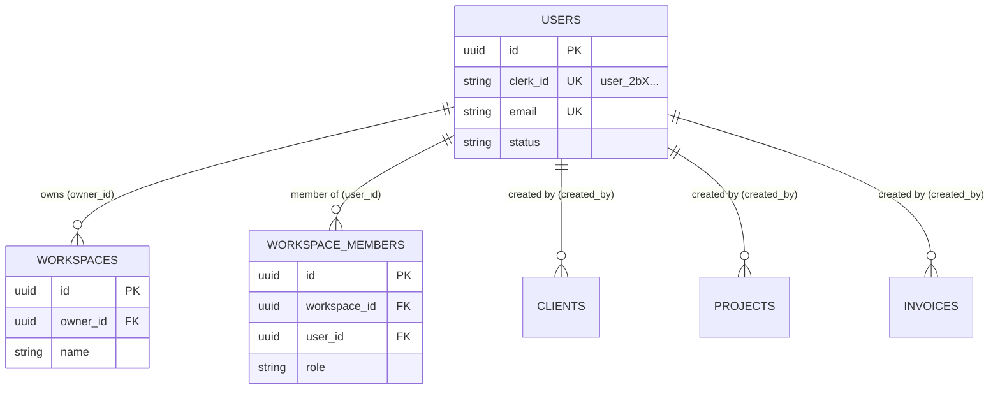

# Database & Identity Persistence Specification

**Document Version:** 1.0  
**Status:** PROPOSED SCHEMA DESIGN (Sprint 5 Phase 0)  
**Target Package:** `packages/database`  

---

## 1. Executive Summary

This document defines the database architecture required for real user authentication in Freelance-OS. It introduces an internal `users` table to bridge external Clerk Identity Provider strings (`user_2bX...`) with internal PostgreSQL `UUID` primary keys used throughout the codebase.

---

## 2. Proposed `users` Table Schema

```ts
import { pgTable, uuid, varchar, timestamp, index, uniqueIndex } from 'drizzle-orm/pg-core';

export const userStatusEnum = pgEnum('user_status', ['active', 'suspended', 'deactivated']);

export const usersTable = pgTable(
  'users',
  {
    // Primary Key — Internal UUID referenced by all domain tables
    id: uuid('id').primaryKey().defaultRandom(),

    // External Provider Reference — Clerk User Identifier
    clerkId: varchar('clerk_id', { length: 255 }).notNull().unique(),

    // Identity Fields
    email: varchar('email', { length: 255 }).notNull().unique(),
    firstName: varchar('first_name', { length: 255 }),
    lastName: varchar('last_name', { length: 255 }),
    imageUrl: varchar('image_url', { length: 512 }),

    // Status
    status: userStatusEnum('status').notNull().default('active'),

    // Audit Timestamps
    createdAt: timestamp('created_at', { withTimezone: true }).defaultNow().notNull(),
    updatedAt: timestamp('updated_at', { withTimezone: true }).defaultNow().notNull(),
    deletedAt: timestamp('deleted_at', { withTimezone: true }), // Soft delete
  },
  (table) => ({
    clerkIdIdx: uniqueIndex('idx_users_clerk_id').on(table.clerkId),
    emailIdx: uniqueIndex('idx_users_email').on(table.email),
  })
);
```

---

## 3. Relational Mapping to Domain Schemas



### Relational Foreign Keys:
1. `workspace_members.user_id` ──> `users.id` (UUID)
2. `workspaces.owner_id` ──> `users.id` (UUID)
3. `clients.created_by` / `updated_by` ──> `users.id` (UUID)
4. `projects.created_by` / `updated_by` ──> `users.id` (UUID)
5. `invoices.created_by` / `updated_by` ──> `users.id` (UUID)

---

## 4. User Lifecycle & Sync Engine

### Just-In-Time (JIT) Resolution
During API requests:
```ts
// User Resolution Algorithm (Express Middleware)
const clerkId = req.auth.userId; // From Clerk JWT
let user = await db.select().from(usersTable).where(eq(usersTable.clerkId, clerkId)).first();

if (!user) {
  // First time request after Clerk sign-up: provision local user
  const clerkUser = await clerkClient.users.getUser(clerkId);
  [user] = await db.insert(usersTable).values({
    clerkId,
    email: clerkUser.emailAddresses[0].emailAddress,
    firstName: clerkUser.firstName,
    lastName: clerkUser.lastName,
    imageUrl: clerkUser.imageUrl,
  }).returning();
}

req.user = { id: user.id, clerkId: user.clerkId };
```

---

## 5. Development Seed & Migration Strategy

- **Migration**: To be generated during Sprint 5 Phase 1 using `pnpm --filter @repo/database db:generate`.
- **Development Seed**: Update `apps/api/src/db/seed.ts` to insert a default `users` row with `id: "550e8400-e29b-41d4-a716-446655440000"` so existing test suites and seeding helpers remain 100% functional.
