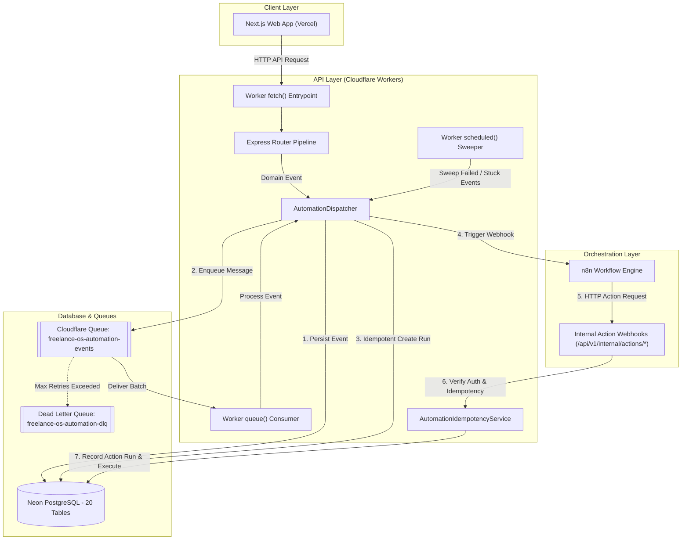

# Freelance OS — Automation Engine Canonical Architecture

> **Document Status**: Production Canonical Architecture  
> **Sprint Reliability Closure**: Sprint 20 Completed & Hardened  
> **Target Audience**: Core Engineering & AI Agent Builders (Sprint 21 Preparation)

---

## 1. System Overview & Runtime Topology

Freelance OS is architected as a distributed modern cloud platform:

- **Frontend (`apps/web`)**: Next.js 14 App Router deployed on Vercel.
- **Backend API (`apps/api`)**: Express running on Cloudflare Workers using Node.js compatibility mode (`nodejs_compat`).
- **AI Intelligence Service (`apps/ai`)**: Python FastAPI RAG and LLM service deployed on Render.
- **Primary Database (`@repo/database`)**: PostgreSQL via Neon Serverless (`@neondatabase/serverless`) utilizing stateless HTTP queries.
- **Workflow Orchestrator**: External n8n service integrated through HTTP webhook triggers and authenticated internal action callbacks.
- **Durable Event Queue**: Cloudflare Queues (`AUTOMATION_QUEUE`) paired with Cloudflare Cron Triggers for scheduled retry sweeping.

---

## 2. Ingestion & Durable Dispatch Protocol

### A. Domain Event Ingestion
When a business action occurs (e.g., `invoice.created`, `proposal.signed`, `client.created`), the domain service constructs a typed `AutomationEventV1` and calls `AutomationDispatcher.dispatchEvent(event)`:

1. **Idempotent DB Insertion**: The event is inserted into `automation_events` with `status = 'pending'`. The database unique constraint on `event_id` ensures exactly-once event recording.
2. **Durable Enqueue**: If the event is in `pending` or `failed` state, it is enqueued into `AUTOMATION_QUEUE` with message payload `{ eventId, workspaceId, eventType, attempt, enqueuedAt }`.
3. **Zero Request-Bound Promises**: No unawaited background promises are attached to the API fetch cycle, preventing Cloudflare Worker lifecycle eviction.

### B. Queue Processing & Worker Lifecycle
When Cloudflare Queue delivers a batch to `worker.ts -> queue()`:
1. The message batch is processed message by message.
2. `AutomationDispatcher.triggerProcessor(eventId)` is invoked.
3. Active automations matching `(workspaceId, eventType)` are queried.
4. For each automation, `createRun()` creates an automation run with `onConflictDoNothing()` on `(automation_event_id, automation_id)`.
5. If the run is new or in `queued`/`failed` state, n8n's webhook is triggered with the full correlation context.
6. Upon completion, `markDispatched(eventId)` marks the event as `dispatched`.
7. `message.ack()` acknowledges successful delivery.

---

## 3. Concurrency, Deduplication & Idempotency Hardening

| Level | Key / Constraint | Database Table | Prevention Mechanism |
|---|---|---|---|
| **Event Level** | `event_id` (Unique) | `automation_events` | `onConflictDoNothing()` on domain event insert |
| **Run Level** | `(automation_event_id, automation_id)` (Unique) | `automation_runs` | `onConflictDoNothing()` prevents duplicate n8n webhook triggers |
| **Action Level** | `(workspace_id, idempotency_key)` (Unique) | `automation_action_runs` | SHA-256 key (`workspaceId:autoId:eventId:actionIdx:version`), short-circuits with `already_completed` |

---

## 4. Error Classification, Backoff & Dead-Lettering

1. **Transient Errors**:
   - HTTP status `5xx`, `429` (Rate Limited).
   - Network socket timeouts, `ECONNREFUSED`, `ETIMEDOUT`, `ECONNRESET`.
   - Action: Event marked `failed` in DB with exponential backoff `nextAttemptAt = now + (attempt^2 * 1 min)`. Cloudflare Queue message is retried with delay.
2. **Permanent Errors**:
   - HTTP status `4xx` (Invalid payload, unresolvable automation).
   - Action: Run marked `failed` with code `N8N_TRIGGER_FAILED`. Event acknowledged to avoid poison-pill loops.
3. **Dead-Letter Exhaustion**:
   - When attempt reaches maximum (3), status transitions to `dead_lettered` in `automation_events` and message is routed to dead-letter queue.
4. **Scheduled Cron Sweeper**:
   - Cloudflare Cron (`*/5 * * * *`) executes `sweepPendingOrRetryableEvents()`, picking up retryable failed events whose backoff expired and stuck pending events (> 5 mins old).

---

## 5. Security & Internal Action Authentication

- **Timing-Safe Service Authentication**: Internal webhook endpoints `/api/v1/internal/actions/*` validate the Bearer token using `crypto.timingSafeEqual` with a constant-time length pre-check.
- **No Secret Leakage**: Secrets and credentials are automatically redacted in structured JSON logger output (`src/utils/logger.ts`).
- **RBAC & Workspace Isolation**: All automation queries strictly enforce `workspaceId` predicate checks.
