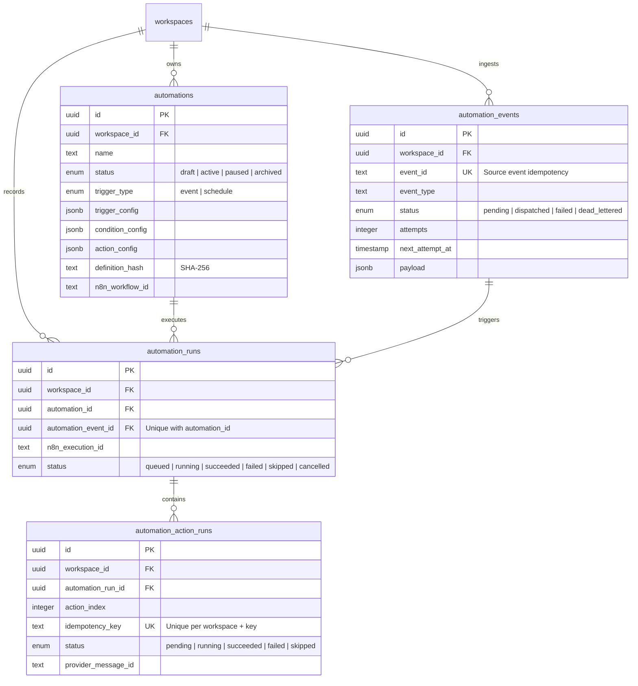

# Freelance OS — Canonical Database Schema Inventory

> **Truth Reconciliation Status**: Verified against active codebase schemas in `packages/database/src/schema/` and migrations in `packages/database/migrations/`.
> **Total Tables**: 20 (Reconciled from previous stale reports claiming 11).
> **Active Migrations**: 13 (0000_glorious_gorilla_man through 0012_add_automation_runs_event_unique).

---

## 1. Complete Table Inventory (20 Tables)

| # | Table Name | Schema File | Primary Key | Description & Domain |
|---|------------|-------------|-------------|----------------------|
| 1 | `users` | `users.ts` | `id` (uuid) | User accounts, Clerk auth link, role, status |
| 2 | `workspaces` | `workspaces.ts` | `id` (uuid) | Multi-tenant workspace entities |
| 3 | `workspace_members` | `workspaces.ts` | `id` (uuid) | Workspace membership & RBAC (owner, admin, member, viewer) |
| 4 | `clients` | `clients.ts` | `id` (uuid) | Client contacts, billing details, status |
| 5 | `projects` | `projects.ts` | `id` (uuid) | Project entities, budget, state machine, dates |
| 6 | `project_deliverables` | `project_deliverables.ts` | `id` (uuid) | Granular deliverable milestones within projects |
| 7 | `change_orders` | `change_orders.ts` | `id` (uuid) | Scope change order proposals, hours impact, client approval |
| 8 | `invoices` | `invoices.ts` | `id` (uuid) | Invoices, amounts, statuses, due dates |
| 9 | `invoice_items` | `invoices.ts` | `id` (uuid) | Line items linked to invoices & deliverables |
| 10 | `scope_analyses` | `scope_analyses.ts` | `id` (uuid) | AI Scope generation inputs, JSON outputs, confirmation |
| 11 | `drift_analyses` | `drift_analyses.ts` | `id` (uuid) | AI Scope drift evaluations, impact metrics, recommendations |
| 12 | `activity_events` | `activity.ts` | `id` (uuid) | Audit log and workspace domain activity stream |
| 13 | `communication_channels` | `communication.ts` | `id` (uuid) | WhatsApp / Email channel configuration per workspace |
| 14 | `communication_messages` | `communication.ts` | `id` (uuid) | Outbound/inbound communication message records |
| 15 | `communication_events` | `communication.ts` | `id` (uuid) | Webhook delivery events (delivered, read, failed) |
| 16 | `communication_preferences` | `communication.ts` | `id` (uuid) | Client communication channel opt-in preferences |
| 17 | `automations` | `automations.ts` | `id` (uuid) | Automation definitions, trigger/condition/action configs, n8n ref |
| 18 | `automation_events` | `automations.ts` | `id` (uuid) | Ingested domain events for at-least-once automation dispatch |
| 19 | `automation_runs` | `automations.ts` | `id` (uuid) | Individual workflow execution runs per automation |
| 20 | `automation_action_runs` | `automations.ts` | `id` (uuid) | Granular action execution state & idempotency tracking |

---

## 2. Migration Journal (0000 – 0012)

1. `0000_glorious_gorilla_man.sql` — Initial schema (users, baseline enums)
2. `0001_init_workspaces.sql` — Workspaces and workspace members
3. `0002_add_clients.sql` — Client management tables
4. `0003_add_projects.sql` — Core project domain tables
5. `0004_add_invoices.sql` — Invoicing and invoice items
6. `0005_add_activity_events.sql` — Activity feed audit logging
7. `0006_amazing_ma_gnuci.sql` — Scope analysis persistence
8. `0007_boring_snowbird.sql` — Drift analysis tables
9. `0008_add_project_deliverables.sql` — Project deliverable breakdown
10. `0009_add_change_orders.sql` — Project change order management
11. `0010_add_communication_hub.sql` — Communication channels, messages, and preferences
12. `0011_good_vin_gonzales.sql` — Automation tables (`automations`, `automation_events`, `automation_runs`, `automation_action_runs`)
13. `0012_add_automation_runs_event_unique.sql` — Sprint 20 Reliability: Unique constraint on `(automation_event_id, automation_id)` for run-level idempotency

---

## 3. Automation Subsystem Schema & Invariants

