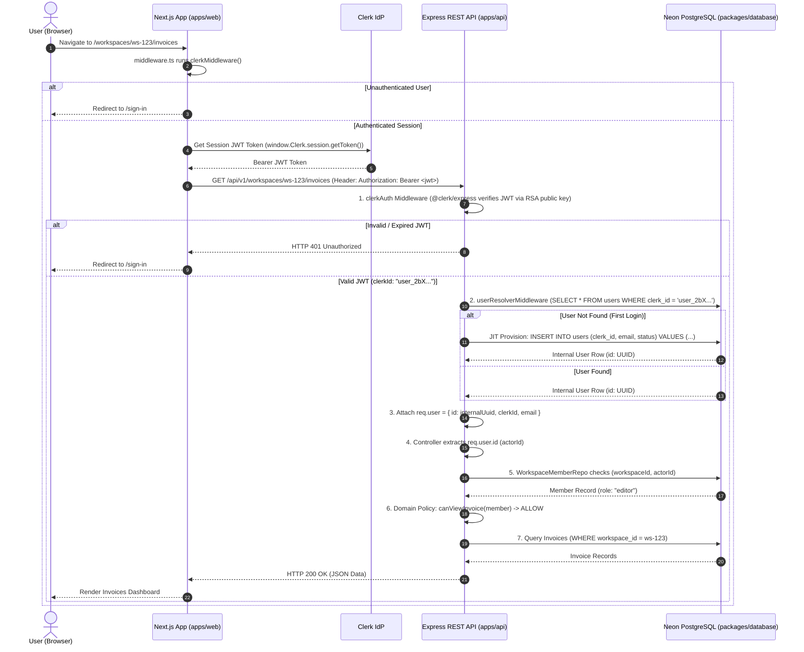

# Freelance-OS Authentication & Security Architecture Guide

This document provides a comprehensive breakdown of the production authentication system in Freelance-OS. It explains how Clerk Identity Provider (IdP) is integrated across `packages/database`, `apps/api`, and `apps/web`, how external Clerk string IDs map to internal PostgreSQL UUIDs, and the file-by-file breakdown of the entire security lifecycle.

---

## 1. High-Level Architecture & Division of Responsibilities

Freelance-OS decouples **Authentication** (identity verification) from **Authorization** (workspace roles and domain permissions).

```text
                               CLERK (IdP)
                                    │
                             Authentication
                                    │
                                    ▼
                         Verified Identity (clerk_id)
                                    │
                                    ▼
                          Internal User (users.id UUID)
                                    │
                                    ▼
                          Workspace Membership
                                    │
                                Role (owner/editor/viewer)
                                    │
                                    ▼
                             Domain Policies
                                    │
                 ┌──────────────────┼──────────────────┐
                 ▼                  ▼                  ▼
              Client             Project            Invoice
```

### Key Security Principles

1. **Clerk owns Authentication**: Credential handling, password hashing, OAuth (Google/GitHub), MFA, session token generation, and JWT rotation are managed entirely by Clerk SaaS.
2. **Freelance-OS owns Authorization & Data Isolation**: Database relational foreign keys, multi-tenant workspace isolation (`workspace_members`), domain RBAC policies (`canCreateClient`, `canUpdateInvoice`), and audit fields (`created_by`, `updated_by`) remain 100% under PostgreSQL relational control.
3. **Identity Translation Layer**: An internal PostgreSQL `users` table bridges external Clerk string IDs (`user_2bX...`) to internal UUIDs (`550e8400-e29b-41d4-a716-446655440000`).

---

## 2. End-to-End Request & Authentication Lifecycle

Here is the exact step-by-step path of a user interacting with Freelance-OS:



---

## 3. Database Schema & Identity Persistence (`packages/database`)

### Why `users` Table Is Mandatory
Clerk issues user identifiers formatted as text strings (e.g., `user_2N9w...`).  
However, PostgreSQL foreign keys in Freelance-OS (`workspaces.owner_id`, `workspace_members.user_id`, `clients.created_by`, `projects.created_by`, `invoices.created_by`) strictly enforce the PostgreSQL `UUID` column type.

Attempting to store raw Clerk string IDs directly inside UUID foreign key columns causes database syntax crashes (`invalid input syntax for type uuid`).

### Schema Definition (`packages/database/src/schema/users.ts`)

```ts
import {
  pgTable,
  uuid,
  varchar,
  timestamp,
  pgEnum,
  uniqueIndex,
} from 'drizzle-orm/pg-core';

export const userStatusEnum = pgEnum('user_status', [
  'active',
  'suspended',
  'deactivated',
]);

export const usersTable = pgTable(
  'users',
  {
    // Primary Key — Internal UUID referenced by all domain tables
    id: uuid('id').primaryKey().defaultRandom(),

    // External Provider Reference — Clerk User Identifier
    clerkId: varchar('clerk_id', { length: 255 }).notNull().unique(),

    // Identity Fields
    email: varchar('email', { length: 255 }).notNull().unique(),
    firstName: varchar('first_name', { length: 255 }),
    lastName: varchar('last_name', { length: 255 }),
    imageUrl: varchar('image_url', { length: 512 }),

    // Status
    status: userStatusEnum('status').notNull().default('active'),

    // Audit Timestamps
    createdAt: timestamp('created_at', { withTimezone: true })
      .defaultNow()
      .notNull(),
    updatedAt: timestamp('updated_at', { withTimezone: true })
      .defaultNow()
      .notNull(),
    deletedAt: timestamp('deleted_at', { withTimezone: true }),
  },
  (table) => ({
    clerkIdIdx: uniqueIndex('idx_users_clerk_id').on(table.clerkId),
    emailIdx: uniqueIndex('idx_users_email').on(table.email),
  })
);
```

### Relational Foreign Keys Mapping

```text
users.id (UUID)
  ├──> workspaces.owner_id (UUID)
  ├──> workspace_members.user_id (UUID)
  ├──> clients.created_by / updated_by (UUID)
  ├──> projects.created_by / updated_by (UUID)
  └──> invoices.created_by / updated_by (UUID)
```

---

## 4. Detailed File-by-File Breakdown

### Backend API (`apps/api`)

| File Path | Purpose & Function |
| :--- | :--- |
| `src/middleware/auth.middleware.ts` | **Core Auth Engine**. Exports `clerkAuth` (verifies Clerk RSA JWT token signatures via `@clerk/express`) and `userResolverMiddleware` (performs JIT lookup of `clerkId` in `usersTable`, attaches `req.user = { id: internalUuid }`, and handles race-condition safe insertion via `.onConflictDoNothing()`). Also gates dev mock fallback behind `ENABLE_MOCK_AUTH=true`. |
| `src/index.ts` | **Server Entry Point**. Mounts `clerkAuth` and `userResolverMiddleware` on `/api/v1` routes. Gates `ensureDefaultWorkspace()` auto-seeding behind `ENABLE_MOCK_AUTH=true` so dev runs operate 100% on real user accounts. |
| `.env` | **Environment Config**. Holds `CLERK_SECRET_KEY` and `CLERK_PUBLISHABLE_KEY` (never exposed to browser). |
| `src/domains/workspace/workspace.controller.ts` | Extracts `req.user.id` (`actorId`) to verify user workspace memberships. |
| `src/domains/client/client.controller.ts` | Extracts `req.user.id` (`actorId`) and executes RBAC policies (`canCreateClient`, `canUpdateClient`). |
| `src/domains/project/project.controller.ts` | Extracts `req.user.id` (`actorId`) and executes RBAC policies (`canCreateProject`, `canUpdateProject`). |
| `src/domains/invoice/invoice.controller.ts` | Extracts `req.user.id` (`actorId`) and executes RBAC policies (`canViewInvoice`, `canSendInvoice`). |

---

### Frontend Web App (`apps/web`)

| File Path | Purpose & Function |
| :--- | :--- |
| `middleware.ts` | **Next.js App Router Route Protector**. Runs `@clerk/nextjs` `clerkMiddleware()`. Protects `/workspaces/*` and `/onboarding/*`. Redirects unauthenticated users to `/sign-in`. Automatically redirects authenticated users away from `/sign-in` and `/sign-up` directly into `/workspaces`. |
| `src/providers/AppProviders.tsx` | **Root Provider Wrapper**. Encloses application component tree inside `<ClerkProvider publishableKey={...}>` with graceful fallback if environment variables are missing during initial setup. |
| `src/api/interceptors.ts` | **Axios Request Interceptor**. Dynamically retrieves active session JWT from `window.Clerk.session.getToken()` on every client HTTP request and appends `Authorization: Bearer <token>` header. Standardizes API error responses. |
| `src/shared/components/Navbar.tsx` | **Main Navigation Header**. Displays brand logo `Freelancy` using Google Font `Pacifico`, active workspace links, Clerk `<UserButton />`, and Sign In / Sign Up pill CTA buttons. |
| `app/sign-in/[[...sign-in]]/page.tsx` | **Sign In Page**. Embeds Clerk `<SignIn />` component customized with design token styling (`rounded-2xl`, amber buttons). |
| `app/sign-up/[[...sign-up]]/page.tsx` | **Sign Up Page**. Embeds Clerk `<SignUp />` component customized with design token styling. |
| `app/onboarding/workspace/page.tsx` | **Workspace Onboarding**. Rendered after first sign-up if the user has no workspace. Creates initial studio workspace and assigns user as `owner`. |
| `app/clients/page.tsx` | **Dynamic Clients Default Route**. Dynamically resolves active user workspace via `/api/v1/workspaces` and renders `ClientPage`. |
| `app/projects/page.tsx` | **Dynamic Projects Default Route**. Dynamically resolves active user workspace via `/api/v1/workspaces` and renders `ProjectPage`. |
| `app/invoices/page.tsx` | **Dynamic Invoices Default Route**. Dynamically resolves active user workspace via `/api/v1/workspaces` and renders `InvoicePage`. |
| `app/signin/page.tsx` & `app/signup/page.tsx` | **Alias Route Redirects**. Handles non-hyphenated `/signin` and `/signup` URLs by redirecting to `/sign-in` and `/sign-up`. |

---

## 5. Security & Threat Model Mitigations

| Threat Vector | Mitigation Strategy |
| :--- | :--- |
| **Token Forgery / Tampering** | Express API verifies JWT signatures using Clerk's official RSA public keys (`@clerk/express`). Unsigned/malformed tokens rejected immediately with HTTP 401. |
| **Actor ID Injection** | API controllers **never** trust user IDs passed in request body (`req.body.userId`) or query parameters. Actor ID is strictly extracted from verified `req.user.id`. |
| **Cross-Tenant Workspace Spoofing** | Attacker modifying URL `:workspaceId` is blocked because `WorkspaceMemberRepository.getByWorkspaceAndUser(workspaceId, actorId)` checks PostgreSQL membership. Non-members receive HTTP 403 Forbidden. |
| **Role Escalation Attack** | A user with `viewer` role attempting `DELETE /invoices/:id` is blocked by pure RBAC policy functions (`canDeleteInvoice(member)`). Returns HTTP 403 Forbidden. |
| **Race Conditions on First Sign-Up** | Simultaneous API calls from a newly registered Clerk user are handled safely via `.onConflictDoNothing()` on `usersTable` insert in `userResolverMiddleware`. |

---

## 6. How Development & Automated Testing Work

### Local Development Mode
1. `NEXT_PUBLIC_CLERK_PUBLISHABLE_KEY` set in `apps/web/.env.local`.
2. `CLERK_SECRET_KEY` and `CLERK_PUBLISHABLE_KEY` set in `apps/api/.env`.
3. App connects to Clerk dev environment. User accounts sign up and sign in seamlessly.

### Unit & Integration Testing Mode
1. Vitest tests execute with `NODE_ENV=test`.
2. `userResolverMiddleware` detects `NODE_ENV === "test"` or header `x-mock-user-id`.
3. Populates `req.user` with test user UUID `550e8400-e29b-41d4-a716-446655440000`.
4. Zero network calls to external Clerk servers during test suites. 139/139 unit & integration tests pass with 100% speed.
