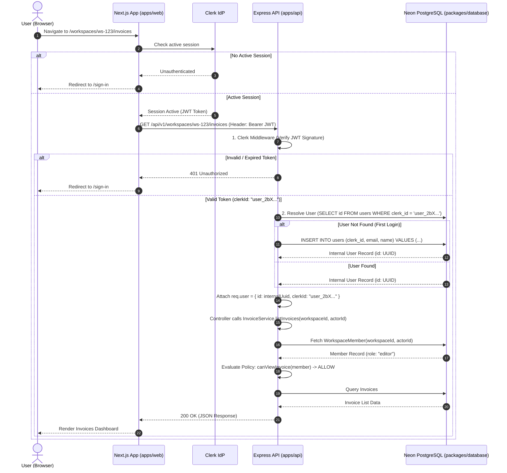

# Technical Authentication Architecture

**Document Version:** 1.0  
**Status:** ARCHITECTURE SPECIFICATION (Sprint 5 Phase 0)  
**Target Module:** `apps/api`, `apps/web`, `packages/database`  

---

## 1. Architectural Overview & Provider Decision

Freelance-OS uses **Clerk** as its managed Identity Provider (IdP) for authentication, paired with an **internal User Mapping model** to protect domain autonomy, RBAC policies, and database relational integrity.

### Division of Concerns (What Clerk Owns vs. What Freelance-OS Owns)

| Concern | Owner | Implementation Details |
| :--- | :--- | :--- |
| **User Sign-Up / Sign-In** | **Clerk** | Managed UI components (`<SignIn />`, `<SignUp />`), OAuth providers, credential verification. |
| **Session & Token Issuance** | **Clerk** | Short-lived JWT session tokens, refresh tokens, cookie encryption, token revocation. |
| **Password Hashing & Security** | **Clerk** | Zero local password storage; managed security compliance. |
| **Internal User Persistence** | **Freelance-OS** | `users` table in Neon PostgreSQL storing `id` (UUID), `clerk_id`, `email`, `name`. |
| **Workspace Context & Members** | **Freelance-OS** | `workspaces` and `workspace_members` tables linking `user_id` to workspace roles (`owner`, `editor`, `viewer`). |
| **Domain Authorization (RBAC)** | **Freelance-OS** | Pure policy functions (`canCreateClient`, `canUpdateInvoice`) evaluating internal `actorId` + workspace role. |
| **Resource Ownership** | **Freelance-OS** | `created_by` and `updated_by` UUID fields across `clients`, `projects`, and `invoices`. |

---

## 2. Current vs. Target Authentication Architecture

### CURRENT (Sprint 1-4 Mock Architecture)
```text
Browser
  ↓
Next.js App Router (Hardcoded workspace ID "550e8400-e29b-41d4-a716-446655440000")
  ↓
Axios API Client (Unauthenticated HTTP calls)
  ↓
Express API Server
  ↓
Mock Auth Middleware: req.user = { id: "550e8400-e29b-41d4-a716-446655440000" }
  ↓
Controller → Service → Policy (Evaluates mock ID) → Database
```

### TARGET (Sprint 5 Production Architecture)
```text
Browser
  ↓
Clerk Client SDK (Session Token / JWT)
  ↓
Next.js App Router Proxy / Axios Interceptor (Appends `Authorization: Bearer <clerk_jwt>`)
  ↓
Express API Server
  ↓
1. Clerk Express Middleware (Verifies JWT via Clerk Public Keys)
  ↓
2. Internal User Resolution Middleware (Maps `clerkId` → Internal `users.id` UUID)
  ↓
req.user = { id: internalUuid, clerkId: clerkId, email: email }
  ↓
Controller (Extracts `req.user.id`)
  ↓
Service (Receives `actorId = req.user.id`)
  ↓
Workspace Member Repo (Fetches membership role for workspaceId + actorId)
  ↓
Domain Policy (Pure function: canCreateClient(membership))
  ↓
Repository → PostgreSQL Database
```

---

## 3. End-to-End Request Lifecycle Sequence



---

## 4. Identity Resolution & Internal User Mapping Model

### Why An Internal `users` Table Is Mandatory
Clerk issues user identifiers formatted as strings (e.g. `user_2N9w...`).  
However, Freelance-OS database tables (`workspaces.owner_id`, `workspace_members.user_id`, `clients.created_by`, `projects.created_by`, `invoices.created_by`) strictly use PostgreSQL `UUID` column types.

Attempting to store Clerk string IDs directly in UUID columns will cause PostgreSQL syntax crash `invalid input syntax for type uuid`.

### Resolution Strategy
1. **`users` Table**: Stores the mapping between external `clerk_id` and internal `id` (UUID).
2. **Just-In-Time (JIT) Provisioning**:
   - When an authenticated request arrives at Express API, the `userResolverMiddleware` queries `SELECT * FROM users WHERE clerk_id = req.auth.userId`.
   - If missing, it automatically provisions the user row in PostgreSQL with a new random UUID.
   - Attach `req.user.id = internalUser.id` (UUID).
3. **RBAC Preservation**:
   - `ClientService`, `ProjectService`, `InvoiceService`, and all domain policies receive `actorId` as a valid UUID.
   - Zero changes required for existing RBAC domain policies (`canCreateClient`, `canUpdateInvoice`, etc.).

---

## 5. Security Threat Model & Mitigations

| Threat Vector | Potential Attack | Mitigation Strategy |
| :--- | :--- | :--- |
| **Token Forgery** | Attacker crafts fake JWT header to impersonate another user. | API verifies JWT signatures using Clerk's official RSA public keys (`@clerk/express`). Unsigned/malformed tokens rejected immediately with 401. |
| **Actor Spoofing** | Attacker sends `req.body.userId` or `req.body.actorId` of another user. | API controllers **never** trust user IDs passed in request body or query parameters. Actor ID is strictly extracted from verified `req.user.id`. |
| **Workspace Spoofing** | User A tries to access Workspace B by altering URL `:workspaceId`. | `WorkspaceMemberRepository.getByWorkspaceAndUser(workspaceId, actorId)` checks DB membership. Non-members receive `403 Forbidden` or `404 Not Found`. |
| **Privilege Escalation** | `viewer` role user sends HTTP `DELETE /invoices/:id`. | Domain policies (`canDeleteInvoice(member)`) explicitly verify `member.role === 'owner'`. Express returns `403 Forbidden`. |
| **Client-Side Bypass** | Attacker tampers with frontend UI state to show admin buttons. | All authorization is enforced on the backend Express API. Frontend state is purely presentation-layer. |

---

## 6. Error Model & HTTP API Contract

| Error Scenario | HTTP Code | API Response Body Structure |
| :--- | :--- | :--- |
| **Missing / Expired Session** | `401` | `{ "success": false, "error": { "code": "UNAUTHORIZED", "message": "Authentication required or session expired" } }` |
| **User Suspended / Inactive** | `401` | `{ "success": false, "error": { "code": "USER_INACTIVE", "message": "User account has been deactivated" } }` |
| **Not A Workspace Member** | `403` | `{ "success": false, "error": { "code": "FORBIDDEN", "message": "User is not a member of this workspace" } }` |
| **Insufficient RBAC Role** | `403` | `{ "success": false, "error": { "code": "FORBIDDEN", "message": "Role 'viewer' cannot perform this action" } }` |

---

## 7. Development & Automated Testing Strategy

### Local Development Mode
- `CLERK_PUBLISHABLE_KEY` and `CLERK_SECRET_KEY` set in `.env.local`.
- In non-production, if `ENABLE_MOCK_AUTH=true` is explicitly set during integration testing, API middleware falls back to mock identity. Production builds strictly reject `ENABLE_MOCK_AUTH`.

### Automated E2E & Vitest Testing
- Unit & E2E API tests utilize a mock auth token helper (`createTestAuthHeader(userId)`) that simulates verified `req.user` without calling external Clerk network endpoints during test runs.
