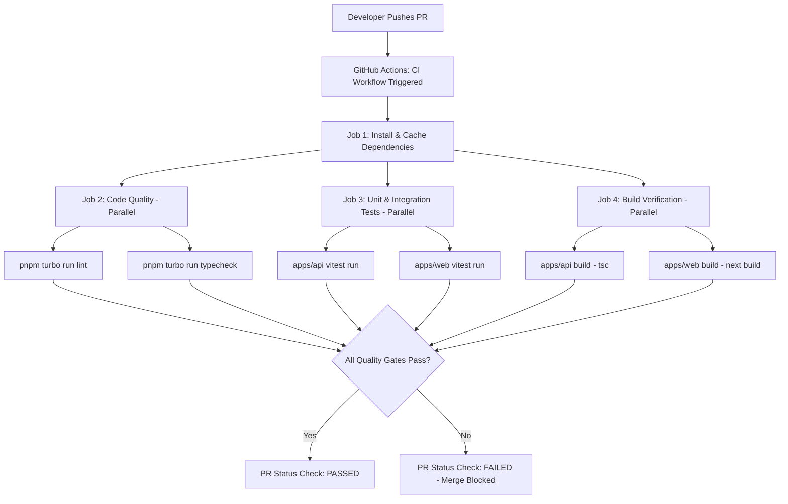
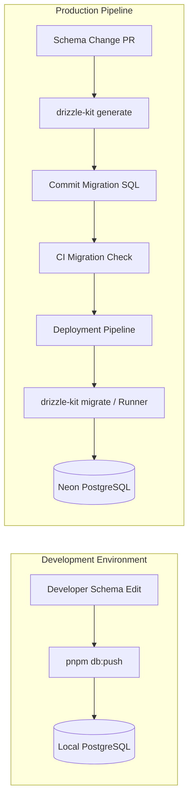
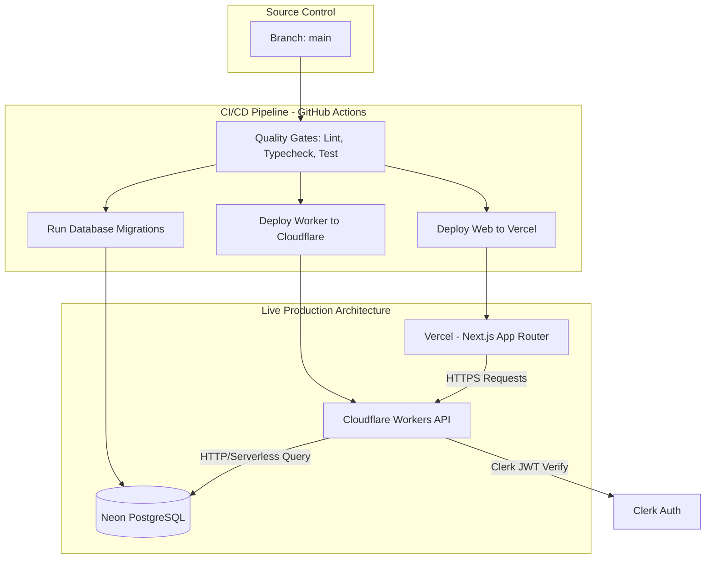
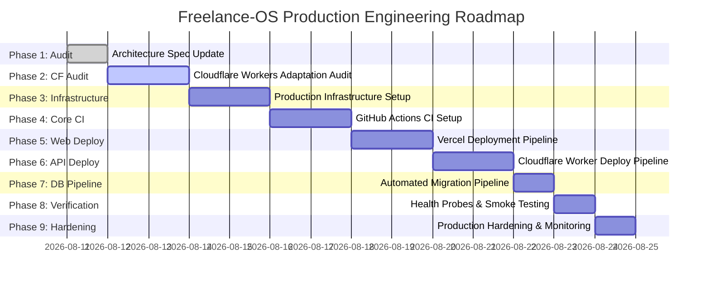

# CI/CD Pipeline Architecture & Production Engineering Specification

## 1. Executive Summary & Purpose

This document defines the architectural contract for the future GitHub Actions CI/CD pipeline and production engineering workflow for **Freelance-OS**.

Currently, local development relies on `pnpm dev` with mock authentication and direct database schema pushing (`pnpm db:push`). To evolve into an enterprise-grade SaaS application, Freelance-OS requires an automated, reproducible, and secure Continuous Integration and Continuous Deployment (CI/CD) pipeline.

### Target Production Stack

- **Frontend**: Next.js App Router (v16) deployed on **Vercel**.
- **Backend API**: Express 4 TypeScript backend deployed on **Cloudflare Workers**.
- **Database**: Serverless PostgreSQL hosted on **Neon**.
- **ORM**: **Drizzle ORM**.
- **Authentication**: **Clerk IdP** (Production Tenant).
- **CI/CD Automation**: **GitHub Actions**.

```text
                         GitHub
                           │
                    GitHub Actions
                           │
              ┌────────────┴────────────┐
              │                         │
              ▼                         ▼
           Vercel                  Cloudflare
         Next.js Web              Workers API
              │                         │
              │                         │
              └──────────┬──────────────┘
                         │
                       Clerk
                         │
                         ▼
                       Neon
                    PostgreSQL
```

---

## 2. Monorepo Build & Package Audit

### Package & Script Matrix

The following table reflects the **actual** scripts configured across all workspaces in `package.json`:

| Package / App | Path | Build | Typecheck | Lint | Test | Dev | E2E |
| :--- | :--- | :--- | :--- | :--- | :--- | :--- | :--- |
| **Root Workspace** | `/` | `turbo run build` | `turbo run typecheck` | `turbo run lint` | `turbo run test` | `turbo run dev` | N/A |
| **`web`** | `apps/web` | `next build` | `tsc --noEmit` | `eslint` | `vitest` | `next dev -p 5000` | Missing Config / Script |
| **`@repo/api`** | `apps/api` | `tsc` | `tsc --noEmit` | `biome check src/` | `vitest run` | `tsx watch src/index.ts` | N/A |
| **`@repo/database`** | `packages/database` | *None* | `tsc --noEmit` | *None* | *None* | *None* (`db:push`) | N/A |
| **`@repo/biome-config`**| `packages/biome-config` | *None* | *None* | *None* | *None* | *None* | N/A |
| **`@repo/eslint-config`**| `packages/eslint-config` | *None* | *None* | *None* | *None* | *None* | N/A |
| **`@repo/tsconfig`** | `packages/tsconfig` | *None* | *None* | *None* | *None* | *None* | N/A |

### Discrepancy & Documentation Audit Report

| Document / Prompt Expectation | Actual Repository Implementation | Audit Findings & Difference | Action Plan / Recommendation |
| :--- | :--- | :--- | :--- |
| `packages/shared` package | Not present | Package does not exist in `packages/`. | Common types are currently co-located in `apps/api` and `apps/web`. |
| `packages/validation` package | Not present | Package does not exist in `packages/`. | Zod schemas exist locally in domain subdirectories in `apps/api/src/domains/*`. |
| Playwright E2E Testing | `apps/web/e2e/client.spec.ts` exists | No `playwright.config.ts` in `apps/web`. `@playwright/test` is missing from `apps/web/package.json` `devDependencies`. No `pnpm test:e2e` script. | E2E setup is incomplete. Requires adding `@playwright/test`, config file, and CI Playwright runner task. |
| Node.js / pnpm Version | `packageManager: pnpm@10.30.1`, `engines.node: >=20.0.0` | No `.nvmrc` or `.volta` pins present at root. | Add `.nvmrc` containing `20` to guarantee identical Node runtime across local & CI. |
| Database Migration Script | `drizzle-kit push:pg` (`db:push`) | `db:push` modifies schema directly without tracking migration files. | Add formal `db:migrate` script running `drizzle-kit migrate` for production environments. |

---

## 3. Cloudflare Workers Compatibility Audit (`apps/api`)

> [!WARNING]
> **Cloudflare Workers Compatibility Mandate**: Cloudflare Workers is a serverless V8 isolate runtime, not a traditional Node.js process environment. Cloudflare Workers compatibility must be verified against the actual `apps/api` dependency graph and runtime behavior before production deployment.

### Dependency & API Compatibility Breakdown

| Component / Dependency | Current API Implementation | Workers Compatibility Status | Required Adaptation |
| :--- | :--- | :--- | :--- |
| **Server Framework** | `express` (`apps/api/src/index.ts`) | **Requires Adaptation** | Wrap Express in a Worker fetch handler (e.g. `@hono/express` adapter or Cloudflare Worker fetch wrapper with `nodejs_compat`). |
| **Server Process Entry** | `app.listen(PORT)` | **Requires Adaptation** | Export default `{ fetch(request, env, ctx) }` handler instead of calling `app.listen()`. |
| **Database Driver** | `postgres` (`postgres.js`) via `drizzle-orm/postgres-js` | **Requires Adaptation** | `postgres.js` uses Node TCP sockets (`net`/`tls`). Must switch to `@neondatabase/serverless` (HTTP/WebSocket) with `drizzle-orm/neon-http` or Cloudflare Socket API. |
| **Environment Variables**| `dotenv/config` reading `process.env` | **Compatible with Flag** | Requires `nodejs_compat` flag in Wrangler configuration to expose bindings via `process.env` or binding objects. |
| **Authentication SDK** | `@clerk/express` middleware | **Potentially Compatible** | Verify `@clerk/express` or `@clerk/backend` execution inside Workers environment under `nodejs_compat`. |

### Cloudflare Hyperdrive Strategy

- **Initial Deployment Approach**: Direct Worker-to-Neon connection utilizing `@neondatabase/serverless` HTTP driver.
- **Future Optimization**: Evaluate Cloudflare Hyperdrive only if database connection management, query latency, or scaling limits justify adding connection pooling middleware.

---

## 4. Turborepo Orchestration & Caching Analysis

### Current `turbo.json` Tasks Configuration

```json
{
  "tasks": {
    "build": {
      "dependsOn": ["^build"],
      "outputs": ["dist/**", ".next/**"]
    },
    "typecheck": {
      "dependsOn": ["^typecheck"]
    },
    "lint": {},
    "test": {},
    "dev": {
      "cache": false,
      "persistent": true
    }
  }
}
```

### Dependency Graph & Execution Order

1. **`build`**: Topological dependency (`^build`). Internal packages (`@repo/database`, `@repo/tsconfig`) must be built before dependent applications (`web`, `@repo/api`) build.
2. **`typecheck`**: Topological dependency (`^typecheck`). Ensures base TypeScript definitions compile cleanly before dependent packages typecheck.
3. **`lint` & `test`**: Parallelizable per package.

### CI Execution Strategy: `turbo run` vs Package-Specific Commands

GitHub Actions MUST invoke Turbo root scripts (`pnpm turbo run <task>`) to leverage cache efficiency, automatic dependency graph resolution, and parallel worker execution across jobs.

---

## 5. Pull Request (PR) CI Pipeline Design



### Recommended Workflow Job Matrix & Quality Gates

| Quality Gate | Tool / Script | Status | Rationale |
| :--- | :--- | :--- | :--- |
| **Dependency Install** | `pnpm install --frozen-lockfile` | **BLOCKING** | Lockfile must be synchronized and reproducible. |
| **TypeScript Compilation** | `pnpm typecheck` (`tsc --noEmit`) | **BLOCKING** | Zero type errors allowed across web, api, database. |
| **Linter Compliance** | `pnpm lint` (Biome & ESLint) | **BLOCKING** | Code style, syntax, and formatting rules must pass cleanly. |
| **Unit & Service Tests** | `pnpm test` (Vitest) | **BLOCKING** | All domain services, repositories, and UI tests must pass 100%. |
| **Production Build** | `pnpm build` (`tsc` + `next build`)| **BLOCKING** | Catch build-time dynamic import or bundling errors before merge. |
| **Database Migration Dry-Run**| `drizzle-kit generate` check | **BLOCKING** | Ensures schema changes match committed SQL migrations. |
| **End-to-End (E2E) Tests** | Playwright | **NON-BLOCKING (Phase 1-3)**<br>**BLOCKING (Phase 4+)** | Requires test database & Clerk mock tenant; blocked until Phase 3 infrastructure complete. |

---

## 6. Database CI & Production Safety Strategy

### Development vs Production Paradigms



### Safety Constraints

1. **`db:push` Prohibition**: `drizzle-kit push:pg` is strictly forbidden in CI, Staging, and Production environments.
2. **Formal SQL Migrations**: All schema modifications MUST be captured in `packages/database/migrations/*.sql` using `pnpm db:generate`.
3. **Automated Migration Runner**: Production deployments execute `drizzle-kit migrate` (via a migration runner job) against the target database before starting application processes.
4. **Isolated Test Database in CI**: CI test runs must NEVER connect to development or production database instances.

---

## 7. Web & API Deployment Architecture



### Hosting Target & Deployment Integration Analysis

| Component | Target Platform | Deployment Strategy | Build Command | Output / Runtime |
| :--- | :--- | :--- | :--- | :--- |
| **`apps/web`** | **Vercel** | GitHub Actions trigger or Vercel Git Integration | `pnpm --filter=web build` | Next.js App Router (v16) |
| **`apps/api`** | **Cloudflare Workers** | GitHub Actions invoking `wrangler deploy` | `pnpm --filter=@repo/api build` | Cloudflare Worker (V8 Isolate) |
| **Database** | **Neon PostgreSQL** | Migration Runner (`drizzle-kit migrate`) | `pnpm --filter=@repo/database db:migrate` | Serverless PostgreSQL 15+ |

### Rejected Alternatives

- **Railway / Render**: Evaluated for Node.js container hosting. Rejected in favor of Cloudflare Workers for edge execution, global latency benefits, and serverless scaling.
- **Docker / Kubernetes**: Over-engineered for early SaaS requirements.

---

## 8. Health Checks & CORS Architecture

### Health Endpoint Specification

- **Liveness Check**: Existing `/health` endpoint returning `{ status: "ok" }`.
- **Readiness Check (Required Before Production)**: `GET /health/ready` verifying database connectivity:
  ```typescript
  app.get("/health/ready", async (req, res) => {
    try {
      await db.execute(sql`SELECT 1`);
      res.json({ status: "ready", database: "connected" });
    } catch (err) {
      res.status(503).json({ status: "unhealthy", database: "disconnected" });
    }
  });
  ```

### Production CORS Rules

- Allowed Origin: Set `FRONTEND_URL` strictly to `https://app.freelance-os.com` (Vercel production origin).
- Wildcard origin (`*`) is forbidden for authenticated routes.

---

## 9. Comprehensive Implementation Roadmap



### Phase Details

#### Phase 1 — Infrastructure Documentation (COMPLETE)
- **Goal**: Document target architecture (Vercel + Cloudflare Workers + Neon + Clerk + GitHub Actions).

#### Phase 2 — Cloudflare Workers Compatibility Audit & Adaptation (NEXT PHASE)
- **Goal**: Audit `apps/api` for Node dependencies, adapt Express server entry point to Workers fetch handler, update Drizzle driver to `@neondatabase/serverless`.

#### Phase 3 — Production Infrastructure Setup
- **Goal**: Provision Neon production DB, Clerk production tenant, Vercel web project, Cloudflare Workers service.

#### Phase 4 — GitHub Actions CI Workflow
- **Goal**: Implement `.github/workflows/ci.yml` enforcing quality gates on PRs.

#### Phase 5 — Vercel Web Deployment Pipeline
- **Goal**: Configure automated Vercel deployment pipeline for `apps/web`.

#### Phase 6 — Cloudflare Worker API Deployment Pipeline
- **Goal**: Configure Wrangler deployment pipeline for `apps/api` Workers service.

#### Phase 7 — Production Database Migration Pipeline
- **Goal**: Implement automated `drizzle-kit migrate` pre-deployment execution job.

#### Phase 8 — Health Probes & Smoke Testing
- **Goal**: Implement readiness probes and post-deployment smoke tests.

#### Phase 9 — Production Hardening & Rollback Verification
- **Goal**: Verify instantaneous rollback protocols on Vercel and Cloudflare.
