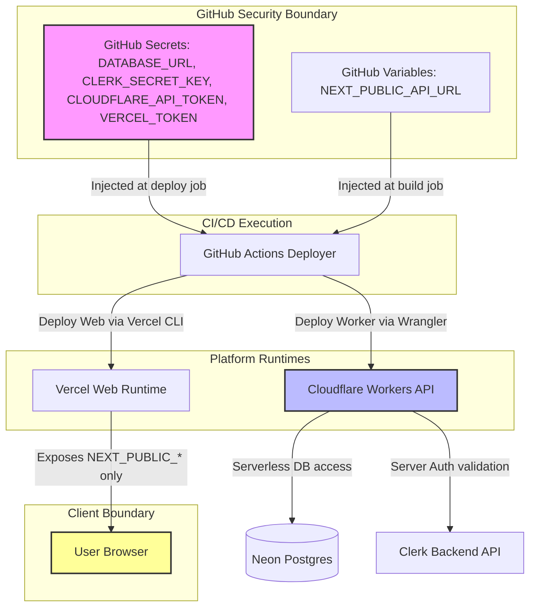
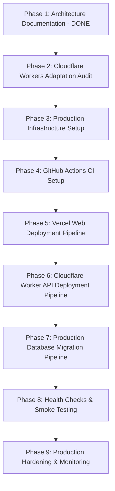

# Production Infrastructure Setup & Configuration Plan

## 1. Purpose & Scope

This document specifies the exact, step-by-step infrastructure setup and environment configuration required before implementing GitHub Actions CI/CD workflows and executing production deployments for **Freelance-OS**.

It translates the architecture defined in [`ci-cd-architecture.md`](file:///c:/Users/kirti/coding/Freelance-OS/docs/07-development/ci-cd-architecture.md) and [`production-environment-guide.md`](file:///c:/Users/kirti/coding/Freelance-OS/docs/07-development/production-environment-guide.md) into a concrete, executable operational plan.

> [!IMPORTANT]
> **Execution Constraint**: This document is an infrastructure preparation manual. Do not create GitHub Actions workflow files (`.github/workflows/*`), deploy code, or modify production infrastructure until this plan has been reviewed and approved.

---

## 2. Infrastructure Inventory

The following table documents all required platform components, their purpose, provider selection, and current setup status:

| Component | Purpose | Selected Provider | Decision Status | Current State | Required Action |
| :--- | :--- | :--- | :--- | :--- | :--- |
| **Source Control & CI** | Code repository & automated workflow runner | **GitHub & GitHub Actions** | `DECIDED` | Active Git repository | Configure repo settings, environments, branch protection, and secrets |
| **Web Hosting** | Next.js App Router (v16) frontend | **Vercel** | `DECIDED` | Local `pnpm dev` on port 5000 | Create Vercel project, connect repo, configure build settings and `NEXT_PUBLIC_` variables |
| **API Hosting** | Express 4 backend server | **Cloudflare Workers** | `DECIDED` | Local `pnpm dev` on port 5001 | Create Cloudflare Worker service, set up `wrangler` config, adapt Express entry, inject secrets |
| **Database** | Serverless PostgreSQL storage | **Neon** | `DECIDED` | Development Neon instance | Create Production Neon project & CI database branch, retrieve connection strings with SSL |
| **Authentication** | Customer identity & session management | **Clerk** | `DECIDED` | Clerk Dev Tenant + Mock Auth | Create Production Clerk Tenant (`pk_live_...`, `sk_live_...`), set allowed domains & origins |
| **Domain & DNS** | Production HTTPS routing | **User DNS Provider** | `REQUIRES USER CONFIGURATION` | Localhost (`localhost:5000`) | Assign custom domain (e.g., `app.freelance-os.com`, `api.freelance-os.com`) or platform default subdomains |

### Rejected Alternatives

- **Railway / Render**: Evaluated for traditional Node.js container hosting. Rejected in favor of Cloudflare Workers to leverage serverless V8 edge execution, zero cold starts, global distribution, and lower operational overhead.

---

## 3. Environment Model & Matrix

| Variable Name | Local Value | CI Value | Production Web | Production API | Storage Location | Secret? |
| :--- | :--- | :--- | :--- | :--- | :--- | :--- |
| `NODE_ENV` | `development` | `test` | `production` | `production` | Platform Environment | No |
| `DATABASE_URL` | Dev Neon URL | CI Test DB URL | N/A | Prod Neon DB URL | Cloudflare Secrets (`wrangler secret`) | **YES** |
| `CLERK_PUBLISHABLE_KEY` | `pk_test_...` | `pk_test_...` | N/A | `pk_live_...` | Cloudflare API Settings | No |
| `NEXT_PUBLIC_CLERK_PUBLISHABLE_KEY` | `pk_test_...` | `pk_test_...` | `pk_live_...` | N/A | Vercel Web Settings | No |
| `CLERK_SECRET_KEY` | `sk_test_...` | `sk_test_...` | N/A | `sk_live_...` | Cloudflare Secrets (`wrangler secret`) | **YES** |
| `NEXT_PUBLIC_API_URL` | `http://localhost:5001/api/v1` | `http://localhost:5001/api/v1` | `https://api.freelance-os.com/api/v1` | N/A | Vercel Web Settings | No |
| `FRONTEND_URL` | `http://localhost:5000` | `http://localhost:5000` | N/A | `https://app.freelance-os.com` | Cloudflare API Settings | No |
| `ENABLE_MOCK_AUTH` | `true` | `true` | *Omitted / false* | *Omitted / false* | Local & CI runner env | No |
| `DEBUG_DB` | `true` | `false` | N/A | `false` | Cloudflare API Settings | No |

---

## 4. GitHub Setup & Configuration

### Repository Settings

1. **Actions Permissions**: Set "Workflow permissions" to **Read repository contents and packages permissions** by default. Restrict fork PRs from accessing repository secrets.
2. **Branch Protection (`main` Branch)**:
   - Enable **Require a pull request before merging**.
   - Require status checks to pass before merging (`lint-and-typecheck`, `unit-test`, `build`).
   - Enable **Require branches to be up to date before merging**.

### GitHub Environments

Configure two GitHub Environments under **Repository Settings -> Environments**:

1. **`staging`**: Environment Secrets (`DATABASE_URL`, `CLERK_SECRET_KEY`), Environment Variables (`NEXT_PUBLIC_API_URL`, `FRONTEND_URL`).
2. **`production`**: Require 1 reviewer approval before deployment. Environment Secrets (`DATABASE_URL`, `CLERK_SECRET_KEY`), Environment Variables (`NEXT_PUBLIC_API_URL`, `FRONTEND_URL`).

---

## 5. GitHub Secrets vs. Variables Classification

| Identifier | Classification | Scope | Justification |
| :--- | :--- | :--- | :--- |
| `DATABASE_URL` | **GitHub Secret** | Environment Secret (`production` & `staging`) | Contains database credentials and connection password. |
| `CLERK_SECRET_KEY` | **GitHub Secret** | Environment Secret (`production` & `staging`) | Grants administrative access to Clerk backend APIs. |
| `CLOUDFLARE_API_TOKEN` | **GitHub Secret** | Repository Secret | Authenticates Wrangler CLI during deployment workflow. |
| `CLOUDFLARE_ACCOUNT_ID` | **GitHub Variable** | Repository Variable | Identifies Cloudflare target account ID. |
| `VERCEL_TOKEN` | **GitHub Secret** | Repository Secret | Authenticates Vercel CLI during web deployment workflow. |
| `NEXT_PUBLIC_CLERK_PUBLISHABLE_KEY` | **GitHub Variable** | Repository / Environment Variable | Non-sensitive public key required during Next.js static build steps. |
| `NEXT_PUBLIC_API_URL` | **GitHub Variable** | Repository / Environment Variable | Public HTTP endpoint URL embedded in frontend application bundle. |
| `FRONTEND_URL` | **GitHub Variable** | Repository / Environment Variable | Public origin domain used for CORS validation by Express API. |

---

## 6. Clerk Authentication Infrastructure Setup

### Manual Configuration Tasks in Clerk Dashboard

#### Production Instance Setup
1. **Create Instance**: Log in to [Clerk Dashboard](https://dashboard.clerk.com) -> Add Application -> Name: `Freelance-OS Prod`.
2. **Extract Credentials**: Record `Publishable key` (`pk_live_...`) and `Secret key` (`sk_live_...`).
3. **Domain & Origin Configuration**:
   - Set **Production Domain**: `app.freelance-os.com` (or Vercel domain).
   - Add Allowed Authorized Origins: `https://app.freelance-os.com`.
4. **Paths & Redirect Routing**:
   - Sign-in URL: `/sign-in`
   - Sign-up URL: `/sign-up`
   - After sign-in URL: `/clients`
   - After sign-up URL: `/onboarding/workspace`

---

## 7. Neon Database Infrastructure Setup

### Production Database Provisioning

1. Log in to [Neon Console](https://console.neon.tech) -> Create Project `freelance-os-production`.
2. Create Database `freelance_os_prod`.
3. Extract Connection Strings:
   - **Pooled Connection String** (for API Serverless Queries): `postgresql://<user>:<password>@<ep-pooler-host>/freelance_os_prod?sslmode=require`
   - **Direct Connection String** (for Drizzle Migration Runner): `postgresql://<user>:<password>@<ep-direct-host>/freelance_os_prod?sslmode=require`

### Cloudflare Hyperdrive Strategy

Direct connection from Workers to Neon using `@neondatabase/serverless` is the default initial approach. Hyperdrive will be evaluated in future phases if query latency or connection scaling warrants it.

---

## 8. Web Hosting Setup (Vercel)

### Project Configuration

1. Log in to Vercel -> Import Git Repository -> Select `Freelance-OS`.
2. Framework Preset: **Next.js**.
3. Root Directory: `apps/web`.
4. Build Command: `pnpm --filter=web build`.
5. Node.js Version: **20.x**.

### Environment Variables on Vercel

| Variable Name | Scope | Value / Source |
| :--- | :--- | :--- |
| `NEXT_PUBLIC_API_URL` | Production | `https://api.freelance-os.com/api/v1` |
| `NEXT_PUBLIC_CLERK_PUBLISHABLE_KEY` | Production | `pk_live_...` |
| `CLERK_SECRET_KEY` | Production | `sk_live_...` (Server side only) |

---

## 9. API Hosting Setup (Cloudflare Workers)

> [!REQUIRED]
> **REQUIRED IMPLEMENTATION TASK BEFORE DEPLOYMENT**: `apps/api` must be updated with Cloudflare Workers fetch handler wrapper and Wrangler configuration (`wrangler.jsonc` / `wrangler.toml`) during Phase 2 before deploying to Cloudflare.

### Service Configuration

1. Create Cloudflare Workers Service `freelance-os-api`.
2. Set compatibility flags in Wrangler: `compatibility_flags = ["nodejs_compat"]`.
3. Configure `wrangler.toml` root directory to `apps/api`.
4. Inject Secrets via Wrangler CLI:
   ```bash
   wrangler secret put DATABASE_URL
   wrangler secret put CLERK_SECRET_KEY
   ```
5. Set Environment Variables via Wrangler:
   - `NODE_ENV=production`
   - `CLERK_PUBLISHABLE_KEY=pk_live_...`
   - `FRONTEND_URL=https://app.freelance-os.com`

---

## 10. Secrets Flow & Exposure Protections



---

## 11. First Production Deployment Checklist

### Phase A: Database & Auth Infrastructure
- [ ] 1. Create Production Neon PostgreSQL project and extract connection string.
- [ ] 2. Create Production Clerk Tenant and configure production domain, allowed origins, and sign-in/up routes.

### Phase B: Hosting Platform Provisioning
- [ ] 3. Audit and adapt `apps/api` for Cloudflare Workers compatibility (`nodejs_compat`, `@neondatabase/serverless`).
- [ ] 4. Create Cloudflare Workers Service `freelance-os-api` and configure `wrangler.toml`.
- [ ] 5. Inject Cloudflare Worker secrets (`DATABASE_URL`, `CLERK_SECRET_KEY`).
- [ ] 6. Create Web Project on Vercel, set root directory `apps/web`, configure Node 20 runtime.
- [ ] 7. Inject Web environment variables (`NEXT_PUBLIC_API_URL`, `NEXT_PUBLIC_CLERK_PUBLISHABLE_KEY`).

### Phase C: Initial Migration & Release
- [ ] 8. Execute initial database migration against production database (`pnpm --filter=@repo/database db:migrate`).
- [ ] 9. Deploy API Worker via Wrangler (`wrangler deploy`) and verify `/health` returns `HTTP 200`.
- [ ] 10. Trigger initial Web deployment on Vercel.

### Phase D: Post-Deployment Smoke Verification
- [ ] 11. Open `https://app.freelance-os.com` in browser and test Clerk sign-up / sign-in flow.
- [ ] 12. Confirm JIT user provisioning creates row in production `users` table.
- [ ] 13. Create test Workspace, Client, Project, and Invoice to verify end-to-end CRUD persistence.

---

## 12. Manual vs. Automated Tasks Matrix

| Setup & Operational Task | Manual One-Time Action | Automated in CI/CD |
| :--- | :---: | :---: |
| Provision Neon Production DB & Connection Strings | **✓** | |
| Create Clerk Production Tenant & Configure Origins | **✓** | |
| Create GitHub Repository Environments & Secrets | **✓** | |
| Provision Vercel & Cloudflare Workers Projects | **✓** | |
| Enforce TypeScript, Lint, and Unit Test Quality Gates | | **✓** |
| Execute Production Database Migrations (`db:migrate`) | | **✓** |
| Deploy API Service to Cloudflare Workers on `main` merge | | **✓** |
| Deploy Web Frontend to Vercel on `main` merge | | **✓** |
| Run Post-Deployment Health Probe Verification | | **✓** |

---

## 13. Multi-Phase Implementation Order



### Phase Details

#### Phase 1 — Architecture Documentation (`COMPLETED`)
- Target stack finalized: Vercel (Web) + Cloudflare Workers (API) + Neon (DB) + Drizzle + Clerk + GitHub Actions.

#### Phase 2 — Cloudflare Workers Adaptation Audit (`NEXT PHASE`)
- Audit `apps/api` dependencies, adapt Express entry point for Worker fetch handler, update database client to `@neondatabase/serverless`.

#### Phase 3 — Production Infrastructure Setup
- Provision Neon DB, Clerk production tenant, Vercel project, Cloudflare Worker service.

#### Phase 4 — GitHub Actions CI Workflow
- Set up `.github/workflows/ci.yml` enforcing quality gates.

#### Phase 5 — Vercel Web Deployment Pipeline
- Automate Next.js deployment to Vercel.

#### Phase 6 — Cloudflare Worker API Deployment Pipeline
- Automate Worker deployment via Wrangler CLI in GitHub Actions.

#### Phase 7 — Production Database Migration Pipeline
- Automate `db:migrate` execution step.

#### Phase 8 — Health Checks & Smoke Testing
- Implement `/health/ready` probe and post-deployment smoke tests.

#### Phase 9 — Production Hardening & Rollback Verification
- Test Vercel & Cloudflare instantaneous rollback mechanisms.
