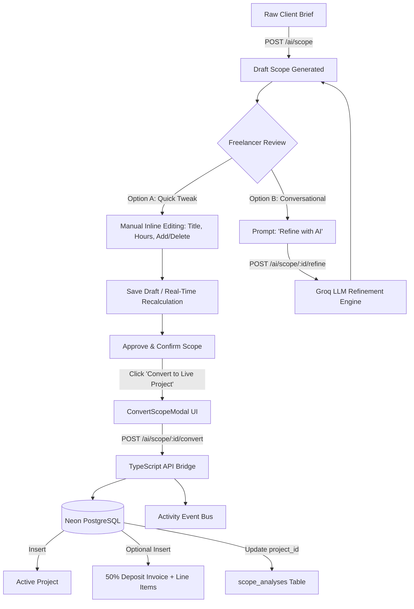

# Sprint 16: Collaborative AI Scope Studio & Operational Bridge

**Version:** 2.0 (Combined Edition: Manual Editing + AI Refinement + Operational Bridge)  
**Status:** COMPLETED & VERIFIED ✅  
**Date:** September 9, 2026 (Audited & Hardened: September 13, 2026)  

---

## Executive Summary

Sprint 16 transforms the AI Scope Studio from a static, one-shot generation tool into an interactive, collaborative co-pilot that feeds directly into core business operations:

1. **Manual Inline Deliverable Editing**: Freelancers can tweak deliverable titles, descriptions, hours, and complexity directly on the card, or add/remove deliverables with live metric recalculations.
2. **Conversational "Refine with AI" Prompt**: Natural-language refinement bar allowing freelancers to request specific scope modifications (e.g., *"Focus on mobile app, remove web deliverables, and add Push Notifications"*), which the Groq LLM applies while preserving the rest of the scope.
3. **1-Click Conversion Bridge**: Converted confirmed tailored scopes directly into active **Projects** and draft **Milestone/Deposit Invoices** with line items generated from deliverables.

---

## System Workflow & Architecture

---

## Deliverables & Modules

### 1. Python AI Microservice (`apps/ai`)
- **`app/schemas/scope.py`**: `ScopeRefineInput` containing `current_scope: ScopeAnalysisResult` and `revision_prompt: str`.
- **`app/services/llm_service.py`**: `refine_scope()` utilizing `ChatGroq.with_structured_output(ScopeAnalysisResult)` with XML-delimited `<current_scope>` and `<revision_instructions>`, backed by deterministic offline mock fallback.
- **`app/api/routes/scope.py`**: `POST /api/v1/scope/refine` endpoint protected by Bearer service authentication.
- **Pytest Suite**: Unit tests verifying schema parsing, prompt preservation, and mock outputs.

### 2. TypeScript Core API (`apps/api`)
- **`src/ai/client.ts`**: `refineScope()` HTTP gateway client.
- **`src/domains/ai/repository.ts`**: `updateResult(id, workspaceId, result)` and `linkProject(id, workspaceId, projectId)`.
- **`src/domains/ai/ai.schema.ts`**: Validation schemas `refineScopeSchema`, `updateScopeResultSchema`, and `convertScopeToProjectSchema`.
- **`src/domains/ai/ai.service.ts` & `ai.controller.ts`**:
  - `POST /api/v1/workspaces/:workspaceId/ai/scope/:scopeId/refine`
  - `PATCH /api/v1/workspaces/:workspaceId/ai/scope/:scopeId`
  - `POST /api/v1/workspaces/:workspaceId/ai/scope/:scopeId/convert`
- **Vitest Suite**: Controller and service tests for refinement, manual updates, and conversion.

### 3. Frontend Web Studio (`apps/web`)
- **`src/api/ai.ts`**: Typed client methods (`refineScopeAnalysis`, `updateScopeAnalysisResult`, `convertScopeToProject`).
- **`src/features/ai/hooks/useScopeRefinement.ts`**: React Query hooks for refinement mutations and manual updates.
- **`src/features/ai/components/ScopeReviewDraft.tsx`**:
  - Inline deliverable editing toggles (title, description, hours, complexity).
  - Add/delete deliverable controls with dynamic total hours counter.
  - Interactive "Refine with AI" prompt bar with sparkle indicators and examples.
  - "Convert to Live Project" CTA on confirmed scopes.
- **`src/features/ai/components/ConvertScopeModal.tsx`**:
  - Conversion dialog pre-populated with refined scope details.
  - Workspace client selector.
  - Target date auto-calculation (Today + `timeline_weeks`).
  - Deposit invoice toggle (25%, 50%, 100%, or Skip) with live price calculation.

---

## Code Review Hardening & Bug Fixes

1. **RBAC Endpoint Hardening**: Enforced `owner` or `editor` role checks in `ai.controller.ts` across `confirm`, `refine`, `update`, and `convert` routes, preventing unauthorized mutations by `viewer` members.
2. **Schema Normalization**: Added case-insensitive preprocessing and fallback for `complexity` in Pydantic and Zod schemas, plus numeric coercion for hours and duration.
3. **Frontend Data Loss Prevention**: Replaced naive `useEffect` on `scopeRecord` with `currentScopeId` tracking, preventing background refetches from overwriting active user edits.
4. **Input Ergonomics & Skill Tags**: Polished `estimated_hours` input behavior (free typing without jumping) and added interactive `×` removal and inline `+ Skill` addition.
5. **Exact Penny Itemization**: Guaranteed deposit milestone lines absorb rounding cents so the invoice sum matches project budget down to the exact penny.
6. **Type Safety Harmonization**: Unified `ProjectService` and `InvoiceService` response handlers to use `{ success: true, data }` and provided required `discountRate` / `taxRate`.

---

## Verification & Monorepo Test Gates

- **`apps/ai`**: Pytest suite passing (**42 / 42 tests**).
- **`apps/api`**: Vitest suite passing (**287 / 287 tests**, 32 suites).
- **`apps/web`**: Vitest suite passing (**34 / 34 tests**, 8 suites).
- **TypeScript**: `pnpm typecheck` passed with **0 errors** across all packages.
- **Total Monorepo**: **363 / 363 tests passing (100%)**.
