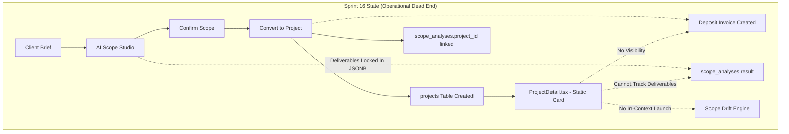
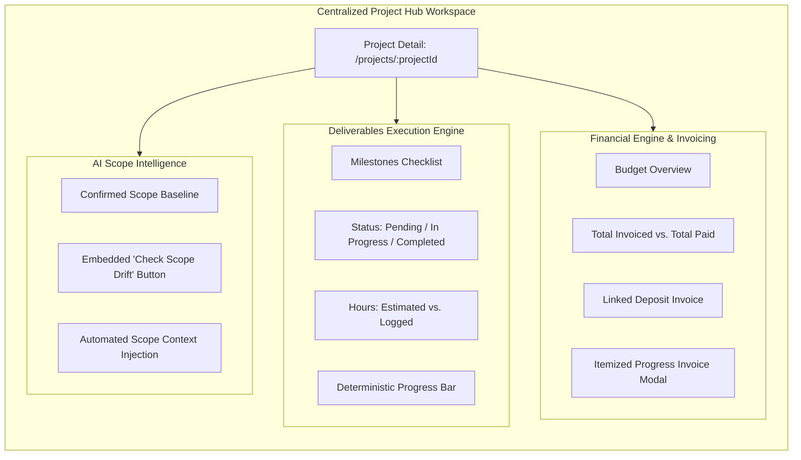
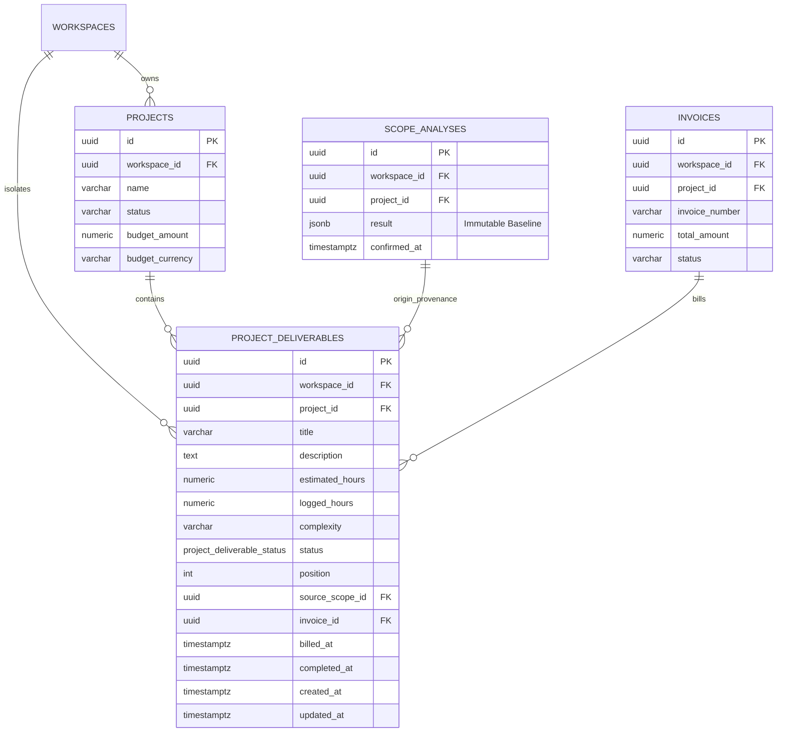
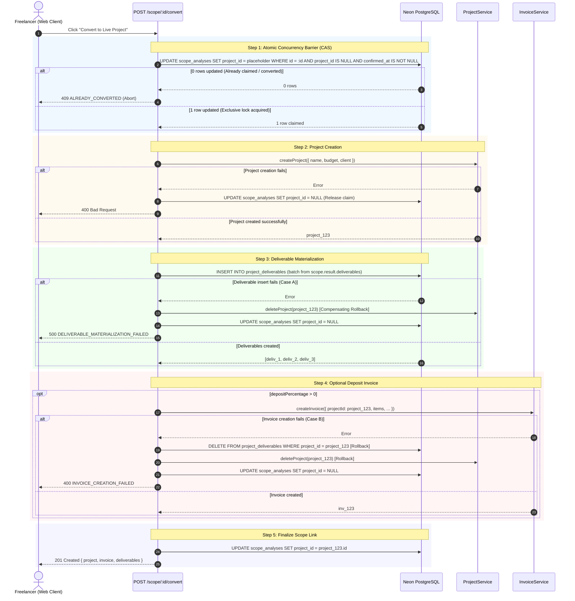
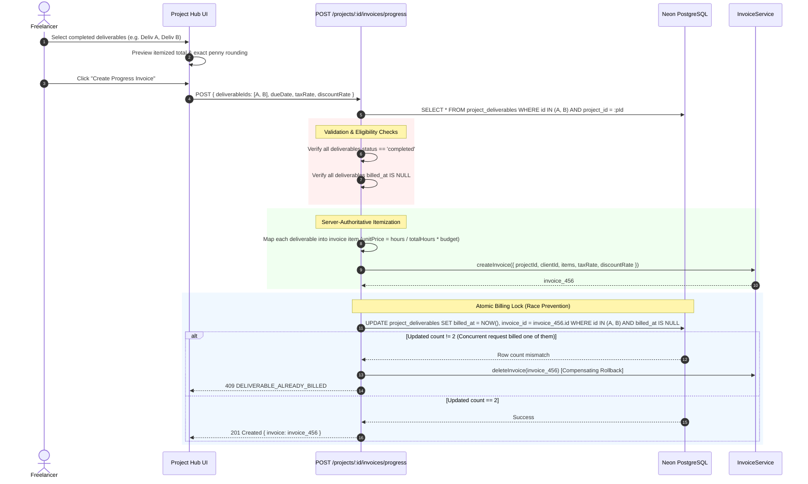
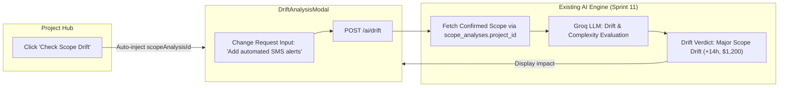

# Sprint 17: Project Hub & Deliverables Execution Engine — Architectural Deep Dive

**Version:** 1.0  
**Date:** September 13, 2026  
**Audience:** Technical Leadership, Engineers, and Product Stakeholders  
**Architecture Pattern:** Normalized Operational Projections + Atomic Sagas + In-Context AI Intelligence  

---

## 1. The Core Breakdown: The Post-Conversion Operational Void

### Symptom & User Impact
Prior to Sprint 17, Freelance OS successfully generated, refined, and converted AI scopes into projects (`POST /ai/scope/:id/convert`). However, immediately upon redirecting to `/workspaces/[id]/projects/[id]`, **the operational journey hit a dead end**:
1. Freelancers were presented with a static 3-card overview displaying only project dates and a raw text block.
2. The detailed deliverables crafted in the AI Scope Studio (hours, complexity, descriptions) were **completely inaccessible** for active tracking.
3. Upfront deposit invoices created during conversion were disconnected and invisible on the project page.
4. Scope Drift Detection could only be run from the standalone AI page, forcing freelancers to manually re-select scopes rather than evaluating change requests directly inside their active project.



### Root Cause & Technical Collision
The root cause was an **architectural mismatch between planning artifacts and operational entities**:
- **Expected State**: A converted project is a living workspace. Its milestones have discrete statuses (`pending`, `in_progress`, `completed`), tracked hours, billing states, and audit trails.
- **Actual State**: Deliverables existed solely as raw objects within `scope_analyses.result` (a JSONB column). They had no database IDs, no independent timestamps, no row-level locks, and no referential integrity. Mutating them to track progress would overwrite the contractual baseline needed for Scope Drift analysis.

---

## 2. The Architectural Fix: End-to-End Implementation Blueprint

Sprint 17 introduces the **Project Hub & Deliverables Execution Engine**, transforming the project page from an informational view into a central command center:



---

### A. Persistence Layer: Normalized `project_deliverables`

Rather than mutating immutable historical JSON, operational deliverables are normalized into a dedicated table:



#### Key Relational Invariants:
1. **Tenant Isolation**: Enforced by composite foreign key `(workspace_id, project_id) REFERENCES projects(workspace_id, id) ON DELETE CASCADE`. Deliverables cannot cross workspace boundaries.
2. **Provenance**: `source_scope_id` points to `scope_analyses(id) ON DELETE SET NULL`, preserving traceability back to the AI prompt.
3. **Billing Lock**: `billed_at` and `invoice_id` track progress billing, preventing double-invoicing.

---

### B. Conversion Engine: Atomic Scope Claim & Compensating Saga

To prevent race conditions where double-clicking "Convert to Project" creates duplicate projects and invoices, conversion utilizes an **Atomic Claim + Compensating Saga**:



---

### C. Financials & Progress Invoicing: Itemized Completed-Deliverable Billing

Freelancers generate cash flow during delivery by billing completed milestones:



---

### D. In-Context Scope Drift Architecture



---

## 3. Concrete Advantages: Why This Architecture Works Best

1. **Immutable AI Baseline Preserved**:
   The confirmed scope (`scope_analyses.result`) remains an unblemished legal contract. Project deliverables can be edited, completed, re-scoped, or split without corrupting the historical baseline needed for Scope Drift evaluation.
2. **Zero Concurrent Lost Updates**:
   Because each deliverable is an indexed row in PostgreSQL, concurrent requests (e.g., logging time while ticking completed) utilize row-level locks. In JSONB, one request would overwrite the other's entire payload.
3. **Atomic Billing Guarantees**:
   The atomic conditional check (`WHERE id IN (...) AND billed_at IS NULL`) physically prevents double-billing a deliverable, even if two tabs submit the invoice simultaneously.
4. **Server-Authoritative Financials**:
   The frontend merely provides an ergonomic preview; all subtotals, sequence numbers, taxes, discounts, and rounding are computed by `InvoiceService` with penny-exact precision.
5. **Zero-Mutation Reads**:
   `GET /projects/:projectId` is 100% read-only. Legacy project backfills are strictly decoupled into an explicit administrative CLI script and an explicit POST action, preventing side-effect bugs on query requests.

---

## 4. Real Tradeoffs & Limitations

1. **Schema Migration Required**:
   Requires `0008_add_project_deliverables.sql` and migration tracking in Neon PostgreSQL.
2. **Compensating Saga Complexity**:
   Because `neon-http` executes stateless fetch requests across separate micro-services (Projects, Invoices, AI), transactions that fail midway require explicit compensating rollbacks (`deleteProject`, releasing scope claims) rather than a single database-level `ROLLBACK`.
3. **Overrun Support Over Strict Budget Gating**:
   `loggedHours > estimatedHours` is intentionally allowed without hard blocking. Freelancers need the ability to record reality (+4h overrun) rather than being stopped by the software.

---

## 5. Alternative Approaches Evaluated

| Approach | Concept | Fatal Flaw / Why Rejected |
| :--- | :--- | :--- |
| **Option A: Scope JSONB** | Mutate `scope_analyses.result.deliverables[]` during execution. | Destroys the immutable contract baseline; breaks Scope Drift; prone to concurrent lost updates. |
| **Option A2: Project JSONB** | Add a `deliverables` JSON column to `projects`. | Solves baseline mutation, but still suffers from full-row read-modify-write collisions and cannot establish foreign keys from `invoice_items`. |
| **Option B (Chosen Path)** | **Normalized `project_deliverables` relational table.** | **Guarantees stable IDs, row-level locking, atomic progress billing, strict tenant isolation, and future change-order extensibility.** |

---

## 6. Implementation Checklist & Verification Gates

```text
[ ] Phase 2: Apply migration 0008_add_project_deliverables.sql to Neon DB
[ ] Phase 3: Implement ProjectDeliverableRepository & ProjectDeliverableService
[ ] Phase 4: Wire deliverables REST endpoints into ProjectController & Routes
[ ] Phase 5: Extend ai.service.ts convertScopeToProject with Atomic Claim & Rollback Saga
[ ] Phase 6: Implement Itemized Progress Invoicing with atomic billed_at locking
[ ] Phase 7: Add backfill script for pre-Sprint-17 legacy projects
[ ] Phase 8: Rebuild ProjectDetail.tsx into the Project Hub with in-context Scope Drift
[ ] Phase 9: Run Concurrency & Rollback Vitest Suites
[ ] Phase 10: Verify Monorepo Quality Gates (Lint, Typecheck, Test, Build)
```
